# Contoso Mining — Microsoft Fabric Real-Time Intelligence Demo Plan

## 📌 Executive Summary

**Contoso Mining** adalah perusahaan tambang batubara terintegrasi yang mengelola operasi dari eksplorasi hingga pengiriman ke pelanggan. Dokumen ini berisi **demo plan** untuk mengimplementasikan **Microsoft Fabric Real-Time Intelligence (RTI)** dan fitur Fabric lainnya guna meningkatkan visibilitas operasional secara real-time.

> **Tujuan:** Membuktikan bahwa Microsoft Fabric dapat memberikan **real-time visibility** terhadap operasi penambangan, hauling, dan shipping — menghasilkan keputusan lebih cepat, mengurangi downtime, dan memungkinkan **AI-driven decision making** melalui Fabric Data Agent dan Fabric IQ.

---

## 🎯 Demo Objectives

| # | Objective | Fabric Feature |
|---|-----------|----------------|
| 1 | Monitoring **real-time coal hauling** (truk, tonase, rute) | Eventstream, Eventhouse, Real-Time Dashboard |
| 2 | Tracking **stockpile level** secara live | KQL Database, Real-Time Dashboard |
| 3 | **Alert otomatis** ketika anomali terdeteksi | Data Activator (Reflex) |
| 4 | **Historical analysis** untuk optimasi operasi | Lakehouse, Notebook, Power BI |
| 5 | **Conversational Q&A** — tanya data pakai bahasa natural | Fabric Data Agent |
| 6 | **AI Operations Agent** — rekomendasi aksi otomatis | Fabric IQ (Operations Agent + Ontology) |

---

## 🏗️ Architecture Overview

### Diagram: End-to-End Solution Architecture

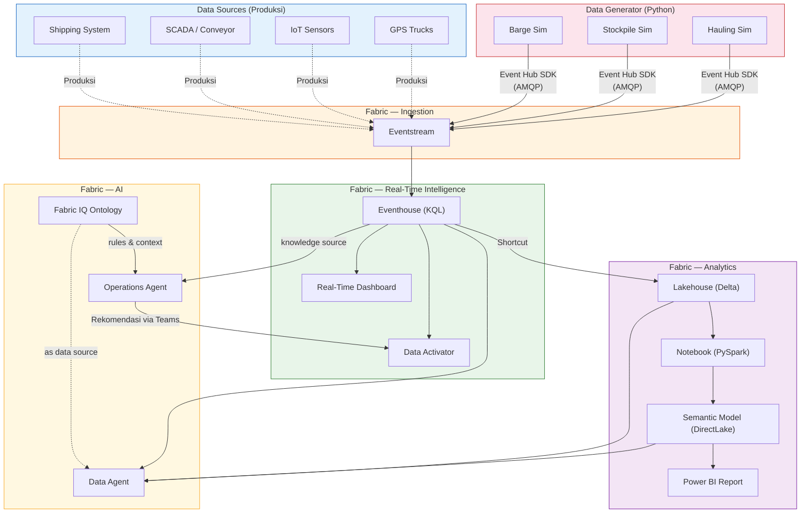
```mermaid
flowchart TB
    subgraph Generator["Data Generator (Python)"]
        direction LR
        SIM_H["Hauling Sim"]
        SIM_S["Stockpile Sim"]
        SIM_B["Barge Sim"]
    end

    subgraph Sources["Data Sources (Produksi)"]
        direction LR
        GPS["GPS Trucks"]
        IOT["IoT Sensors"]
        SCADA["SCADA / Conveyor"]
        SHIP["Shipping System"]
    end

    subgraph Ingest["Fabric — Ingestion"]
        ES["Eventstream"]
    end

    subgraph Process["Fabric — Real-Time Intelligence"]
        EH["Eventhouse (KQL)"]
        RTD["Real-Time Dashboard"]
        DA["Data Activator"]
    end

    subgraph Store["Fabric — Analytics"]
        LH["Lakehouse (Delta)"]
        NB["Notebook (PySpark)"]
        SM["Semantic Model (DirectLake)"]
        PBI["Power BI Report"]
    end

    subgraph AI["Fabric — AI"]
        AGENT["Data Agent"]
        ONT["Fabric IQ Ontology"]
        OPSAG["Operations Agent"]
    end

    SIM_H & SIM_S & SIM_B -->|"Event Hub SDK\n(AMQP)"| ES
    GPS & IOT & SCADA & SHIP -.->|"Produksi"| ES
    ES --> EH
    EH --> RTD
    EH --> DA
    EH -->|Shortcut| LH
    LH --> NB --> SM --> PBI
    EH & LH & SM --> AGENT
    ONT -.->|"as data source"| AGENT
    ONT -->|"rules & context"| OPSAG
    EH -->|"knowledge source"| OPSAG
    OPSAG -->|"Rekomendasi via Teams"| DA

    style Generator fill:#FCE4EC,stroke:#C62828
    style Sources fill:#E3F2FD,stroke:#1565C0
    style Ingest fill:#FFF3E0,stroke:#E65100
    style Process fill:#E8F5E9,stroke:#2E7D32
    style Store fill:#F3E5F5,stroke:#7B1FA2
    style AI fill:#FFF8E1,stroke:#F9A825
```

### Penjelasan Arsitektur (Untuk Pemula)

| Layer | Komponen | Apa yang Dilakukan? |
|-------|----------|---------------------|
| **Data Generator** | Python Simulator (`data_generator.py`) | Untuk demo: mensimulasikan data hauling, stockpile, barge loading |
| **Data Sources** | GPS, Truck Scale, IoT, SCADA | *(Production)* Menghasilkan data secara terus-menerus dari lapangan |
| **Ingestion** | Eventstream (Custom App Endpoint) | Menerima data streaming via Event Hub SDK (AMQP) dan meneruskan ke tujuan |
| **Real-Time Intelligence** | Eventhouse + KQL + Dashboard | Menyimpan, query, dan visualisasi data secara real-time |
| **Alerts** | Data Activator (Reflex) | Mengirim notifikasi otomatis saat kondisi tertentu terpenuhi |
| **Analytics** | Lakehouse + Notebook + Semantic Model + Power BI | Analisis historis: star schema, DAX measures, dan 3-page report |
| **AI & IQ** | Data Agent + Operations Agent + Ontology | Data Agent: tanya jawab natural language (sumber: EH + LH + SM + Ontology). Operations Agent: monitoring proaktif & rekomendasi aksi otomatis (sumber: Eventhouse only + Ontology untuk rules) |

---

## � Data Generator (Python Simulator)

Untuk demo, kita membutuhkan data streaming yang mensimulasikan operasi tambang. Berikut Python script yang men-generate data dan mengirimkannya ke Fabric Eventstream melalui **Custom App endpoint**.

### Arsitektur Data Generator

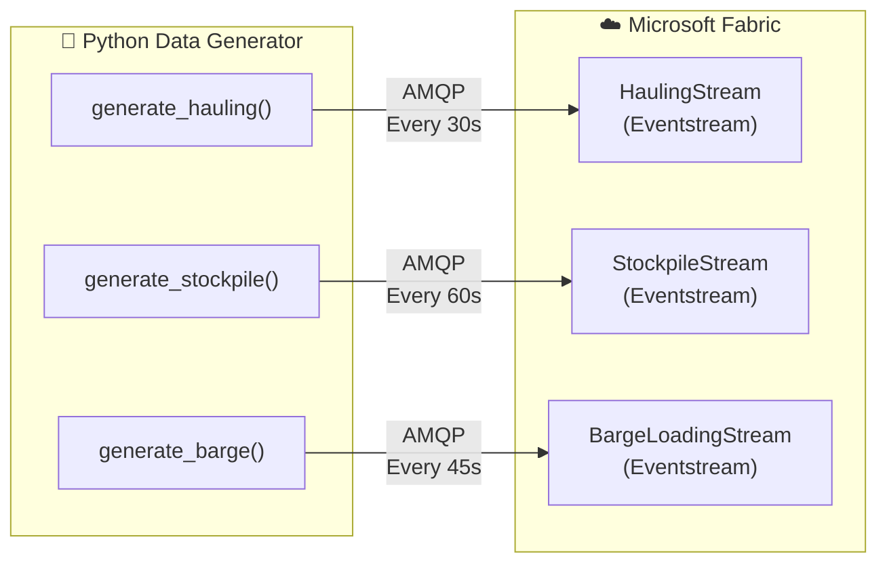
```mermaid
flowchart LR
    subgraph Generator["🐍 Python Data Generator"]
        direction TB
        GH["generate_hauling()"]
        GS["generate_stockpile()"]
        GB["generate_barge()"]
    end

    subgraph Fabric["☁️ Microsoft Fabric"]
        ES_H2["HaulingStream\n(Eventstream)"]
        ES_S2["StockpileStream\n(Eventstream)"]
        ES_B2["BargeLoadingStream\n(Eventstream)"]
    end

    GH -->|"AMQP\nEvery 30s"| ES_H2
    GS -->|"AMQP\nEvery 60s"| ES_S2
    GB -->|"AMQP\nEvery 45s"| ES_B2
```

### Setup: Mendapatkan Eventstream Endpoint

1. Buka Eventstream (misal `HaulingStream`) di Fabric Portal
2. Tambahkan source **Custom App**
3. Klik source, lalu klik **Keys** — salin **Connection string** atau **Event hub name** dan **Endpoint**
4. Gunakan connection string ini di script Python

### Script: `data_generator.py`

```python
"""
Contoso Mining — Real-Time Data Simulator
Mengirim data simulasi hauling, stockpile, dan barge loading ke Fabric Eventstream.
"""

import json
import random
import time
import threading
from datetime import datetime, timezone
from azure.eventhub import EventHubProducerClient, EventData

# ============================================================
# CONFIGURATION — Ganti dengan connection string dari Eventstream
# ============================================================
HAULING_CONN_STR = "<HaulingStream-connection-string>"
HAULING_EVENTHUB = "<HaulingStream-eventhub-name>"

STOCKPILE_CONN_STR = "<StockpileStream-connection-string>"
STOCKPILE_EVENTHUB = "<StockpileStream-eventhub-name>"

BARGE_CONN_STR = "<BargeLoadingStream-connection-string>"
BARGE_EVENTHUB = "<BargeLoadingStream-eventhub-name>"

# ============================================================
# MASTER DATA — Referensi truk, stockpile, tongkang
# ============================================================
TRUCKS = [
    {"truck_id": f"TRK-{str(i).zfill(3)}", "base_lat": -1.6821, "base_lon": 116.0735}
    for i in range(1, 21)  # 20 trucks
]

ROUTES = [
    "Pit-A1 to ROM-Stockyard",
    "Pit-A2 to ROM-Stockyard",
    "Pit-B1 to Port-A",
    "ROM-Stockyard to Port-A",
    "ROM-Stockyard to Port-B",
]

STOCKPILES = [
    {"stockpile_id": "ROM", "max_capacity_ton": 80000, "base_level": 65.0},
    {"stockpile_id": "PORT-A", "max_capacity_ton": 50000, "base_level": 45.0},
    {"stockpile_id": "PORT-B", "max_capacity_ton": 50000, "base_level": 70.0},
]

BARGES = [
    {"barge_id": "BRG-201", "target_tonnage": 8000, "jetty_id": "JETTY-1"},
    {"barge_id": "BRG-202", "target_tonnage": 7500, "jetty_id": "JETTY-2"},
    {"barge_id": "BRG-203", "target_tonnage": 10000, "jetty_id": "JETTY-1"},
]

COAL_QUALITIES = ["GAR-4200", "GAR-4700", "GAR-5000", "GAR-5500"]

# ============================================================
# DATA GENERATORS
# ============================================================
def generate_hauling_event(truck):
    """Generate satu event hauling truck."""
    cycle_phases = ["loading", "hauling", "queuing", "unloading", "returning", "idle"]
    statuses = ["empty", "loaded", "unloading", "idle"]
    return {
        "truck_id": truck["truck_id"],
        "timestamp": datetime.now(timezone.utc).isoformat(),
        "latitude": truck["base_lat"] + random.uniform(-0.05, 0.05),
        "longitude": truck["base_lon"] + random.uniform(-0.05, 0.05),
        "speed_kmh": round(random.uniform(0, 45), 1),
        "payload_ton": round(random.uniform(0, 42), 1),
        "status": random.choice(statuses),
        "route": random.choice(ROUTES),
        "cycle_phase": random.choice(cycle_phases),
    }


def generate_stockpile_event(stockpile):
    """Generate satu event stockpile level."""
    level = stockpile["base_level"] + random.uniform(-5, 5)
    level = max(10, min(95, level))  # clamp 10-95%
    stockpile["base_level"] = level  # drift for realism
    return {
        "stockpile_id": stockpile["stockpile_id"],
        "timestamp": datetime.now(timezone.utc).isoformat(),
        "level_percentage": round(level, 1),
        "estimated_tonnage": round(level / 100 * stockpile["max_capacity_ton"]),
        "max_capacity_ton": stockpile["max_capacity_ton"],
        "coal_quality": random.choice(COAL_QUALITIES),
        "temperature_celsius": round(random.uniform(30, 55), 1),
    }


def generate_barge_event(barge):
    """Generate satu event barge loading."""
    statuses = ["waiting", "loading", "loaded", "departed"]
    status = random.choice(statuses)
    loaded = round(random.uniform(0, barge["target_tonnage"]), 0)
    rate = round(random.uniform(600, 1200), 0) if status == "loading" else 0
    return {
        "barge_id": barge["barge_id"],
        "timestamp": datetime.now(timezone.utc).isoformat(),
        "jetty_id": barge["jetty_id"],
        "loading_rate_tph": rate,
        "loaded_tonnage": loaded,
        "target_tonnage": barge["target_tonnage"],
        "status": status,
        "eta_completion": datetime.now(timezone.utc).isoformat(),
    }


# ============================================================
# SENDER — Kirim ke Eventstream via Event Hub SDK
# ============================================================
def send_events(conn_str, eventhub_name, events):
    """Kirim batch events ke Eventstream."""
    producer = EventHubProducerClient.from_connection_string(
        conn_str, eventhub_name=eventhub_name
    )
    with producer:
        batch = producer.create_batch()
        for event in events:
            batch.add(EventData(json.dumps(event)))
        producer.send_batch(batch)
        print(f"  ✅ Sent {len(events)} events to {eventhub_name}")


def stream_hauling(interval=30):
    """Stream hauling events setiap {interval} detik."""
    print(f"🚛 Hauling stream started (every {interval}s, {len(TRUCKS)} trucks)")
    while True:
        events = [generate_hauling_event(t) for t in TRUCKS]
        send_events(HAULING_CONN_STR, HAULING_EVENTHUB, events)
        time.sleep(interval)


def stream_stockpile(interval=60):
    """Stream stockpile events setiap {interval} detik."""
    print(f"📦 Stockpile stream started (every {interval}s, {len(STOCKPILES)} stockpiles)")
    while True:
        events = [generate_stockpile_event(s) for s in STOCKPILES]
        send_events(STOCKPILE_CONN_STR, STOCKPILE_EVENTHUB, events)
        time.sleep(interval)


def stream_barge(interval=45):
    """Stream barge events setiap {interval} detik."""
    print(f"🚢 Barge stream started (every {interval}s, {len(BARGES)} barges)")
    while True:
        events = [generate_barge_event(b) for b in BARGES]
        send_events(BARGE_CONN_STR, BARGE_EVENTHUB, events)
        time.sleep(interval)


# ============================================================
# MAIN — Jalankan semua stream secara parallel
# ============================================================
if __name__ == "__main__":
    print("=" * 60)
    print("  Contoso Mining — Real-Time Data Simulator")
    print("=" * 60)

    threads = [
        threading.Thread(target=stream_hauling, daemon=True),
        threading.Thread(target=stream_stockpile, daemon=True),
        threading.Thread(target=stream_barge, daemon=True),
    ]

    for t in threads:
        t.start()

    print("\n⏳ All streams running. Press Ctrl+C to stop.\n")

    try:
        while True:
            time.sleep(1)
    except KeyboardInterrupt:
        print("\n🛑 Stopped.")
```

### Install Dependencies

```bash
pip install azure-eventhub
```

### Menjalankan Generator

```bash
python data_generator.py
```

**Output yang diharapkan:**

```
============================================================
  Contoso Mining — Real-Time Data Simulator
============================================================
🚛 Hauling stream started (every 30s, 20 trucks)
📦 Stockpile stream started (every 60s, 3 stockpiles)
🚢 Barge stream started (every 45s, 3 barges)

⏳ All streams running. Press Ctrl+C to stop.

  ✅ Sent 20 events to HaulingStream
  ✅ Sent 3 events to StockpileStream
  ✅ Sent 3 events to BargeLoadingStream
  ✅ Sent 20 events to HaulingStream
  ...
```

### Data Volume Estimasi

| Stream | Interval | Events/Batch | Events/Hour | Events/Day |
|--------|----------|-------------|-------------|------------|
| Hauling | 30 detik | 20 trucks | 2,400 | 57,600 |
| Stockpile | 60 detik | 3 stockpiles | 180 | 4,320 |
| Barge | 45 detik | 3 barges | 240 | 5,760 |
| **Total** | | | **2,820** | **67,680** |

---

## �📋 Demo Scenarios

### Scenario 1: Real-Time Coal Hauling Monitor

**Business Problem:**
Contoso Mining mengoperasikan **50+ dump truck** untuk mengangkut batubara dari pit ke ROM stockyard dan port. Saat ini, monitoring dilakukan manual via radio — menyebabkan **blind spots** terhadap produktivitas dan keterlambatan.

**Solution:**

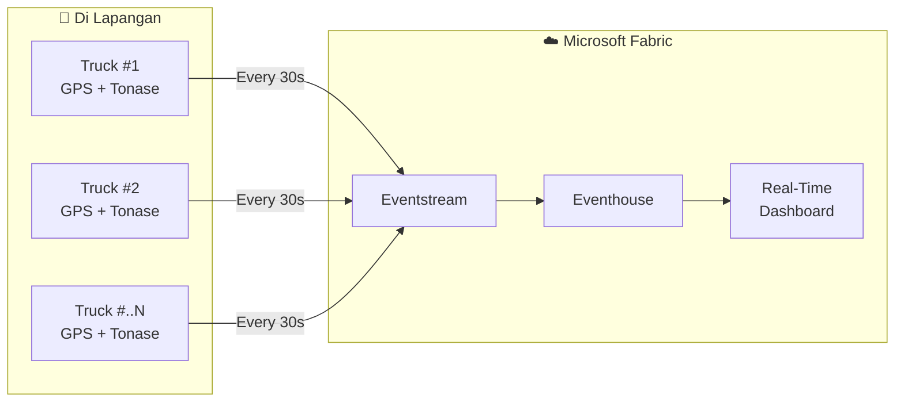
```mermaid
flowchart LR
    subgraph Field["🚛 Di Lapangan"]
        T1["Truck #1\nGPS + Tonase"]
        T2["Truck #2\nGPS + Tonase"]
        T3["Truck #..N\nGPS + Tonase"]
    end

    subgraph Fabric["☁️ Microsoft Fabric"]
        ES1["Eventstream"]
        EH1["Eventhouse"]
        RTD1["Real-Time\nDashboard"]
    end

    T1 -->|"Every 30s"| ES1
    T2 -->|"Every 30s"| ES1
    T3 -->|"Every 30s"| ES1
    ES1 --> EH1 --> RTD1
```

**Apa yang Ditampilkan di Dashboard:**

| Metric | Visualisasi | Contoh |
|--------|-------------|--------|
| Posisi truk saat ini | Map visual | Peta area tambang dengan titik-titik truk |
| Total tonase hari ini | Scorecard | **12,450 ton** dari target 15,000 ton |
| Trip count per truk | Bar chart | Truck-07 sudah 8 trip, Truck-12 baru 3 trip |
| Rata-rata cycle time | Trend line | Avg 45 menit/trip (target: 40 menit) |
| Truk idle > 30 menit | Alert table | ⚠️ Truck-03 idle 47 menit di area ROM |

**Data Sample (JSON yang masuk ke Eventstream):**

```json
{
    "truck_id": "TRK-007",
    "timestamp": "2026-04-16T10:30:00Z",
    "latitude": -1.6821,
    "longitude": 116.0735,
    "speed_kmh": 25.3,
    "payload_ton": 38.5,
    "status": "loaded",
    "route": "Pit-A1 to ROM-Stockyard",
    "cycle_phase": "hauling"
}
```

**KQL Query Contoh:**

```kql
// Top 10 truk dengan tonase tertinggi hari ini
HaulingEvents
| where timestamp > ago(1d)
| where status == "unloaded"
| summarize TotalTonnage = sum(payload_ton), TripCount = count() by truck_id
| top 10 by TotalTonnage desc
| extend AvgPerTrip = round(TotalTonnage / TripCount, 1)
```

---

### Scenario 2: Stockpile Level Monitoring

**Business Problem:**
Contoso Mining memiliki **3 stockpile utama** (ROM, Port-A, Port-B). Level stockpile yang terlalu rendah menyebabkan **kapal menunggu (demurrage)**, sedangkan terlalu tinggi berisiko **spontaneous combustion**.

**Solution:**

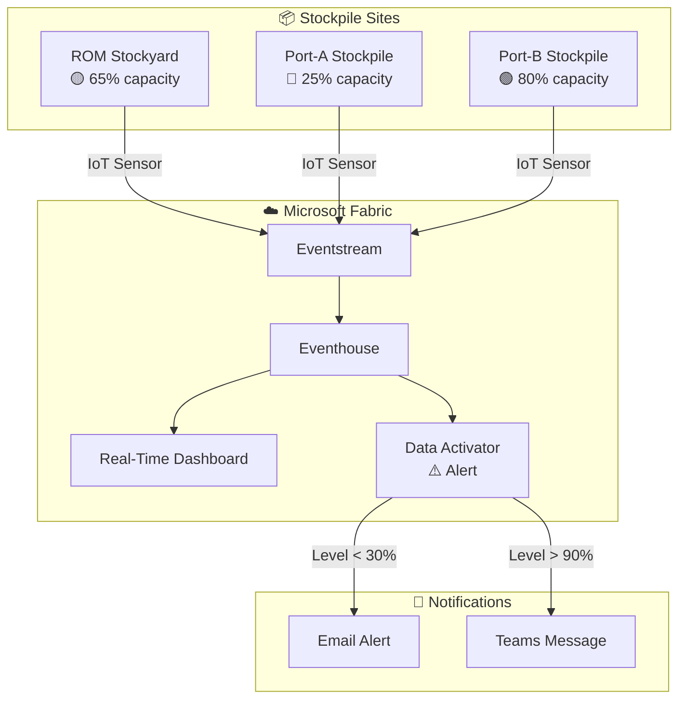
```mermaid
flowchart TD
    subgraph Stockpiles["📦 Stockpile Sites"]
        ROM["ROM Stockyard\n🟡 65% capacity"]
        PA["Port-A Stockpile\n🔴 25% capacity"]
        PB["Port-B Stockpile\n🟢 80% capacity"]
    end

    subgraph Fabric["☁️ Microsoft Fabric"]
        ES2["Eventstream"]
        EH2["Eventhouse"]
        RTD2["Real-Time Dashboard"]
        DA2["Data Activator\n⚠️ Alert"]
    end

    subgraph Actions["📱 Notifications"]
        EMAIL["Email Alert"]
        TEAMS["Teams Message"]
    end

    ROM -->|"IoT Sensor"| ES2
    PA -->|"IoT Sensor"| ES2
    PB -->|"IoT Sensor"| ES2

    ES2 --> EH2
    EH2 --> RTD2
    EH2 --> DA2

    DA2 -->|"Level < 30%"| EMAIL
    DA2 -->|"Level > 90%"| TEAMS
```

**Alert Rules (Data Activator / Reflex):**

| Condition | Severity | Action |
|-----------|----------|--------|
| Stockpile level **< 30%** | 🔴 Critical | Email ke Dispatch + Teams alert |
| Stockpile level **< 50%** | 🟡 Warning | Teams notification |
| Stockpile level **> 90%** | 🔴 Critical | Email ke Mine Supervisor |
| Level tidak berubah > 6 jam | 🟡 Warning | Check sensor health |

**Data Sample:**

```json
{
    "stockpile_id": "PORT-A",
    "timestamp": "2026-04-16T10:35:00Z",
    "level_percentage": 25.4,
    "estimated_tonnage": 12700,
    "max_capacity_ton": 50000,
    "coal_quality": "GAR-4200",
    "temperature_celsius": 42.1
}
```

---

### Scenario 3: Barge Loading & Shipping Tracker

**Business Problem:**
Contoso Mining memuat **3-5 tongkang per hari**. Koordinasi antara stockpile, jetty, dan tongkang dilakukan via WhatsApp — sering terjadi **miskomunikasi** dan **idle time** yang tinggi.

**Solution:**

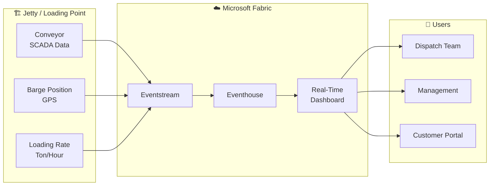
```mermaid
flowchart LR
    subgraph Jetty["🏗️ Jetty / Loading Point"]
        J1["Conveyor\nSCADA Data"]
        J2["Barge Position\nGPS"]
        J3["Loading Rate\nTon/Hour"]
    end

    subgraph Fabric["☁️ Microsoft Fabric"]
        ES3["Eventstream"]
        EH3["Eventhouse"]
        RTD3["Real-Time\nDashboard"]
    end

    subgraph Stakeholders["👥 Users"]
        DISP["Dispatch Team"]
        MGMT["Management"]
        CUST["Customer Portal"]
    end

    J1 --> ES3
    J2 --> ES3
    J3 --> ES3

    ES3 --> EH3 --> RTD3

    RTD3 --> DISP
    RTD3 --> MGMT
    RTD3 --> CUST
```

**Dashboard Metrics:**

| Metric | Keterangan |
|--------|------------|
| Tongkang aktif saat ini | BRG-201: Loading (65%), BRG-202: Waiting |
| Loading rate (ton/jam) | 850 ton/jam (target: 1,000) |
| ETA selesai loading | BRG-201: ~3.5 jam lagi |
| Antrian tongkang | 2 tongkang menunggu di anchorage |
| Total muatan hari ini | 8,200 ton dari 3 tongkang |

---

### Scenario 4: Conversational Q&A dengan Fabric Data Agent

**Business Problem:**
Manajemen Contoso Mining sering membutuhkan jawaban cepat atas pertanyaan operasional — *"Berapa total tonase hauling minggu ini?"*, *"Stockpile mana yang paling rendah?"*, *"Truk mana yang paling produktif?"*. Saat ini, mereka harus menunggu tim data membuat report atau menulis query KQL/SQL secara manual.

**Apa itu Fabric Data Agent?**
Fabric Data Agent adalah fitur **generally available** di Microsoft Fabric yang memungkinkan Anda membangun sistem **conversational Q&A** menggunakan generative AI. User bisa bertanya dalam **bahasa natural (plain English/Indonesia)** dan mendapat jawaban terstruktur — **tanpa perlu menulis SQL, DAX, atau KQL**.

Di balik layar, Data Agent menggunakan **Azure OpenAI Assistant APIs** untuk:
1. Memahami pertanyaan user
2. Menentukan data source yang paling relevan (Lakehouse, Warehouse, KQL Database, Power BI Semantic Model)
3. Men-generate query secara otomatis (NL2SQL, NL2KQL, atau NL2DAX)
4. Menjalankan query dan mengembalikan jawaban dalam format yang mudah dibaca

**Solution:**

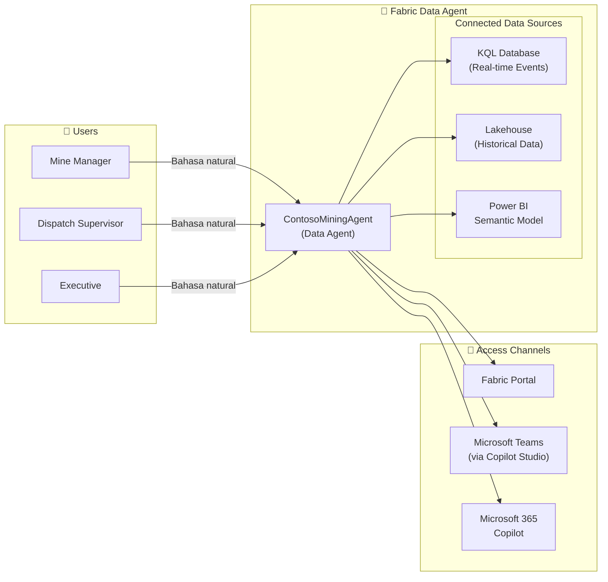
```mermaid
flowchart LR
    subgraph User["👤 Users"]
        MGR["Mine Manager"]
        DISP2["Dispatch Supervisor"]
        EXEC["Executive"]
    end

    subgraph Agent["🤖 Fabric Data Agent"]
        DA_AGENT["ContosoMiningAgent\n(Data Agent)"]
        subgraph Sources2["Connected Data Sources"]
            SRC1["KQL Database\n(Real-time Events)"]
            SRC2["Lakehouse\n(Historical Data)"]
            SRC3["Power BI\nSemantic Model"]
        end
    end

    subgraph Channels["📱 Access Channels"]
        FAB["Fabric Portal"]
        TEAMS2["Microsoft Teams\n(via Copilot Studio)"]
        M365["Microsoft 365\nCopilot"]
    end

    MGR -->|"Bahasa natural"| DA_AGENT
    DISP2 -->|"Bahasa natural"| DA_AGENT
    EXEC -->|"Bahasa natural"| DA_AGENT
    DA_AGENT --> SRC1
    DA_AGENT --> SRC2
    DA_AGENT --> SRC3
    DA_AGENT --> FAB
    DA_AGENT --> TEAMS2
    DA_AGENT --> M365
```

**Contoh Percakapan dengan Data Agent:**

| User Bertanya | Data Agent Menjawab | Di Balik Layar |
|---------------|---------------------|----------------|
| *"Berapa total tonase hauling hari ini?"* | "Total tonase hari ini: **12,450 ton** dari 187 trip. Target: 15,000 ton (83% tercapai)." | NL2KQL → `HaulingEvents \| where timestamp > ago(1d) \| summarize sum(payload_ton)` |
| *"Stockpile mana yang paling kritis?"* | "Port-A Stockpile berada di **25.4%** capacity (12,700 ton dari 50,000 ton). Status: 🔴 Critical." | NL2KQL → `StockpileEvents \| summarize arg_max(timestamp, *) by stockpile_id \| sort by level_percentage asc` |
| *"Top 5 truk paling produktif minggu ini?"* | Tabel: TRK-007 (320 ton), TRK-015 (305 ton), ... | NL2SQL → Lakehouse historical query |
| *"Apa penyebab idle time tertinggi?"* | "Berdasarkan data, **antrian di ROM Stockyard** menyumbang 40% idle time. Rekomendasi: tambah shift crusher." | NL2KQL + reasoning |

**Konfigurasi Data Agent:**

| Setting | Value |
|---------|-------|
| **Nama** | `ContosoMiningAgent` |
| **Data Sources** | KQL Database (ContosoMiningEH), Lakehouse (ContosoMiningLH), Power BI Semantic Model |
| **Custom Instructions** | "Kamu adalah asisten operasional Contoso Mining. Jawab pertanyaan tentang hauling, stockpile, dan barge loading. Gunakan satuan ton untuk tonase dan km/h untuk kecepatan." |
| **Example Queries** | 5-10 sample question-query pairs untuk meningkatkan akurasi |
| **Security** | Read-only access, user identity passthrough, Microsoft Purview governance |

> **💡 Key Point:** Data Agent memastikan **setiap user hanya bisa mengakses data sesuai permission mereka** (row-level security tetap berlaku). Semua akses bersifat **read-only**.

---

### Scenario 5: AI Operations Agent dengan Fabric IQ

**Business Problem:**
Meskipun Data Activator sudah mengirim alert, dispatch team masih harus **menganalisis situasi secara manual** dan **memutuskan aksi yang tepat**. Contoh: ketika stockpile turun drastis, apakah harus menambah truk, mengalihkan rute, atau menunda loading tongkang?

**Apa itu Fabric IQ & Operations Agent?**

**Fabric IQ** (preview) adalah workload di Microsoft Fabric untuk **menyatukan data dan memodelkannya sesuai bahasa bisnis**. Fabric IQ terdiri dari beberapa item:

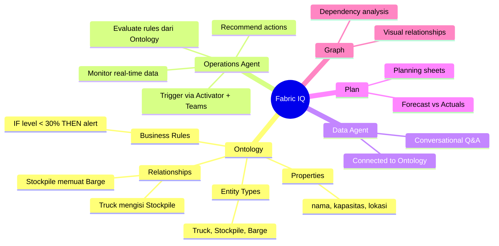
```mermaid
mindmap
    root((Fabric IQ))
        Ontology
            Entity Types
                Truck, Stockpile, Barge
            Properties
                nama, kapasitas, lokasi
            Relationships
                Truck mengisi Stockpile
                Stockpile memuat Barge
            Business Rules
                IF level < 30% THEN alert
        Operations Agent
            Monitor real-time data
            Evaluate rules dari Ontology
            Recommend actions
            Trigger via Activator + Teams
        Data Agent
            Conversational Q&A
            Connected to Ontology
        Plan
            Planning sheets
            Forecast vs Actuals
        Graph
            Visual relationships
            Dependency analysis
```

**Operations Agent** adalah komponen AI otonom yang:
1. **Memonitor** data real-time secara terus-menerus dari Eventhouse
2. **Menginterpretasi** event berdasarkan business rules di Ontology
3. **Merekomendasikan** aksi spesifik ke tim operasional via **Microsoft Teams**
4. **Mengeksekusi** aksi setelah mendapat approval dari manusia (human-in-the-loop)

**Solution:**

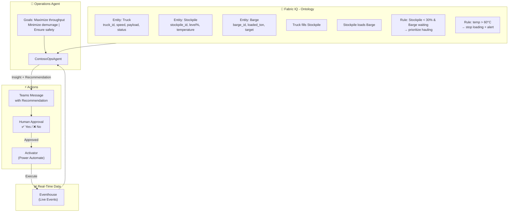
```mermaid
flowchart TD
    subgraph Ontology["📘 Fabric IQ - Ontology"]
        direction TB
        ET1["Entity: Truck\ntruck_id, speed, payload, status"]
        ET2["Entity: Stockpile\nstockpile_id, level%, temperature"]
        ET3["Entity: Barge\nbarge_id, loaded_ton, target"]
        R1["Truck fills Stockpile"]
        R2["Stockpile loads Barge"]
        RULE1["Rule: Stockpile < 30% & Barge waiting\n→ prioritize hauling"]
        RULE2["Rule: temp > 60°C\n→ stop loading + alert"]
    end

    subgraph Agent2["🤖 Operations Agent"]
        OA["ContosoOpsAgent"]
        GOALS["Goals: Maximize throughput\nMinimize demurrage | Ensure safety"]
    end

    subgraph Data["📊 Real-Time Data"]
        EH2["Eventhouse\n(Live Events)"]
    end

    subgraph Action["⚡ Actions"]
        TEAMS3["Teams Message\nwith Recommendation"]
        ACT["Activator\n(Power Automate)"]
        APPROVE["Human Approval\n✅ Yes / ❌ No"]
    end

    EH2 --> OA
    Ontology --> OA
    GOALS --> OA
    OA -->|"Insight + Recommendation"| TEAMS3
    TEAMS3 --> APPROVE
    APPROVE -->|"Approved"| ACT
    ACT -->|"Execute"| EH2
```

**Contoh Skenario Operations Agent:**

| Situasi | Agent Mendeteksi | Rekomendasi | Aksi Setelah Approval |
|---------|-----------------|-------------|----------------------|
| Stockpile Port-A turun ke 20%, tongkang BRG-201 menunggu | *"Port-A critical (20%). BRG-201 waiting 2 hours. Hauling rate insufficient."* | *"Redirect 5 trucks from Pit-B to Port-A route. ETA recovery: 4 hours."* | Update dispatch assignment via Power Automate |
| Suhu stockpile ROM naik ke 65°C | *"ROM temperature 65°C exceeds safety threshold (60°C)."* | *"Stop incoming coal to ROM. Activate water sprinkler. Alert safety team."* | Trigger safety protocol + Teams alert |
| Loading rate tongkang turun 40% | *"BRG-203 loading rate dropped from 1,000 to 600 TPH."* | *"Conveyor belt #2 may have issue. Recommend maintenance check."* | Create maintenance ticket in Maximo |

**Konfigurasi Operations Agent:**

1. **Business Goals:**
   - Maximize coal throughput (target: 15,000 ton/day)
   - Minimize barge waiting time (target: < 4 hours)
   - Maintain stockpile safety temperature (< 60°C)

2. **Instructions:**
   - Prioritas keselamatan di atas produktivitas
   - Selalu rekomendasikan aksi yang bisa dieksekusi
   - Sertakan data pendukung dalam setiap rekomendasi

3. **Knowledge Source:** Eventhouse (ContosoMiningEH)

4. **Actions:**
   - `RedirectTrucks` — mengalihkan truk ke rute tertentu
   - `TriggerSafetyProtocol` — menjalankan prosedur keselamatan
   - `CreateMaintenanceTicket` — membuat tiket pemeliharaan

5. **Recipients:** Dispatch Team, Mine Supervisor, Safety Officer

> **💡 Perbedaan Data Agent vs Operations Agent:**
>
> | Aspek | Data Agent (GA) | Operations Agent (Preview) |
> |-------|----------------|---------------------------|
> | **Mode** | Reaktif — menjawab pertanyaan user | Proaktif — berjalan otomatis di background |
> | **Data Sources** | Maks 5: Lakehouse, Warehouse, KQL DB, Semantic Model, Ontology, Graph | **Eventhouse (KQL Database) saja** |
> | **Ontology** | Bisa dipakai sebagai salah satu data source | Dipakai untuk business rules & reasoning |
> | **Output** | Jawaban terstruktur (tabel, summary) | Rekomendasi aksi via Teams + human approval |
> | **Aksi** | Read-only, tidak bisa eksekusi perubahan | Bisa trigger Activator → Power Automate |
> | **Capacity** | F2+ atau P1+ | F2+ (trial **tidak** didukung) |

---

### Step-by-Step Setup

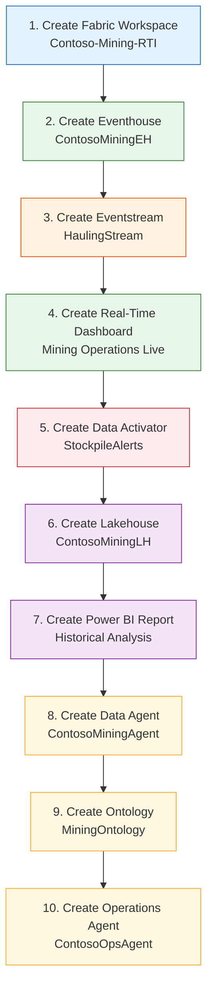
```mermaid
flowchart TD
    S1["1. Create Fabric Workspace\nContoso-Mining-RTI"]
    S2["2. Create Eventhouse\nContosoMiningEH"]
    S3["3. Create Eventstream\nHaulingStream"]
    S4["4. Create Real-Time Dashboard\nMining Operations Live"]
    S5["5. Create Data Activator\nStockpileAlerts"]
    S6["6. Create Lakehouse\nContosoMiningLH"]
    S7["7. Create Power BI Report\nHistorical Analysis"]
    S8["8. Create Data Agent\nContosoMiningAgent"]
    S9["9. Create Ontology\nMiningOntology"]
    S10["10. Create Operations Agent\nContosoOpsAgent"]

    S1 --> S2 --> S3 --> S4 --> S5 --> S6 --> S7 --> S8 --> S9 --> S10

    style S1 fill:#E3F2FD,stroke:#1565C0
    style S2 fill:#E8F5E9,stroke:#2E7D32
    style S3 fill:#FFF3E0,stroke:#E65100
    style S4 fill:#E8F5E9,stroke:#2E7D32
    style S5 fill:#FFEBEE,stroke:#C62828
    style S6 fill:#F3E5F5,stroke:#7B1FA2
    style S7 fill:#F3E5F5,stroke:#7B1FA2
    style S8 fill:#FFF8E1,stroke:#F9A825
    style S9 fill:#FFF8E1,stroke:#F9A825
    style S10 fill:#FFF8E1,stroke:#F9A825
```

### Detail per Step

#### Step 1: Create Workspace

1. Buka [Microsoft Fabric](https://app.fabric.microsoft.com)
2. Klik **Workspaces** → **New Workspace**
3. Nama: `Contoso-Mining-RTI`
4. Pilih kapasitas Fabric yang tersedia

#### Step 2: Create Eventhouse

1. Dalam workspace, klik **+ New item** → **Eventhouse**
2. Nama: `ContosoMiningEH`
3. Otomatis akan membuat **KQL Database** di dalamnya
4. Buat tabel dengan KQL berikut:

```kql
// Tabel untuk data hauling truck
.create table HaulingEvents (
    truck_id: string,
    timestamp: datetime,
    latitude: real,
    longitude: real,
    speed_kmh: real,
    payload_ton: real,
    status: string,
    route: string,
    cycle_phase: string
)

// Tabel untuk data stockpile
.create table StockpileEvents (
    stockpile_id: string,
    timestamp: datetime,
    level_percentage: real,
    estimated_tonnage: real,
    max_capacity_ton: real,
    coal_quality: string,
    temperature_celsius: real
)

// Tabel untuk data barge loading
.create table BargeLoadingEvents (
    barge_id: string,
    timestamp: datetime,
    jetty_id: string,
    loading_rate_tph: real,
    loaded_tonnage: real,
    target_tonnage: real,
    status: string,
    eta_completion: datetime
)
```

#### Step 3: Create Eventstream

1. Klik **+ New item** → **Eventstream**
2. Nama: `HaulingStream`
3. Tambahkan **Source**: Pilih **Custom App** (untuk demo, kita gunakan sample data generator)
4. Tambahkan **Destination**: Pilih **Eventhouse** → database `ContosoMiningEH` → tabel `HaulingEvents`
5. Ulangi untuk `StockpileStream` dan `BargeLoadingStream`

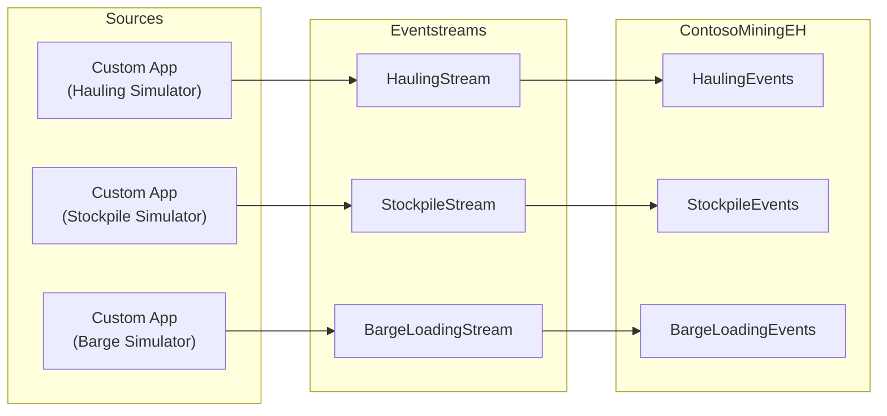
```mermaid
flowchart LR
    subgraph Sources["Sources"]
        CS1["Custom App\n(Hauling Simulator)"]
        CS2["Custom App\n(Stockpile Simulator)"]
        CS3["Custom App\n(Barge Simulator)"]
    end

    subgraph Eventstreams["Eventstreams"]
        ES_H["HaulingStream"]
        ES_S["StockpileStream"]
        ES_B["BargeLoadingStream"]
    end

    subgraph Eventhouse["ContosoMiningEH"]
        T1["HaulingEvents"]
        T2["StockpileEvents"]
        T3["BargeLoadingEvents"]
    end

    CS1 --> ES_H --> T1
    CS2 --> ES_S --> T2
    CS3 --> ES_B --> T3
```

#### Step 4: Create Real-Time Dashboard

1. Dari Eventhouse, klik **New Real-Time Dashboard**
2. Nama: `Mining Operations Live`
3. Tambahkan tiles berikut:

| Tile | Type | KQL Query |
|------|------|-----------|
| Total Tonnage Today | Stat/Scorecard | `HaulingEvents \| where timestamp > ago(1d) \| where status == "unloaded" \| summarize sum(payload_ton)` |
| Active Trucks Map | Map | `HaulingEvents \| summarize arg_max(timestamp, *) by truck_id` |
| Stockpile Levels | Multi-bar chart | `StockpileEvents \| summarize arg_max(timestamp, *) by stockpile_id` |
| Loading Progress | Gauge/Progress | `BargeLoadingEvents \| where status == "loading" \| summarize arg_max(timestamp, *) by barge_id` |
| Hauling Trend (24h) | Time chart | `HaulingEvents \| where timestamp > ago(1d) \| summarize Tons=sum(payload_ton) by bin(timestamp, 1h)` |

#### Step 5: Create Data Activator (Reflex)

1. Klik **+ New item** → **Reflex**
2. Nama: `StockpileAlerts`
3. Connect ke `StockpileEvents` dari Eventhouse
4. Buat trigger rules:

```
IF stockpile level < 30% for any stockpile
THEN send email to dispatch@contosomining.com
AND post to Teams channel "Mining-Alerts"

IF temperature > 60°C for any stockpile  
THEN send CRITICAL alert to safety@contosomining.com
```

#### Step 6: Create Lakehouse

1. Klik **+ New item** → **Lakehouse**
2. Nama: `ContosoMiningLH`
3. Buat **Shortcut** dari Eventhouse ke Lakehouse (one copy of data)
4. Data otomatis tersedia sebagai Delta tables untuk analisis historis

#### Step 7: Create Semantic Model & Power BI Report

##### 7a. Semantic Model Design (Star Schema)

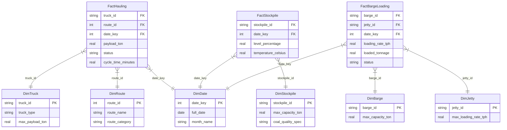
```mermaid
erDiagram
    FactHauling }|--|| DimTruck : "truck_id"
    FactHauling }|--|| DimRoute : "route_id"
    FactHauling }|--|| DimDate : "date_key"
    FactStockpile }|--|| DimStockpile : "stockpile_id"
    FactStockpile }|--|| DimDate : "date_key"
    FactBargeLoading }|--|| DimBarge : "barge_id"
    FactBargeLoading }|--|| DimJetty : "jetty_id"
    FactBargeLoading }|--|| DimDate : "date_key"

    DimTruck {
        string truck_id PK
        string truck_type
        real max_payload_ton
    }
    DimRoute {
        int route_id PK
        string route_name
        string route_category
    }
    DimStockpile {
        string stockpile_id PK
        real max_capacity_ton
        string coal_quality_spec
    }
    DimBarge {
        string barge_id PK
        real max_capacity_ton
    }
    DimJetty {
        string jetty_id PK
        real max_loading_rate_tph
    }
    DimDate {
        int date_key PK
        date full_date
        string month_name
    }
    FactHauling {
        string truck_id FK
        int route_id FK
        int date_key FK
        real payload_ton
        string status
        real cycle_time_minutes
    }
    FactStockpile {
        string stockpile_id FK
        int date_key FK
        real level_percentage
        real temperature_celsius
    }
    FactBargeLoading {
        string barge_id FK
        string jetty_id FK
        int date_key FK
        real loading_rate_tph
        real loaded_tonnage
        string status
    }
```

##### 7b. Membuat Semantic Model di Fabric

1. Dari Lakehouse `ContosoMiningLH`, klik **New Semantic Model**
2. Nama: `ContosoMining_SemanticModel`
3. Pilih semua tabel (Fact + Dim) yang sudah dibuat melalui Notebook:

**Notebook untuk membuat Dimension & Fact tables di Lakehouse:**

```python
# Notebook: Create_Star_Schema
# Jalankan di Lakehouse ContosoMiningLH

from pyspark.sql import functions as F
from pyspark.sql.types import *

# ---- DimTruck ----
dim_truck_data = [
    ("TRK-001", "Truck 001", "Komatsu HD785-7", 42.0, "Driver A", "2023-01-15"),
    ("TRK-002", "Truck 002", "CAT 777F", 40.0, "Driver B", "2023-03-20"),
    ("TRK-003", "Truck 003", "Komatsu HD785-7", 42.0, "Driver C", "2022-08-10"),
    ("TRK-004", "Truck 004", "CAT 777F", 40.0, "Driver D", "2023-06-01"),
    ("TRK-005", "Truck 005", "Komatsu HD785-7", 42.0, "Driver E", "2022-11-22"),
]
dim_truck_schema = StructType([
    StructField("truck_id", StringType()), StructField("truck_name", StringType()),
    StructField("truck_type", StringType()), StructField("max_payload_ton", DoubleType()),
    StructField("operator_name", StringType()), StructField("commissioning_date", StringType()),
])
spark.createDataFrame(dim_truck_data, dim_truck_schema) \
    .write.mode("overwrite").format("delta").saveAsTable("DimTruck")

# ---- DimRoute ----
dim_route_data = [
    (1, "Pit-A1 to ROM-Stockyard", "Pit-A1", "ROM-Stockyard", 5.2, "Pit-to-ROM"),
    (2, "Pit-A2 to ROM-Stockyard", "Pit-A2", "ROM-Stockyard", 6.8, "Pit-to-ROM"),
    (3, "Pit-B1 to Port-A", "Pit-B1", "Port-A", 12.5, "Pit-to-Port"),
    (4, "ROM-Stockyard to Port-A", "ROM-Stockyard", "Port-A", 8.3, "ROM-to-Port"),
    (5, "ROM-Stockyard to Port-B", "ROM-Stockyard", "Port-B", 9.1, "ROM-to-Port"),
]
dim_route_schema = StructType([
    StructField("route_id", IntegerType()), StructField("route_name", StringType()),
    StructField("origin", StringType()), StructField("destination", StringType()),
    StructField("distance_km", DoubleType()), StructField("route_category", StringType()),
])
spark.createDataFrame(dim_route_data, dim_route_schema) \
    .write.mode("overwrite").format("delta").saveAsTable("DimRoute")

# ---- DimStockpile ----
dim_stockpile_data = [
    ("ROM", "ROM Stockyard", "Mine Site", 80000.0, "Mixed"),
    ("PORT-A", "Port-A Stockpile", "Port Area", 50000.0, "GAR-4200"),
    ("PORT-B", "Port-B Stockpile", "Port Area", 50000.0, "GAR-5000"),
]
dim_sp_schema = StructType([
    StructField("stockpile_id", StringType()), StructField("stockpile_name", StringType()),
    StructField("location", StringType()), StructField("max_capacity_ton", DoubleType()),
    StructField("coal_quality_spec", StringType()),
])
spark.createDataFrame(dim_stockpile_data, dim_sp_schema) \
    .write.mode("overwrite").format("delta").saveAsTable("DimStockpile")

# ---- DimBarge ----
dim_barge_data = [
    ("BRG-201", "Barge 201", "PT Pelayaran Nusantara", 8000.0, "Flat-top"),
    ("BRG-202", "Barge 202", "PT Samudera Logistics", 7500.0, "Flat-top"),
    ("BRG-203", "Barge 203", "PT Pelayaran Nusantara", 10000.0, "Self-propelled"),
]
dim_barge_schema = StructType([
    StructField("barge_id", StringType()), StructField("barge_name", StringType()),
    StructField("owner", StringType()), StructField("max_capacity_ton", DoubleType()),
    StructField("vessel_type", StringType()),
])
spark.createDataFrame(dim_barge_data, dim_barge_schema) \
    .write.mode("overwrite").format("delta").saveAsTable("DimBarge")

# ---- DimJetty ----
dim_jetty_data = [
    ("JETTY-1", "Jetty Utama", "Port-A", 2, 1200.0),
    ("JETTY-2", "Jetty Cadangan", "Port-B", 1, 800.0),
]
dim_jetty_schema = StructType([
    StructField("jetty_id", StringType()), StructField("jetty_name", StringType()),
    StructField("location", StringType()), StructField("conveyor_count", IntegerType()),
    StructField("max_loading_rate_tph", DoubleType()),
])
spark.createDataFrame(dim_jetty_data, dim_jetty_schema) \
    .write.mode("overwrite").format("delta").saveAsTable("DimJetty")

# ---- DimDate (generate 2 tahun) ----
from pyspark.sql.functions import col, year, month, dayofmonth, date_format, weekofyear, dayofweek
import datetime

dates = [(datetime.date(2025, 1, 1) + datetime.timedelta(days=i),) for i in range(730)]
df_date = spark.createDataFrame(dates, ["full_date"])
df_date = df_date.withColumn("date_key", F.date_format("full_date", "yyyyMMdd").cast("int")) \
    .withColumn("year", year("full_date")) \
    .withColumn("month", month("full_date")) \
    .withColumn("day", dayofmonth("full_date")) \
    .withColumn("month_name", date_format("full_date", "MMMM")) \
    .withColumn("week_of_year", weekofyear("full_date")) \
    .withColumn("day_name", date_format("full_date", "EEEE")) \
    .withColumn("shift_number", F.when(F.hour(F.current_timestamp()) < 14, 1).otherwise(2))
df_date.write.mode("overwrite").format("delta").saveAsTable("DimDate")

# ---- Fact Tables (dari shortcut Eventhouse) ----
# FactHauling, FactStockpile, FactBargeLoading sudah tersedia
# melalui Shortcut dari Eventhouse ke Lakehouse (lihat Step 6).
# Tambahkan kolom date_key dan route_id via View atau Notebook transform:

df_hauling = spark.sql("SELECT * FROM ContosoMiningLH.HaulingEvents")
df_hauling = df_hauling \
    .withColumn("date_key", F.date_format("timestamp", "yyyyMMdd").cast("int")) \
    .withColumn("cycle_time_minutes", F.lit(None).cast("double"))
df_hauling.write.mode("overwrite").format("delta").saveAsTable("FactHauling")

df_stockpile = spark.sql("SELECT * FROM ContosoMiningLH.StockpileEvents")
df_stockpile = df_stockpile \
    .withColumn("date_key", F.date_format("timestamp", "yyyyMMdd").cast("int"))
df_stockpile.write.mode("overwrite").format("delta").saveAsTable("FactStockpile")

df_barge = spark.sql("SELECT * FROM ContosoMiningLH.BargeLoadingEvents")
df_barge = df_barge \
    .withColumn("date_key", F.date_format("timestamp", "yyyyMMdd").cast("int"))
df_barge.write.mode("overwrite").format("delta").saveAsTable("FactBargeLoading")

print("✅ Star schema tables created successfully!")
```

4. Kembali ke Semantic Model, setup **Relationships**:

| From (Fact) | Column | → To (Dim) | Column | Cardinality |
|-------------|--------|------------|--------|-------------|
| FactHauling | truck_id | DimTruck | truck_id | Many-to-One |
| FactHauling | route | DimRoute | route_name | Many-to-One |
| FactHauling | date_key | DimDate | date_key | Many-to-One |
| FactStockpile | stockpile_id | DimStockpile | stockpile_id | Many-to-One |
| FactStockpile | date_key | DimDate | date_key | Many-to-One |
| FactBargeLoading | barge_id | DimBarge | barge_id | Many-to-One |
| FactBargeLoading | jetty_id | DimJetty | jetty_id | Many-to-One |
| FactBargeLoading | date_key | DimDate | date_key | Many-to-One |

5. Tambahkan **DAX Measures** berikut:

```dax
// ---- HAULING MEASURES ----
Total Tonnage = 
    CALCULATE(
        SUM(FactHauling[payload_ton]),
        FactHauling[status] = "unloaded"
    )

Total Trips = 
    CALCULATE(
        COUNTROWS(FactHauling),
        FactHauling[status] = "unloaded"
    )

Avg Payload Per Trip = 
    DIVIDE([Total Tonnage], [Total Trips], 0)

Avg Cycle Time (min) = 
    AVERAGE(FactHauling[cycle_time_minutes])

Tonnage vs Target % = 
    VAR _actual = [Total Tonnage]
    VAR _target = 15000
    RETURN DIVIDE(_actual, _target, 0)

Active Trucks = 
    CALCULATE(
        DISTINCTCOUNT(FactHauling[truck_id]),
        FactHauling[status] <> "idle"
    )

Idle Trucks = 
    CALCULATE(
        DISTINCTCOUNT(FactHauling[truck_id]),
        FactHauling[status] = "idle"
    )

Truck Utilization % = 
    DIVIDE([Active Trucks], DISTINCTCOUNT(FactHauling[truck_id]), 0)

// ---- STOCKPILE MEASURES ----
Current Stockpile Level % = 
    AVERAGEX(
        VALUES(FactStockpile[stockpile_id]),
        CALCULATE(
            LASTNONBLANK(FactStockpile[timestamp], 1),
            ALLEXCEPT(FactStockpile, FactStockpile[stockpile_id])
        )
    )

Stockpile Utilization % = 
    DIVIDE(
        SUM(FactStockpile[estimated_tonnage]),
        SUM(DimStockpile[max_capacity_ton]),
        0
    )

Avg Temperature = 
    AVERAGE(FactStockpile[temperature_celsius])

Critical Stockpiles = 
    COUNTROWS(
        FILTER(
            VALUES(FactStockpile[stockpile_id]),
            CALCULATE(MAX(FactStockpile[level_percentage])) < 30
        )
    )

// ---- BARGE LOADING MEASURES ----
Loading Efficiency % = 
    DIVIDE(
        SUM(FactBargeLoading[loaded_tonnage]),
        SUM(FactBargeLoading[target_tonnage]),
        0
    )

Avg Loading Rate (TPH) = 
    AVERAGEX(
        FILTER(FactBargeLoading, FactBargeLoading[status] = "loading"),
        FactBargeLoading[loading_rate_tph]
    )

Barges Completed = 
    CALCULATE(
        DISTINCTCOUNT(FactBargeLoading[barge_id]),
        FactBargeLoading[status] = "loaded" || FactBargeLoading[status] = "departed"
    )

Total Shipped Tonnage = 
    CALCULATE(
        SUM(FactBargeLoading[loaded_tonnage]),
        FactBargeLoading[status] IN {"loaded", "departed"}
    )

Avg Barge Wait Time (hrs) = 
    AVERAGEX(
        FILTER(FactBargeLoading, FactBargeLoading[status] = "waiting"),
        DATEDIFF(FactBargeLoading[timestamp], FactBargeLoading[eta_completion], HOUR)
    )
```

##### 7c. Create Power BI Report

1. Dari Semantic Model `ContosoMining_SemanticModel`, klik **Create Report**
2. Nama report: `ContosoMining_Historical_Analysis`
3. Buat halaman-halaman berikut (detail di bagian **Visualization Design** di bawah)

---

## 📐 Visualization Design

### A. Real-Time Dashboard Layout (`Mining Operations Live`)

Dashboard ini dibuat di **Eventhouse → New Real-Time Dashboard** dan menggunakan **KQL queries** langsung.

**Layout Grid: 12 kolom × 8 baris**

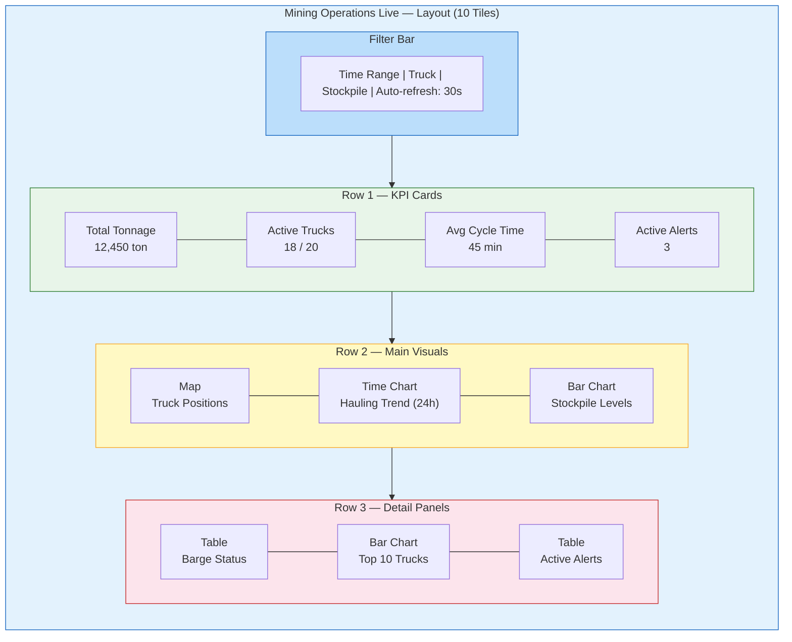
```mermaid
flowchart TB
    subgraph DB["Mining Operations Live — Layout (10 Tiles)"]
        direction TB
        subgraph R0["Filter Bar"]
            F["Time Range | Truck | Stockpile | Auto-refresh: 30s"]
        end
        subgraph R1["Row 1 — KPI Cards"]
            direction LR
            K1["Total Tonnage\n12,450 ton"] --- K2["Active Trucks\n18 / 20"] --- K3["Avg Cycle Time\n45 min"] --- K4["Active Alerts\n3"]
        end
        subgraph R2["Row 2 — Main Visuals"]
            direction LR
            MAP["Map\nTruck Positions"] --- TREND["Time Chart\nHauling Trend (24h)"] --- SP["Bar Chart\nStockpile Levels"]
        end
        subgraph R3["Row 3 — Detail Panels"]
            direction LR
            BARGE["Table\nBarge Status"] --- PERF["Bar Chart\nTop 10 Trucks"] --- ALERT["Table\nActive Alerts"]
        end
    end
    R0 --> R1 --> R2 --> R3

    style DB fill:#E3F2FD,stroke:#1565C0
    style R0 fill:#BBDEFB,stroke:#1565C0
    style R1 fill:#E8F5E9,stroke:#2E7D32
    style R2 fill:#FFF9C4,stroke:#F9A825
    style R3 fill:#FCE4EC,stroke:#C62828
```

**Detail Tile Specifications:**

| # | Tile Name | Visual Type | KQL Query | Size | Refresh |
|---|-----------|-------------|-----------|------|---------|
| 1 | Total Tonnage Today | Stat/Scorecard | `HaulingEvents \| where timestamp > ago(1d) and status == "unloaded" \| summarize round(sum(payload_ton),0)` | 3×1 | 30s |
| 2 | Active Trucks | Stat/Scorecard | `HaulingEvents \| summarize arg_max(timestamp,*) by truck_id \| where status != "idle" \| count` | 3×1 | 30s |
| 3 | Avg Cycle Time | Stat/Scorecard | `HaulingEvents \| where timestamp > ago(1d) \| summarize avg(cycle_time_minutes) \| project round(Column1,0)` | 3×1 | 30s |
| 4 | Alerts Active | Stat/Scorecard | Count dari Data Activator alert feed | 3×1 | 30s |
| 5 | Truck Map | Map | `HaulingEvents \| summarize arg_max(timestamp,*) by truck_id \| project truck_id, latitude, longitude, status, payload_ton` | 6×2 | 30s |
| 6 | Hauling Trend | Time chart | `HaulingEvents \| where timestamp > ago(1d) and status == "unloaded" \| summarize Tons=sum(payload_ton) by bin(timestamp,1h)` | 6×1 | 30s |
| 7 | Stockpile Levels | Multi-bar chart | `StockpileEvents \| summarize arg_max(timestamp,*) by stockpile_id \| project stockpile_id, level_percentage` | 6×1 | 60s |
| 8 | Barge Status | Table | `BargeLoadingEvents \| summarize arg_max(timestamp,*) by barge_id \| project barge_id, status, loaded_tonnage, target_tonnage, Progress=round(loaded_tonnage/target_tonnage*100,0)` | 4×1 | 45s |
| 9 | Truck Performance | Bar chart | `HaulingEvents \| where timestamp > ago(1d) and status == "unloaded" \| summarize Tons=round(sum(payload_ton),0) by truck_id \| top 10 by Tons` | 4×1 | 30s |
| 10 | Active Alerts | Table | Alert feed dari Data Activator | 4×1 | 30s |

### B. Power BI Report Pages (`ContosoMining_Historical_Analysis`)

Report ini menggunakan **Semantic Model** (DirectLake mode) untuk analisis historis.

#### Page 1: Hauling Performance

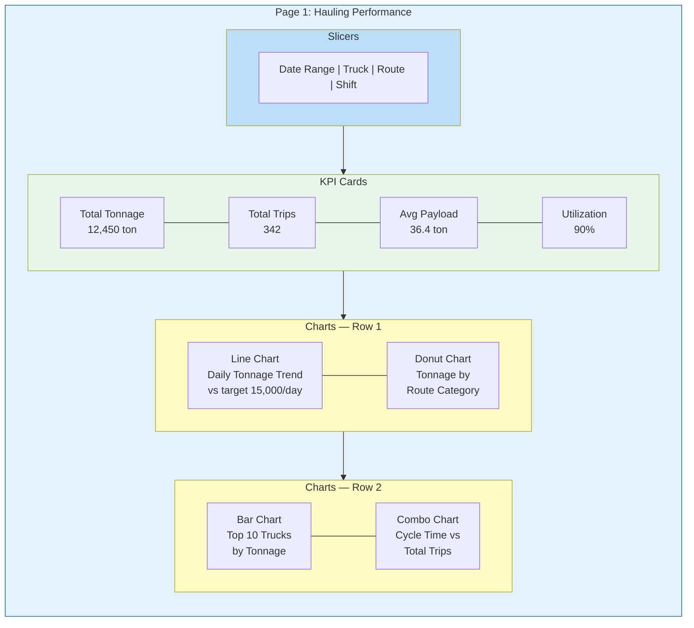
```mermaid
flowchart TB
    subgraph P1["Page 1: Hauling Performance"]
        direction TB
        subgraph P1F["Slicers"]
            SF["Date Range | Truck | Route | Shift"]
        end
        subgraph P1K["KPI Cards"]
            direction LR
            PK1["Total Tonnage\n12,450 ton"] --- PK2["Total Trips\n342"] --- PK3["Avg Payload\n36.4 ton"] --- PK4["Utilization\n90%"]
        end
        subgraph P1C["Charts — Row 1"]
            direction LR
            PC1["Line Chart\nDaily Tonnage Trend\nvs target 15,000/day"] --- PC2["Donut Chart\nTonnage by\nRoute Category"]
        end
        subgraph P1D["Charts — Row 2"]
            direction LR
            PD1["Bar Chart\nTop 10 Trucks\nby Tonnage"] --- PD2["Combo Chart\nCycle Time vs\nTotal Trips"]
        end
    end
    P1F --> P1K --> P1C --> P1D

    style P1 fill:#E3F2FD,stroke:#1565C0
    style P1F fill:#BBDEFB
    style P1K fill:#E8F5E9
    style P1C fill:#FFF9C4
    style P1D fill:#FFF9C4
```

**Visual Specifications — Page 1:**

| Visual | Type | Axis / Fields | Measure | Interaksi |
|--------|------|--------------|---------|-----------|
| KPI Cards (×4) | Card | — | `[Total Tonnage]`, `[Total Trips]`, `[Avg Payload Per Trip]`, `[Truck Utilization %]` | Filter by date slicer |
| Daily Tonnage Trend | Line Chart | X: `DimDate[full_date]` | Y: `[Total Tonnage]`, Constant line: 15,000 | Drill: Year→Month→Day |
| Tonnage by Route | Donut Chart | Legend: `DimRoute[route_category]` | Values: `[Total Tonnage]` | Cross-filter map |
| Top 10 Trucks | Clustered Bar | Y: `DimTruck[truck_name]` | X: `[Total Tonnage]` | Sort desc, Top N=10 |
| Cycle Time vs Trips | Combo Chart | X: `DimDate[full_date]` | Column: `[Total Trips]`, Line: `[Avg Cycle Time (min)]` | Dual axis |

#### Page 2: Stockpile Analytics

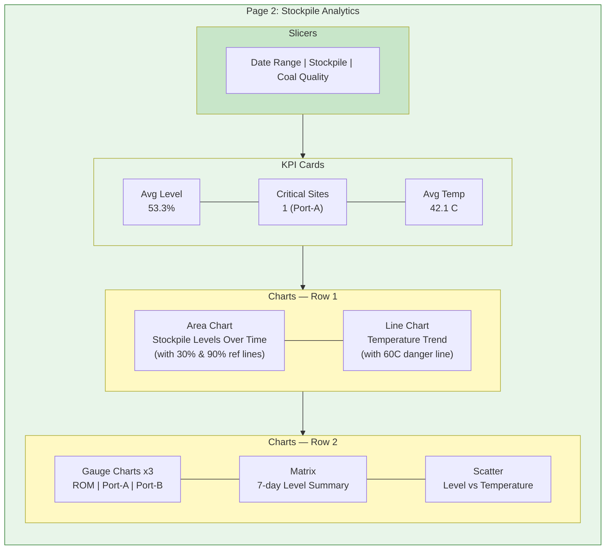
```mermaid
flowchart TB
    subgraph P2["Page 2: Stockpile Analytics"]
        direction TB
        subgraph P2F["Slicers"]
            SF2["Date Range | Stockpile | Coal Quality"]
        end
        subgraph P2K["KPI Cards"]
            direction LR
            PK1["Avg Level\n53.3%"] --- PK2["Critical Sites\n1 (Port-A)"] --- PK3["Avg Temp\n42.1 C"]
        end
        subgraph P2C["Charts — Row 1"]
            direction LR
            PC1["Area Chart\nStockpile Levels Over Time\n(with 30% & 90% ref lines)"] --- PC2["Line Chart\nTemperature Trend\n(with 60C danger line)"]
        end
        subgraph P2D["Charts — Row 2"]
            direction LR
            PD1["Gauge Charts x3\nROM | Port-A | Port-B"] --- PD2["Matrix\n7-day Level Summary"] --- PD3["Scatter\nLevel vs Temperature"]
        end
    end
    P2F --> P2K --> P2C --> P2D

    style P2 fill:#E8F5E9,stroke:#2E7D32
    style P2F fill:#C8E6C9
    style P2K fill:#E8F5E9
    style P2C fill:#FFF9C4
    style P2D fill:#FFF9C4
```

**Visual Specifications — Page 2:**

| Visual | Type | Axis / Fields | Measure | Interaksi |
|--------|------|--------------|---------|-----------|
| KPI Cards (×3) | Card | — | `[Current Stockpile Level %]`, `[Critical Stockpiles]`, `[Avg Temperature]` | Filter by stockpile |
| Levels Over Time | Area Chart | X: `timestamp` (1h bins) | Y: `level_percentage`, Series: `stockpile_id` | Reference lines 30%, 90% |
| Temperature Trend | Line Chart | X: `timestamp` (1h bins) | Y: `temperature_celsius`, Series: `stockpile_id` | Danger zone shading |
| Current Level Gauges | Gauge (×3) | — | `level_percentage` per stockpile | Red/Yellow/Green zones |
| Daily Summary | Matrix | Rows: `stockpile_id`, Cols: `date` | `AVG(level_percentage)` | Conditional formatting |
| Level vs Temp | Scatter | X: `level_percentage`, Y: `temperature_celsius` | Size: `estimated_tonnage` | Cross-filter |

#### Page 3: Shipping & Barge Summary

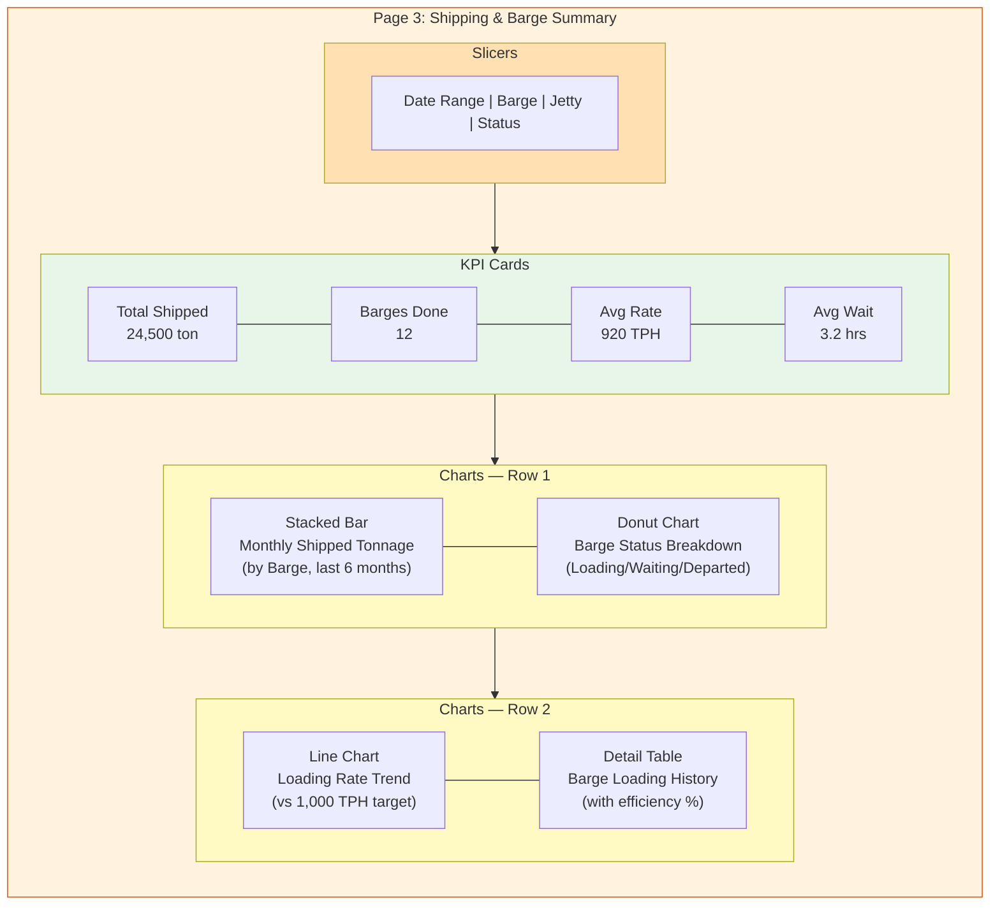
```mermaid
flowchart TB
    subgraph P3["Page 3: Shipping & Barge Summary"]
        direction TB
        subgraph P3F["Slicers"]
            SF3["Date Range | Barge | Jetty | Status"]
        end
        subgraph P3K["KPI Cards"]
            direction LR
            PK1["Total Shipped\n24,500 ton"] --- PK2["Barges Done\n12"] --- PK3["Avg Rate\n920 TPH"] --- PK4["Avg Wait\n3.2 hrs"]
        end
        subgraph P3C["Charts — Row 1"]
            direction LR
            PC1["Stacked Bar\nMonthly Shipped Tonnage\n(by Barge, last 6 months)"] --- PC2["Donut Chart\nBarge Status Breakdown\n(Loading/Waiting/Departed)"]
        end
        subgraph P3D["Charts — Row 2"]
            direction LR
            PD1["Line Chart\nLoading Rate Trend\n(vs 1,000 TPH target)"] --- PD2["Detail Table\nBarge Loading History\n(with efficiency %)"]
        end
    end
    P3F --> P3K --> P3C --> P3D

    style P3 fill:#FFF3E0,stroke:#E65100
    style P3F fill:#FFE0B2
    style P3K fill:#E8F5E9
    style P3C fill:#FFF9C4
    style P3D fill:#FFF9C4
```

**Visual Specifications — Page 3:**

| Visual | Type | Axis / Fields | Measure | Interaksi |
|--------|------|--------------|---------|-----------|
| KPI Cards (×4) | Card | — | `[Total Shipped Tonnage]`, `[Barges Completed]`, `[Avg Loading Rate (TPH)]`, `[Avg Barge Wait Time (hrs)]` | Filter by date |
| Monthly Shipped | Stacked Bar | X: `DimDate[month_name]` | Y: `[Total Shipped Tonnage]`, Stack: `DimBarge[barge_name]` | Drill: Month→Week |
| Status Breakdown | Donut Chart | Legend: `status` | Count of `barge_id` | Cross-filter table |
| Loading Rate Trend | Line Chart | X: `DimDate[full_date]` | Y: `[Avg Loading Rate (TPH)]`, Color: `DimJetty[jetty_name]` | Target line 1,000 |
| Barge History Table | Table | All barge fields | `[Loading Efficiency %]`, duration | Sort, conditional format |

1. Dalam workspace, klik **+ New item** → **Data Agent**
2. Nama: `ContosoMiningAgent`
3. **Add Data Sources** (maks 5 dalam kombinasi apapun: Lakehouse, Warehouse, KQL DB, Semantic Model, Ontology, Graph):
   - KQL Database: `ContosoMiningEH` → pilih tabel `HaulingEvents`, `StockpileEvents`, `BargeLoadingEvents`
   - Lakehouse: `ContosoMiningLH` → pilih tabel historis
   - Power BI Semantic Model: `Historical Analysis`
   - *(Opsional)* Ontology: `MiningOntology` — jika sudah dibuat di Step 9
4. **Add Instructions:**
   ```
   Kamu adalah asisten data operasional Contoso Mining.
   - Jawab pertanyaan tentang hauling, stockpile, dan barge loading
   - Gunakan satuan ton untuk tonase, km/h untuk kecepatan
   - Untuk pertanyaan real-time, gunakan KQL Database
   - Untuk pertanyaan historis/trend, gunakan Lakehouse
   - Untuk pertanyaan KPI/metrik bisnis, gunakan Power BI Semantic Model
   ```
5. **Add Example Queries** (sample question-query pairs):
   - "Berapa total tonase hari ini?" → KQL: `HaulingEvents | where timestamp > ago(1d) | summarize sum(payload_ton)`
   - "Stockpile mana yang level-nya paling rendah?" → KQL: `StockpileEvents | summarize arg_max(timestamp, *) by stockpile_id | sort by level_percentage asc`
6. Klik **Publish** untuk membuat endpoint yang bisa dikonsumsi
7. **Optional:** Integrasikan ke **Copilot Studio** untuk akses via Teams, atau ke **Microsoft 365 Copilot** untuk akses di Outlook/Excel

#### Step 9: Create Ontology (Fabric IQ)

1. Klik **+ New item** → cari di bagian **Fabric IQ** → **Ontology**
2. Nama: `MiningOntology`
3. **Define Entity Types:**

| Entity Type | Properties | Data Binding |
|-------------|------------|-------------|
| **Truck** | truck_id, speed_kmh, payload_ton, status, route | Eventhouse → HaulingEvents |
| **Stockpile** | stockpile_id, level_percentage, temperature_celsius, coal_quality | Eventhouse → StockpileEvents |
| **Barge** | barge_id, loaded_tonnage, target_tonnage, status, eta_completion | Eventhouse → BargeLoadingEvents |

4. **Define Relationships:**
   - Truck → *fills* → Stockpile
   - Stockpile → *loads* → Barge
5. **Define Business Rules (via Activator):**
   - IF Stockpile.level_percentage < 30% AND Barge.status == "waiting" → trigger `PrioritizeHauling`
   - IF Stockpile.temperature_celsius > 60 → trigger `SafetyProtocol`
6. **Bind to Data:** Map setiap entity type ke tabel dan kolom yang sesuai di Eventhouse

#### Step 10: Create Operations Agent

1. Klik **+ New item** → di bagian **Real-Time Intelligence** → **Operations Agent**
2. Nama: `ContosoOpsAgent`
3. **Configure Agent Setup:**

   **a. Business Goals:**
   ```
   1. Maximize daily coal throughput to meet target of 15,000 tons/day
   2. Minimize barge waiting time to under 4 hours
   3. Maintain stockpile temperature below 60°C for safety
   4. Optimize truck utilization and reduce idle time
   ```

   **b. Instructions:**
   ```
   - Safety is the highest priority — always recommend safety actions first
   - Include supporting data (numbers, trends) in every recommendation
   - Recommend actionable steps, not just observations
   - When stockpile is critical and barge is waiting, prioritize hauling redirection
   ```

   **c. Knowledge Source:** Eventhouse `ContosoMiningEH`

   **d. Actions:**
   - `RedirectTrucks` (params: truck_count, from_route, to_route)
   - `TriggerSafetyProtocol` (params: stockpile_id, protocol_type)
   - `CreateMaintenanceTicket` (params: equipment_id, issue_description)

4. Klik **Save** → Agent akan generate **Playbook** otomatis
5. Review playbook (concepts, rules, properties mapping)
6. Klik **Start** untuk mengaktifkan agent
7. **Install Teams App:** Cari "Fabric Operations Agent" di Teams app store agar menerima notifikasi rekomendasi

> **⚠️ Note:** Operations Agent berjalan menggunakan **identity creator-nya**. Saat recipient approve rekomendasi, aksi dijalankan dengan permission creator. Pastikan permission sesuai.

---

## 🔗 End-to-End Data Flow Summary

Diagram berikut menunjukkan aliran data lengkap dari generator hingga visualisasi dan AI:

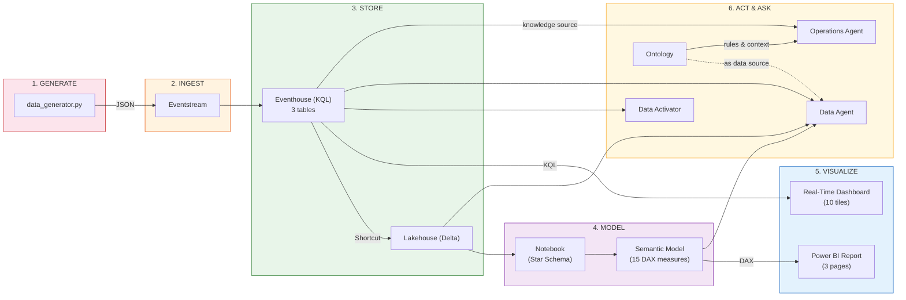
```mermaid
flowchart LR
    subgraph S1["1. GENERATE"]
        PY["data_generator.py"]
    end
    subgraph S2["2. INGEST"]
        ES["Eventstream"]
    end
    subgraph S3["3. STORE"]
        EH["Eventhouse (KQL)\n3 tables"]
        LH["Lakehouse (Delta)"]
    end
    subgraph S4["4. MODEL"]
        NB["Notebook\n(Star Schema)"]
        SM["Semantic Model\n(15 DAX measures)"]
    end
    subgraph S5["5. VISUALIZE"]
        RTD["Real-Time Dashboard\n(10 tiles)"]
        PBI["Power BI Report\n(3 pages)"]
    end
    subgraph S6["6. ACT & ASK"]
        DA["Data Activator"]
        AG["Data Agent"]
        ONT["Ontology"]
        OP["Operations Agent"]
    end

    PY -->|JSON| ES
    ES --> EH
    EH -->|Shortcut| LH
    LH --> NB --> SM
    EH -->|KQL| RTD
    SM -->|DAX| PBI
    EH --> DA
    EH & LH & SM --> AG
    ONT -.->|"as data source"| AG
    EH -->|"knowledge source"| OP
    ONT -->|"rules & context"| OP

    style S1 fill:#FCE4EC,stroke:#C62828
    style S2 fill:#FFF3E0,stroke:#E65100
    style S3 fill:#E8F5E9,stroke:#2E7D32
    style S4 fill:#F3E5F5,stroke:#7B1FA2
    style S5 fill:#E3F2FD,stroke:#1565C0
    style S6 fill:#FFF8E1,stroke:#F9A825
```

**Checklist End-to-End:**

| # | Stage | Item | Detail | Status |
|---|-------|------|--------|--------|
| 1 | Generate | `data_generator.py` | Python script: 3 simulators, azure-eventhub SDK | ✅ Defined |
| 2 | Ingest | Eventstream (×3) | HaulingStream, StockpileStream, BargeLoadingStream | ✅ Defined |
| 3 | Store (RT) | Eventhouse tables (×3) | HaulingEvents, StockpileEvents, BargeLoadingEvents + KQL `.create table` | ✅ Defined |
| 4 | Store (Historical) | Lakehouse Shortcut | Delta tables dari Eventhouse → Lakehouse | ✅ Defined |
| 5 | Transform | Notebook (PySpark) | Star Schema: 6 Dim tables + 3 Fact tables | ✅ Defined |
| 6 | Model | Semantic Model | 8 relationships + 15 DAX measures (DirectLake mode) | ✅ Defined |
| 7 | Visualize (RT) | Real-Time Dashboard | 10 tiles: map, scorecards, charts, tables (KQL) | ✅ Defined |
| 8 | Visualize (Historical) | Power BI Report | 3 pages: Hauling, Stockpile, Shipping (15+ visuals) | ✅ Defined |
| 9 | Alert | Data Activator | Stockpile level & temperature rules | ✅ Defined |
| 10 | AI - Q&A | Data Agent | NL2KQL/NL2SQL, 5 data sources, Copilot Studio integration | ✅ Defined |
| 11 | AI - Proactive | Ontology + Operations Agent | Entity types, relationships, business goals, Teams integration | ✅ Defined |

---

## 🎬 Demo Script (20-Minute Presentation)

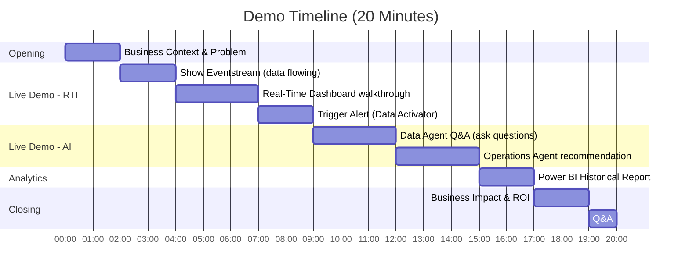
```mermaid
gantt
    title Demo Timeline (20 Minutes)
    dateFormat mm:ss
    axisFormat %M:%S

    section Opening
    Business Context & Problem      :a1, 00:00, 2m

    section Live Demo - RTI
    Show Eventstream (data flowing)  :a2, 02:00, 2m
    Real-Time Dashboard walkthrough  :a3, 04:00, 3m
    Trigger Alert (Data Activator)   :a4, 07:00, 2m

    section Live Demo - AI
    Data Agent Q&A (ask questions)   :a5, 09:00, 3m
    Operations Agent recommendation  :a6, 12:00, 3m

    section Analytics
    Power BI Historical Report       :a7, 15:00, 2m

    section Closing
    Business Impact & ROI            :a8, 17:00, 2m
    Q&A                              :a9, 19:00, 1m
```

### Narasi Demo

| Waktu | Slide/Screen | Yang Dikatakan |
|-------|-------------|----------------|
| 0:00 | Slide: Problem | *"Contoso Mining mengelola 50+ truk, 3 stockpile, dan 3-5 tongkang per hari. Saat ini monitoring masih manual — kita kehilangan visibility."* |
| 2:00 | Eventstream | *"Data dari GPS truk, IoT sensor, dan SCADA mengalir setiap 30 detik ke Microsoft Fabric melalui Eventstream."* |
| 4:00 | RT Dashboard | *"Ini dashboard real-time. Kita bisa lihat posisi setiap truk, tonase total hari ini, dan level stockpile — semuanya LIVE."* |
| 7:00 | Data Activator | *"Ketika stockpile Port-A turun di bawah 30%, sistem otomatis mengirim alert ke dispatch team via email dan Teams."* |
| 9:00 | Data Agent | *"Sekarang fitur paling menarik — saya akan bertanya ke data menggunakan bahasa natural. 'Berapa total tonase hari ini?' ... Dalam hitungan detik, Data Agent menjawab dengan angka akurat langsung dari data. Tanpa perlu menulis query!"* |
| 12:00 | Ops Agent (Teams) | *"Ini Operations Agent — AI yang berjalan 24/7 memonitor data. Dia baru saja mendeteksi stockpile kritis dan tongkang menunggu. Lihat di Teams — agent merekomendasikan 'Redirect 5 truk ke rute Port-A'. Kita tinggal klik Yes untuk approve."* |
| 15:00 | Power BI | *"Untuk analisis historis, data yang sama tersedia di Lakehouse. Kita bisa lihat trend mingguan dan identifikasi bottleneck."* |
| 17:00 | Slide: Impact | *"Dengan solusi lengkap ini — RTI, Data Agent, dan Operations Agent — Contoso Mining mendapat real-time visibility, conversational analytics, dan AI-driven operations."* |

---

## 💰 Expected Business Impact

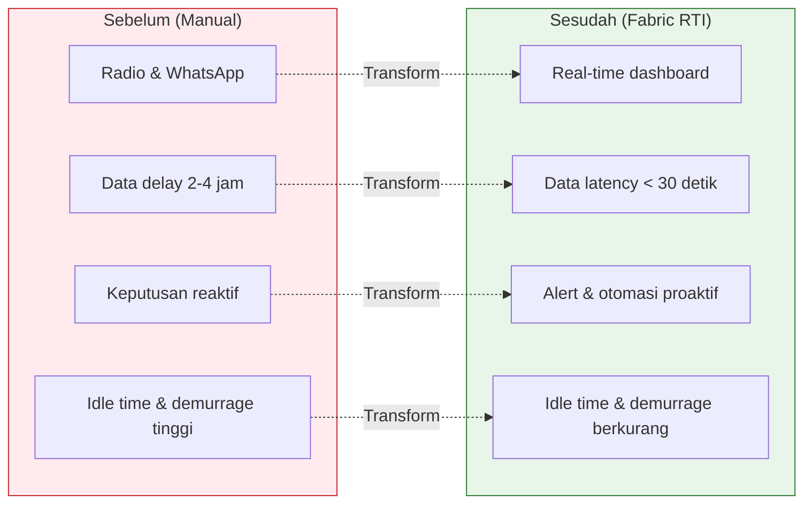
```mermaid
flowchart LR
    subgraph Before["Sebelum (Manual)"]
        B1["Radio & WhatsApp"]
        B2["Data delay 2-4 jam"]
        B3["Keputusan reaktif"]
        B4["Idle time & demurrage tinggi"]
    end
    subgraph After["Sesudah (Fabric RTI)"]
        A1["Real-time dashboard"]
        A2["Data latency < 30 detik"]
        A3["Alert & otomasi proaktif"]
        A4["Idle time & demurrage berkurang"]
    end

    B1 -.->|Transform| A1
    B2 -.->|Transform| A2
    B3 -.->|Transform| A3
    B4 -.->|Transform| A4

    style Before fill:#FFEBEE,stroke:#C62828
    style After fill:#E8F5E9,stroke:#2E7D32
```

| KPI | Before | After (Expected) | Improvement |
|-----|--------|-------------------|-------------|
| Data latency | 2-4 jam | < 30 detik | **~99% faster** |
| Truck idle time | ~45 min/day | ~25 min/day | **44% reduction** |
| Stockpile visibility | Manual check 2x/day | Real-time continuous | **Real-time** |
| Demurrage incidents | 3-4x/month | 0-1x/month | **75% reduction** |
| Decision speed | Hours | Minutes | **Significantly faster** |
| Data accessibility | Hanya tim data/IT | Semua level manajemen (via Data Agent) | **Demokratisasi data** |
| Operational response | Manual analysis + decision | AI recommendation + 1-click approval | **Autonomous operations** |

---

## 🧩 Fabric Features Used — Summary

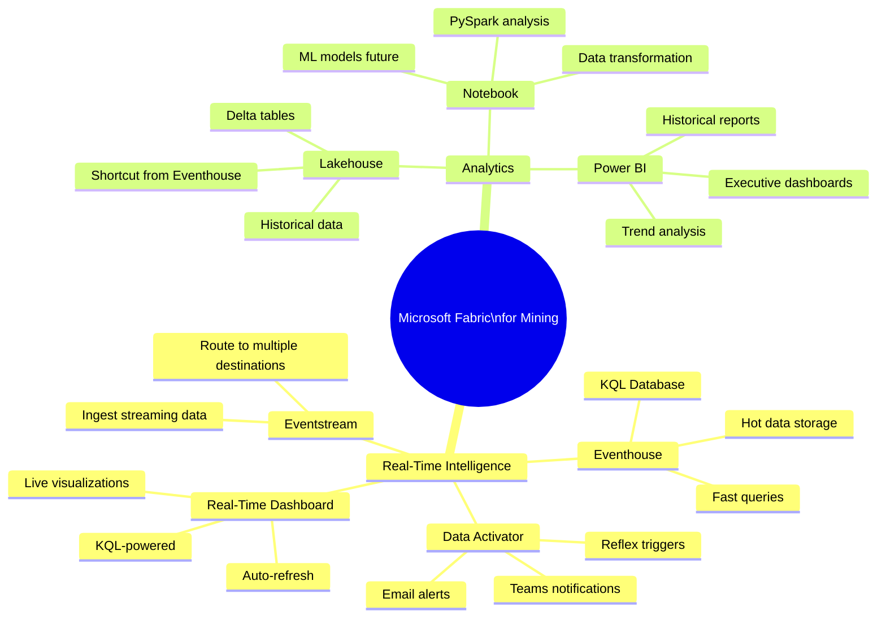
```mermaid
mindmap
    root((Microsoft Fabric\nfor Mining))
        Real-Time Intelligence
            Eventstream
                Ingest streaming data
                Route to multiple destinations
            Eventhouse
                KQL Database
                Hot data storage
                Fast queries
            Real-Time Dashboard
                Live visualizations
                Auto-refresh
                KQL-powered
            Data Activator
                Reflex triggers
                Email alerts
                Teams notifications
        Analytics
            Lakehouse
                Delta tables
                Historical data
                Shortcut from Eventhouse
            Notebook
                PySpark analysis
                Data transformation
                ML models future
            Power BI
                Historical reports
                Trend analysis
                Executive dashboards
```

| Feature | Role in Demo | Kenapa Dipakai? |
|---------|-------------|-----------------|
| **Eventstream** | Data ingestion | Menerima data streaming dari berbagai sumber tanpa coding |
| **Eventhouse** | Real-time storage | Database optimized untuk time-series data, query super cepat |
| **KQL Queryset** | Data exploration | Bahasa query powerful untuk analisis data real-time |
| **Real-Time Dashboard** | Live monitoring | Dashboard yang auto-refresh, langsung dari KQL |
| **Data Activator** | Automated alerts | No-code alert rules, kirim notifikasi otomatis |
| **Lakehouse** | Historical storage | Menyimpan data historis dalam format Delta untuk analisis mendalam |
| **Notebook** | Data processing | PySpark untuk transformasi dan analisis data kompleks |
| **Power BI** | Business reporting | Reporting untuk manajemen dan analisis trend |

---

## 📁 Workspace Structure

```
Contoso-Mining-RTI (Workspace)
│
├── 📦 ContosoMiningEH (Eventhouse)
│   └── ContosoMiningEH (KQL Database)
│       ├── HaulingEvents (Table)
│       ├── StockpileEvents (Table)
│       └── BargeLoadingEvents (Table)
│
├── 🔄 HaulingStream (Eventstream)
├── 🔄 StockpileStream (Eventstream)
├── 🔄 BargeLoadingStream (Eventstream)
│
├── 📊 Mining Operations Live (Real-Time Dashboard)
│
├── ⚠️ StockpileAlerts (Reflex / Data Activator)
│
├── 🏠 ContosoMiningLH (Lakehouse)
│   ├── Tables/
│   │   ├── hauling_events (Delta)
│   │   ├── stockpile_events (Delta)
│   │   └── barge_loading_events (Delta)
│   └── Files/
│
├── 📓 DataExploration (Notebook - PySpark)
│
├── 📈 Historical Analysis (Power BI Report)
│   ├── Page: Hauling Performance
│   ├── Page: Stockpile Analytics
│   └── Page: Shipping Summary
│
├── 🤖 ContosoMiningAgent (Data Agent)           ← NEW
│   ├── Sources: KQL DB, Lakehouse, Power BI
│   ├── Instructions: mining-specific guidance
│   └── Example Queries: 5-10 pairs
│
├── 📘 MiningOntology (Ontology - Fabric IQ)      ← NEW
│   ├── Entity Types: Truck, Stockpile, Barge
│   ├── Relationships: fills, loads
│   ├── Data Bindings: → Eventhouse tables
│   └── Business Rules: → Activator triggers
│
└── 🧠 ContosoOpsAgent (Operations Agent)          ← NEW
    ├── Goals: throughput, demurrage, safety
    ├── Knowledge: Eventhouse (ContosoMiningEH)
    ├── Actions: RedirectTrucks, SafetyProtocol, MaintenanceTicket
    └── Recipients: Dispatch, Supervisor, Safety
```

---

## 🚀 Next Steps (Post-Demo)

| Phase | Timeline | Scope |
|-------|----------|-------|
| **Phase 1 — Pilot** | Month 1-2 | 1 site, hauling monitoring + real-time dashboard |
| **Phase 2 — Expand** | Month 3-4 | Add stockpile + barge loading + Data Activator alerts |
| **Phase 3 — AI** | Month 5-6 | Deploy Data Agent + Ontology + Operations Agent |
| **Phase 4 — Scale** | Month 7-8 | All sites, full integration with ERP |
| **Phase 5 — Advanced** | Month 9+ | Predictive analytics, ML models, Digital Twin |

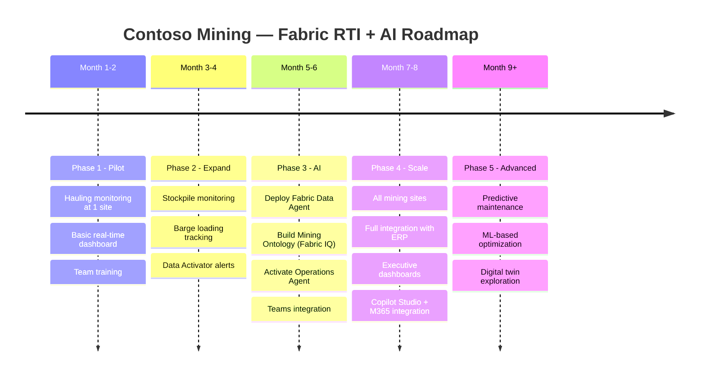
```mermaid
timeline
    title Contoso Mining — Fabric RTI + AI Roadmap
    Month 1-2 : Phase 1 - Pilot
              : Hauling monitoring at 1 site
              : Basic real-time dashboard
              : Team training
    Month 3-4 : Phase 2 - Expand
              : Stockpile monitoring
              : Barge loading tracking
              : Data Activator alerts
    Month 5-6 : Phase 3 - AI
              : Deploy Fabric Data Agent
              : Build Mining Ontology (Fabric IQ)
              : Activate Operations Agent
              : Teams integration
    Month 7-8 : Phase 4 - Scale
              : All mining sites
              : Full integration with ERP
              : Executive dashboards
              : Copilot Studio + M365 integration
    Month 9+  : Phase 5 - Advanced
              : Predictive maintenance
              : ML-based optimization
              : Digital twin exploration
```

---

## 📝 Prerequisites for Demo

| Item | Details |
|------|---------|
| **Fabric Capacity** | F2 atau higher (trial capacity **tidak** didukung untuk Operations Agent) |
| **Fabric Workspace** | 1 workspace dengan RTI enabled |
| **Data Simulator** | Python script atau Custom App untuk generate sample data |
| **Browser** | Microsoft Edge atau Chrome (latest) |
| **Admin Settings** | Copilot & Azure OpenAI enabled di tenant, cross-geo AI processing (jika capacity di luar US/EU) |
| **Microsoft Teams** | Untuk menerima rekomendasi dari Operations Agent — install app "Fabric Operations Agent" |
| **Audience** | Business stakeholders, IT team, management |

---

## 📚 Reference Documentation (Microsoft Learn)

Semua fitur yang digunakan dalam demo plan ini telah diverifikasi dengan dokumentasi resmi Microsoft:

| Feature | Status | Documentation |
|---------|--------|---------------|
| **Eventstream** | GA | [Microsoft Fabric Eventstreams](https://learn.microsoft.com/fabric/real-time-intelligence/event-streams/overview) |
| **Eventhouse** | GA | [Eventhouse overview](https://learn.microsoft.com/fabric/real-time-intelligence/eventhouse) |
| **Real-Time Dashboard** | GA | [Create a Real-Time Dashboard](https://learn.microsoft.com/fabric/real-time-intelligence/dashboard-real-time-create) |
| **Data Activator** | GA | [What is Activator?](https://learn.microsoft.com/fabric/real-time-intelligence/data-activator/activator-introduction) |
| **KQL Queryset** | GA | [Query data in KQL queryset](https://learn.microsoft.com/fabric/real-time-intelligence/kusto-query-set) |
| **Copilot for KQL** | GA | [Copilot for writing KQL queries](https://learn.microsoft.com/fabric/real-time-intelligence/copilot-writing-queries) |
| **Lakehouse** | GA | [Lakehouse overview](https://learn.microsoft.com/fabric/data-engineering/lakehouse-overview) |
| **Fabric Data Agent** | **GA** | [Data Agent concepts](https://learn.microsoft.com/fabric/data-science/concept-data-agent) |
| **Fabric IQ** | **Preview** | [What is Fabric IQ?](https://learn.microsoft.com/fabric/iq/overview) |
| **Ontology** | **Preview** | [What is Ontology?](https://learn.microsoft.com/fabric/iq/ontology/overview) |
| **Operations Agent** | **Preview** | [Create and configure Operations Agents](https://learn.microsoft.com/fabric/real-time-intelligence/operations-agent) |
| **Power BI** | GA | [Power BI documentation](https://learn.microsoft.com/power-bi/) |

> ⚠️ **Feature dengan status "Preview"** mungkin mengalami perubahan sebelum GA. Pastikan cek dokumentasi terbaru sebelum demo.

---

> **Note:** Dokumen ini adalah demo plan untuk Contoso Mining (nama samaran). Semua data, metrik, dan skenario bersifat simulasi untuk keperluan demonstrasi Microsoft Fabric Real-Time Intelligence, Fabric Data Agent, dan Fabric IQ.
