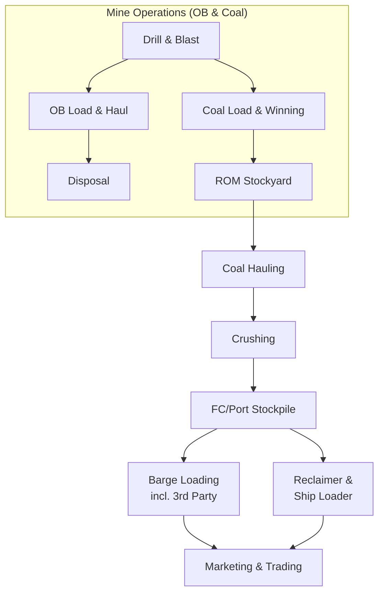
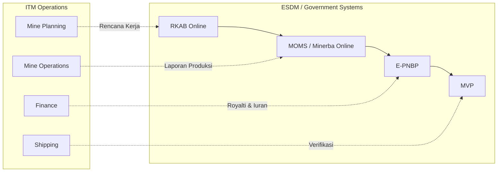
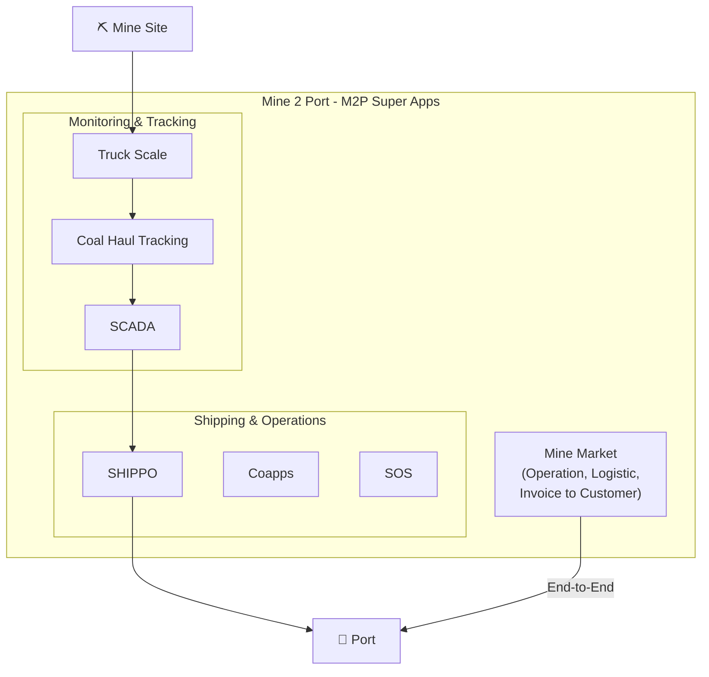
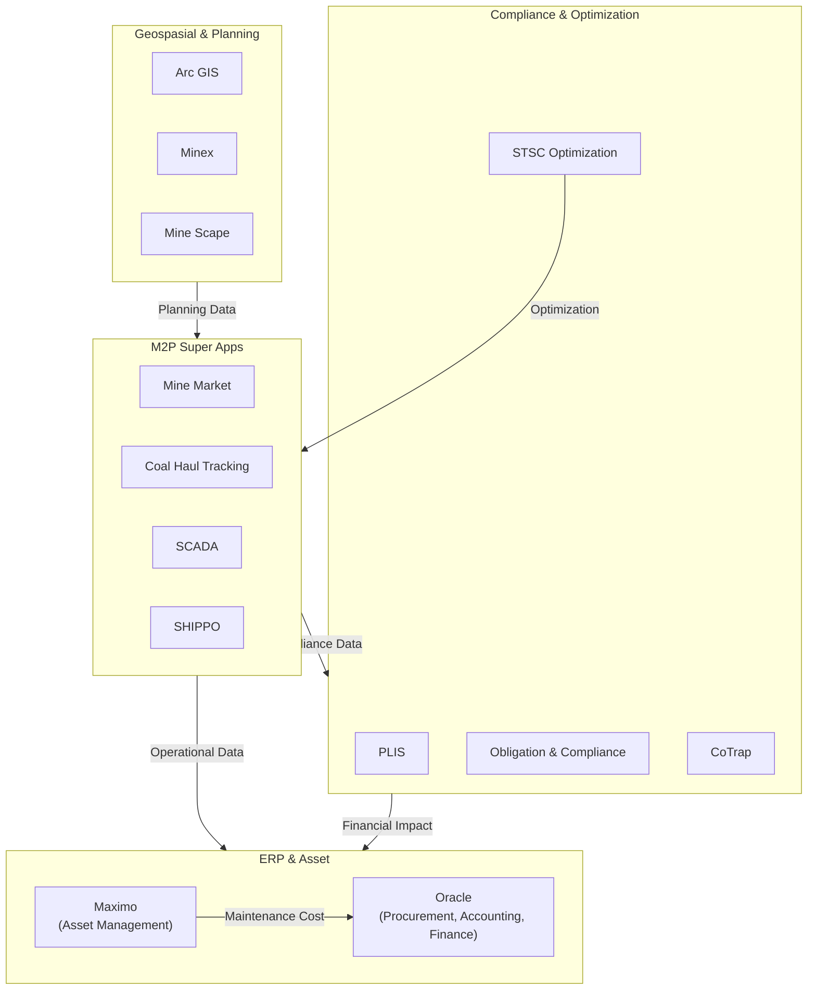
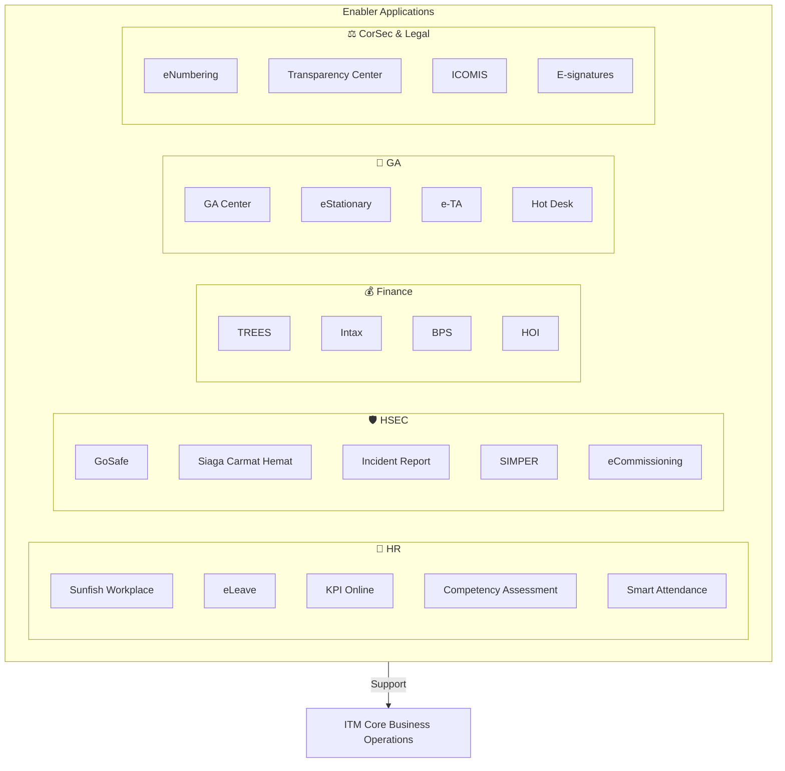
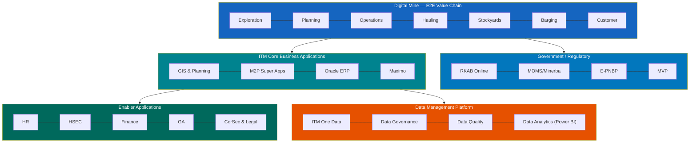
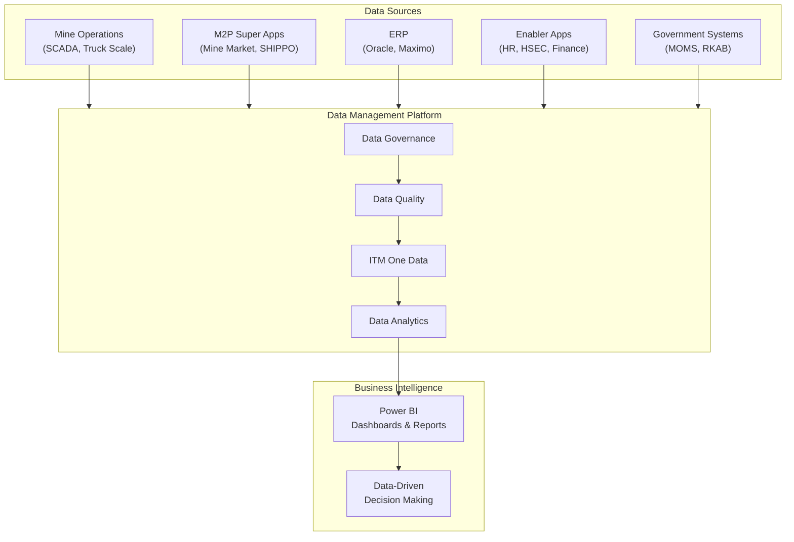

# ITM Coal Business – Core Value Applications and Data Landscape

## Overview

Dokumen ini menjelaskan arsitektur aplikasi dan lanskap data bisnis batubara **ITM (Indo Tambangraya Megah)**, yang mencakup seluruh **Mining Value Chain** — alur batubara dari sumber daya (resource) hingga ke pelanggan (customer), termasuk rantai pasok (supply chain) dan optimalisasi.

Arsitektur ini terbagi menjadi **4 lapisan utama**:

1. **Digital Mine (E2E Value Chain)** — Rantai nilai end-to-end pertambangan
2. **ITM Core Business Application Landscape** — Aplikasi inti bisnis
3. **Enabler Application** — Aplikasi pendukung operasional
4. **Data Management Platform** — Platform pengelolaan data terpadu

---

## 1. Digital Mine (E2E Value Chain)

Lapisan ini menggambarkan alur operasional tambang secara digital dari hulu ke hilir:

### Diagram: Mining Value Chain (E2E Flow)

```mermaid
flowchart LR
    subgraph Exploration["🔍 Exploration & Geo Model"]
        A1[Survei Geologi]
        A2[Pemodelan Cadangan]
    end

    subgraph Planning["📋 Mine Planning"]
        B1[Perencanaan Pit]
        B2[Perencanaan Produksi]
    end

    subgraph Operations["⛏️ Mine Operations"]
        C1[Drill & Blast]
        C2[OB Load & Haul]
        C3[Coal Load & Winning]
        C4[ROM Stockyard]
        C5[Disposal]
    end

    subgraph Hauling["🚛 Hauling"]
        D1[Coal Hauling]
    end

    subgraph Stockyards["🏗️ Stockyards"]
        E1[Crushing]
        E2[FC/Port Stockpile]
    end

    subgraph Barging["🚢 Barging & Shipping"]
        F1[Barge Loading]
        F2[Reclaimer & Ship Loader]
    end

    subgraph Customer["👤 Customer"]
        G1[Marketing]
        G2[Trading]
    end

    Exploration --> Planning --> Operations --> Hauling --> Stockyards --> Barging --> Customer
```

| Tahap | Deskripsi | Aktivitas Utama |
|-------|-----------|-----------------|
| **Exploration and Geo Model** | Eksplorasi dan pemodelan geologi | Survei, pemodelan cadangan |
| **Mine Planning** | Perencanaan tambang | Perencanaan produksi dan pit |
| **Mine Operations (OB & Coal)** | Operasi penambangan overburden & batubara | Drill & Blast, OB Load & Haul, Coal Load & Winning, ROM Stockyard, Disposal |
| **Hauling** | Pengangkutan batubara | Coal Hauling dari pit ke stockyard/port |
| **Stockyards** | Pengelolaan stockpile | Crushing, FC/Port Stockpile |
| **Barging & Shipping** | Pengapalan dan tongkang | Barge Loading (incl. 3rd party), Reclaimer & Ship Loader |
| **Customer** | Pemasaran dan perdagangan | Marketing, Trading |

### Diagram: Alur Operasi Penambangan Detail

---

## 2. Sistem Pemerintah / Regulasi (ESDM / Government)

Integrasi dengan sistem pemerintah untuk kepatuhan regulasi:

| Sistem | Fungsi |
|--------|--------|
| **RKAB Online** | Rencana Kerja dan Anggaran Biaya — pelaporan rencana kerja tambang ke ESDM |
| **MOMS / Minerba Online** | Mining Operations Management System — pelaporan produksi dan operasi ke Ditjen Minerba |
| **E-PNBP** | Penerimaan Negara Bukan Pajak elektronik — pembayaran royalti dan iuran |
| **MVP** | Sistem verifikasi dan validasi pemerintah |

### Diagram: Integrasi Sistem Pemerintah

---

## 3. ITM Core Business Application Landscape

### 3.1 Aplikasi Geospasial & Perencanaan

| Aplikasi | Fungsi |
|----------|--------|
| **Arc GIS** | Sistem informasi geografis untuk pemetaan dan analisis spasial |
| **Minex** | Software perencanaan tambang dan pemodelan geologi |
| **Mine Scape** | Software pemodelan tambang dan perencanaan pit |

### 3.2 Mine 2 Port (M2P Super Apps)

Platform super-app yang mengintegrasikan operasi dari tambang hingga pelabuhan, mencakup:

#### Diagram: Ekosistem M2P Super Apps

| Aplikasi | Fungsi |
|----------|--------|
| **Mine Market** | Operasi, logistik, hingga invoice ke customer — sistem end-to-end untuk manajemen penjualan dan distribusi batubara |
| **Truck Scale** | Sistem penimbangan truk untuk pencatatan tonase |
| **Coal Haul Tracking** | Pelacakan pengangkutan batubara secara real-time |
| **SCADA** | Supervisory Control and Data Acquisition — monitoring dan kontrol operasi |
| **SHIPPO** | Sistem manajemen pengapalan (shipping operations) |
| **Coapps** | Aplikasi koordinasi operasional |
| **SOS** | Sistem operasi pendukung |

### 3.3 Aplikasi Kepatuhan & Optimasi

| Aplikasi | Fungsi |
|----------|--------|
| **PLIS** | Sistem informasi perizinan dan lisensi |
| **Obligation & Compliance** | Manajemen kewajiban dan kepatuhan regulasi |
| **Mercy** | Aplikasi pendukung operasional |
| **MOCA** | Monitoring and Control Application |
| **STSC Optimization (SSO)** | Optimalisasi rantai pasok (Supply Chain Optimization) |
| **CoTrap** | Coal Transportation Planning — perencanaan transportasi batubara |
| **Squba** | Sistem pendukung operasi barging |

### Diagram: Core Application Integration Map

### 3.4 Sistem ERP & Asset Management

| Aplikasi | Fungsi |
|----------|--------|
| **Oracle** | Sistem ERP untuk **Procurement, Accounting, dan Finance** — backbone keuangan dan pengadaan |
| **Maximo** | Enterprise Asset Management — manajemen aset dan pemeliharaan peralatan tambang |

### 3.5 Sistem Operasi Pendukung

| Aplikasi | Fungsi |
|----------|--------|
| **ROMA** | Sistem manajemen operasional |
| **MMS** | Maintenance Management System |
| **SLeZ** | Sistem pendukung operasional |

---

## 4. Enabler Application

Aplikasi pendukung yang menopang fungsi-fungsi korporat:

### Diagram: Enabler Application Ecosystem

### 4.1 Human Resources (HR)

| Aplikasi | Fungsi |
|----------|--------|
| **Sunfish Workplace** | Sistem HRIS (Human Resource Information System) utama |
| **eLeave** | Manajemen cuti elektronik |
| **KPI Online** | Sistem manajemen kinerja dan KPI |
| **Competency Assessment** | Penilaian kompetensi karyawan |
| **Smart Attendance** | Sistem absensi/kehadiran digital |

### 4.2 Health, Safety, Environment & Community (HSEC)

| Aplikasi | Fungsi |
|----------|--------|
| **GoSafe** | Aplikasi keselamatan kerja |
| **Siaga Carmat Hemat (using MDP)** | Sistem siaga dan kesiapan darurat menggunakan Mobile Digital Platform |
| **Incident Report** | Pelaporan insiden keselamatan |
| **SIMPER** | Surat Izin Mengemudi Perusahaan — manajemen izin mengemudi internal |
| **eCommissioning** | Sistem commissioning peralatan elektronik |

### 4.3 Finance

| Aplikasi | Fungsi |
|----------|--------|
| **TREES** | Sistem pelaporan dan analisis keuangan |
| **Intax** | Sistem manajemen perpajakan |
| **BPS** | Budget Planning System — sistem perencanaan anggaran |
| **HOI** | Sistem keuangan pendukung |

### 4.4 General Affairs (GA)

| Aplikasi | Fungsi |
|----------|--------|
| **GA Center** | Pusat layanan General Affairs |
| **eStationary** | Manajemen alat tulis kantor elektronik |
| **e-TA** | Electronic Travel Authorization — manajemen perjalanan dinas |
| **Hot Desk** | Sistem reservasi meja kerja (hot desking) |

### 4.5 Corporate Secretary and Legal (CorSec and Legal)

| Aplikasi | Fungsi |
|----------|--------|
| **eNumbering** | Sistem penomoran dokumen korporat |
| **Transparency Center** | Pusat transparansi dan kepatuhan |
| **ICOMIS** | Integrated Corporate Management Information System |
| **E-signatures** | Tanda tangan digital/elektronik |

---

## 5. Data Management Platform

Fondasi dari seluruh arsitektur adalah **Data Management Platform** yang mencakup:

| Komponen | Deskripsi |
|----------|-----------|
| **ITM One Data** | Inisiatif satu sumber data terpadu (single source of truth) untuk seluruh organisasi |
| **Data Governance** | Tata kelola data — kebijakan, standar, dan prosedur pengelolaan data |
| **Data Quality** | Manajemen kualitas data — memastikan akurasi, kelengkapan, dan konsistensi data |
| **Data Analytics** | Analitik data menggunakan **Power BI** sebagai platform visualisasi dan business intelligence |

---

## Ringkasan Arsitektur

### Diagram: Arsitektur Keseluruhan (Layered View)

### Diagram: Alur Data End-to-End

---

## Catatan Penting

- Arsitektur ini menunjukkan **integrasi vertikal** dari operasi tambang hingga pelanggan
- **Mine 2 Port (M2P)** berperan sebagai super-app yang menyatukan berbagai sistem operasional
- **Oracle ERP** menjadi backbone untuk proses procurement, accounting, dan finance
- **Data Management Platform** di lapisan paling bawah menunjukkan komitmen terhadap **data-driven decision making**
- Integrasi dengan sistem pemerintah (ESDM) memastikan kepatuhan regulasi pertambangan Indonesia
