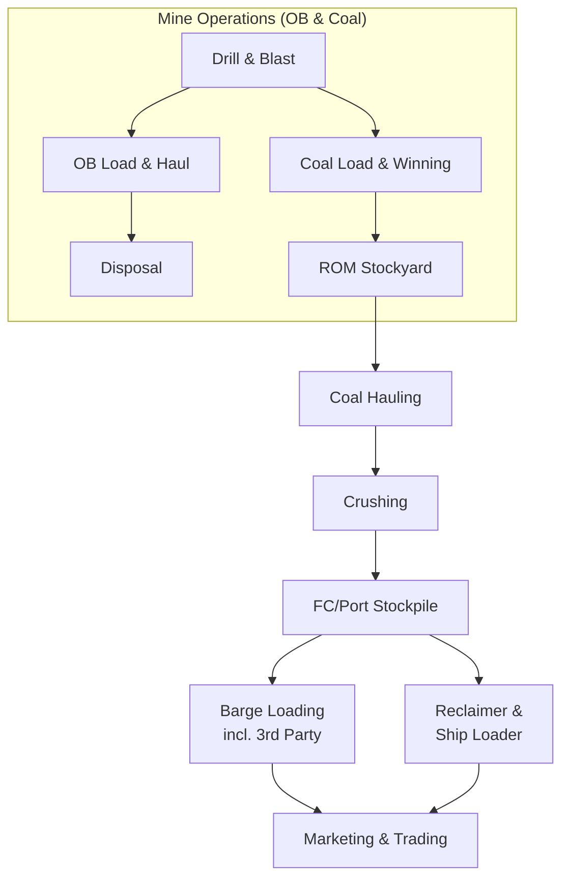
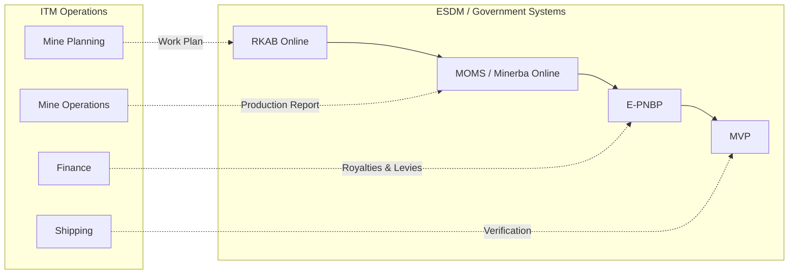
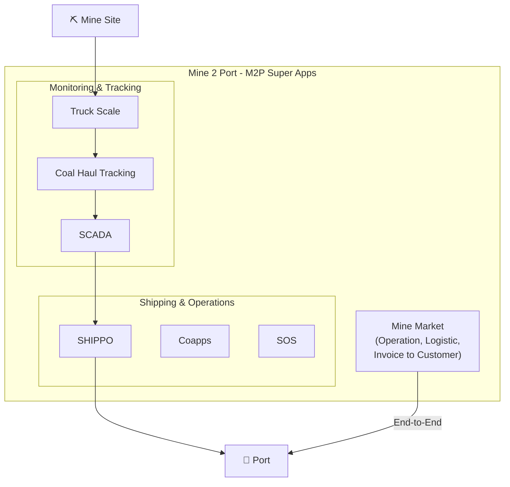
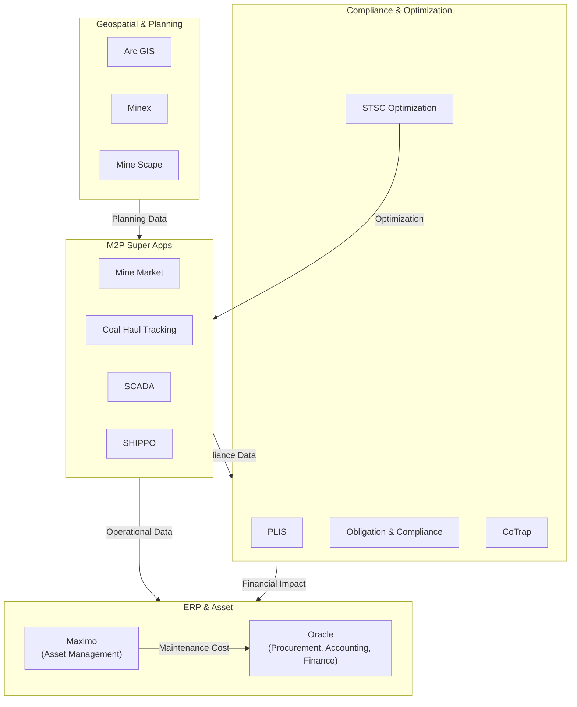
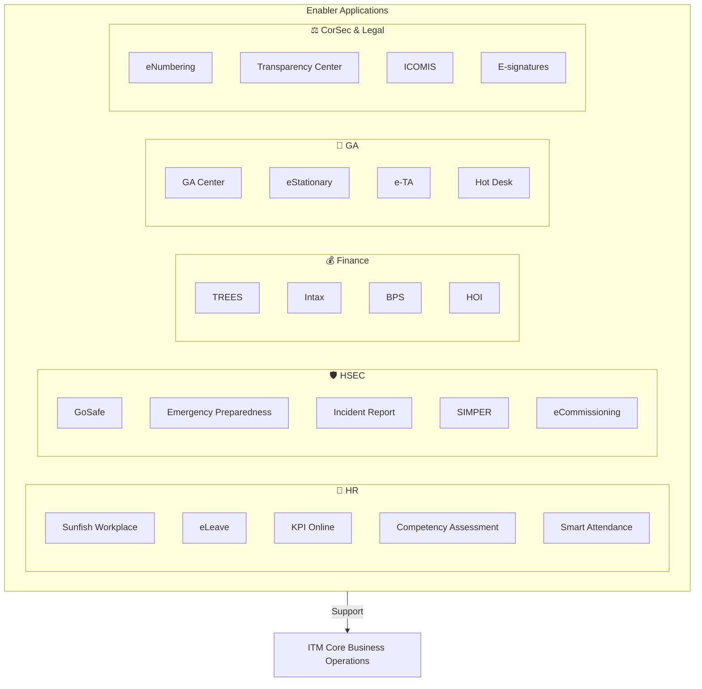
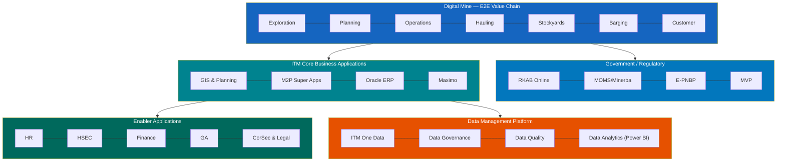
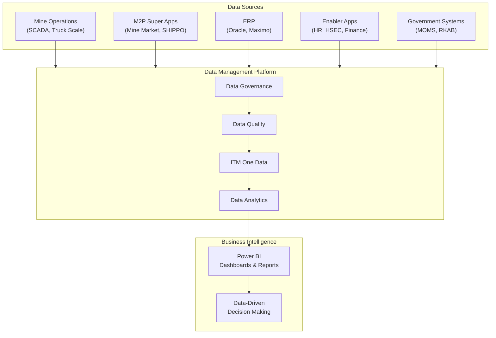

# ITM Coal Business – Core Value Applications and Data Landscape

## Overview

This document describes the application architecture and data landscape of **ITM (Indo Tambangraya Megah)** coal business, covering the entire **Mining Value Chain** — the flow of coal from resource to customer, including supply chain and optimization.

The architecture is divided into **4 main layers**:

1. **Digital Mine (E2E Value Chain)** — End-to-end mining value chain
2. **ITM Core Business Application Landscape** — Core business applications
3. **Enabler Application** — Operational support applications
4. **Data Management Platform** — Unified data management platform

---

## 1. Digital Mine (E2E Value Chain)

This layer illustrates the digital mining operational flow from upstream to downstream:

### Diagram: Mining Value Chain (E2E Flow)

```mermaid
flowchart LR
    subgraph Exploration["🔍 Exploration & Geo Model"]
        A1[Geological Survey]
        A2[Reserve Modeling]
    end

    subgraph Planning["📋 Mine Planning"]
        B1[Pit Planning]
        B2[Production Planning]
    end

    subgraph Operations["⛏️ Mine Operations"]
        C1[Drill & Blast]
        C2[OB Load & Haul]
        C3[Coal Load & Winning]
        C4[ROM Stockyard]
        C5[Disposal]
    end

    subgraph Hauling["🚛 Hauling"]
        D1[Coal Hauling]
    end

    subgraph Stockyards["🏗️ Stockyards"]
        E1[Crushing]
        E2[FC/Port Stockpile]
    end

    subgraph Barging["🚢 Barging & Shipping"]
        F1[Barge Loading]
        F2[Reclaimer & Ship Loader]
    end

    subgraph Customer["👤 Customer"]
        G1[Marketing]
        G2[Trading]
    end

    Exploration --> Planning --> Operations --> Hauling --> Stockyards --> Barging --> Customer
```

| Stage | Description | Key Activities |
|-------|-------------|----------------|
| **Exploration and Geo Model** | Geological exploration and modeling | Survey, reserve modeling |
| **Mine Planning** | Mine planning | Production and pit planning |
| **Mine Operations (OB & Coal)** | Overburden & coal mining operations | Drill & Blast, OB Load & Haul, Coal Load & Winning, ROM Stockyard, Disposal |
| **Hauling** | Coal transportation | Coal hauling from pit to stockyard/port |
| **Stockyards** | Stockpile management | Crushing, FC/Port Stockpile |
| **Barging & Shipping** | Barging and shipping operations | Barge Loading (incl. 3rd party), Reclaimer & Ship Loader |
| **Customer** | Marketing and trading | Marketing, Trading |

### Diagram: Detailed Mining Operations Flow

---

## 2. Government / Regulatory Systems (ESDM / Government)

Integration with government systems for regulatory compliance:

| System | Function |
|--------|----------|
| **RKAB Online** | Work Plan and Budget — mine work plan reporting to ESDM (Ministry of Energy and Mineral Resources) |
| **MOMS / Minerba Online** | Mining Operations Management System — production and operations reporting to Directorate General of Minerals and Coal |
| **E-PNBP** | Electronic Non-Tax State Revenue — royalty and levy payments |
| **MVP** | Government verification and validation system |

### Diagram: Government System Integration

---

## 3. ITM Core Business Application Landscape

### 3.1 Geospatial & Planning Applications

| Application | Function |
|-------------|----------|
| **Arc GIS** | Geographic Information System for mapping and spatial analysis |
| **Minex** | Mine planning and geological modeling software |
| **Mine Scape** | Mine modeling and pit planning software |

### 3.2 Mine 2 Port (M2P Super Apps)

A super-app platform integrating operations from mine to port, including:

#### Diagram: M2P Super Apps Ecosystem

| Application | Function |
|-------------|----------|
| **Mine Market** | Operations, logistics, through to customer invoicing — end-to-end system for coal sales and distribution management |
| **Truck Scale** | Truck weighing system for tonnage recording |
| **Coal Haul Tracking** | Real-time coal hauling tracking |
| **SCADA** | Supervisory Control and Data Acquisition — operational monitoring and control |
| **SHIPPO** | Shipping operations management system |
| **Coapps** | Operational coordination application |
| **SOS** | Support operations system |

### 3.3 Compliance & Optimization Applications

| Application | Function |
|-------------|----------|
| **PLIS** | Permit and licensing information system |
| **Obligation & Compliance** | Obligation and regulatory compliance management |
| **Mercy** | Operational support application |
| **MOCA** | Monitoring and Control Application |
| **STSC Optimization (SSO)** | Supply Chain Optimization |
| **CoTrap** | Coal Transportation Planning |
| **Squba** | Barging operations support system |

### Diagram: Core Application Integration Map

### 3.4 ERP & Asset Management Systems

| Application | Function |
|-------------|----------|
| **Oracle** | ERP system for **Procurement, Accounting, and Finance** — financial and procurement backbone |
| **Maximo** | Enterprise Asset Management — mining equipment asset and maintenance management |

### 3.5 Operational Support Systems

| Application | Function |
|-------------|----------|
| **ROMA** | Operational management system |
| **MMS** | Maintenance Management System |
| **SLeZ** | Operational support system |

---

## 4. Enabler Applications

Supporting applications that underpin corporate functions:

### Diagram: Enabler Application Ecosystem

### 4.1 Human Resources (HR)

| Application | Function |
|-------------|----------|
| **Sunfish Workplace** | Primary HRIS (Human Resource Information System) |
| **eLeave** | Electronic leave management |
| **KPI Online** | Performance and KPI management system |
| **Competency Assessment** | Employee competency assessment |
| **Smart Attendance** | Digital attendance system |

### 4.2 Health, Safety, Environment & Community (HSEC)

| Application | Function |
|-------------|----------|
| **GoSafe** | Workplace safety application |
| **Siaga Carmat Hemat (using MDP)** | Emergency preparedness system using Mobile Digital Platform |
| **Incident Report** | Safety incident reporting |
| **SIMPER** | Company Driving Permit — internal driving permit management |
| **eCommissioning** | Electronic equipment commissioning system |

### 4.3 Finance

| Application | Function |
|-------------|----------|
| **TREES** | Financial reporting and analysis system |
| **Intax** | Tax management system |
| **BPS** | Budget Planning System |
| **HOI** | Supporting financial system |

### 4.4 General Affairs (GA)

| Application | Function |
|-------------|----------|
| **GA Center** | General Affairs service center |
| **eStationary** | Electronic office supplies management |
| **e-TA** | Electronic Travel Authorization — business travel management |
| **Hot Desk** | Hot desk reservation system |

### 4.5 Corporate Secretary and Legal (CorSec and Legal)

| Application | Function |
|-------------|----------|
| **eNumbering** | Corporate document numbering system |
| **Transparency Center** | Transparency and compliance center |
| **ICOMIS** | Integrated Corporate Management Information System |
| **E-signatures** | Digital/electronic signatures |

---

## 5. Data Management Platform

The foundation of the entire architecture is the **Data Management Platform**, which includes:

| Component | Description |
|-----------|-------------|
| **ITM One Data** | A unified single source of truth initiative for the entire organization |
| **Data Governance** | Data governance — policies, standards, and data management procedures |
| **Data Quality** | Data quality management — ensuring accuracy, completeness, and consistency of data |
| **Data Analytics** | Data analytics using **Power BI** as the visualization and business intelligence platform |

---

## Architecture Summary

### Diagram: Overall Architecture (Layered View)

### Diagram: End-to-End Data Flow

---

## Key Takeaways

- This architecture demonstrates **vertical integration** from mining operations through to the customer
- **Mine 2 Port (M2P)** serves as a super-app unifying various operational systems
- **Oracle ERP** is the backbone for procurement, accounting, and finance processes
- The **Data Management Platform** at the bottom layer reflects a commitment to **data-driven decision making**
- Integration with government systems (ESDM) ensures compliance with Indonesian mining regulations
