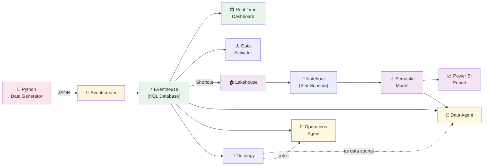

# Contoso Mining — Tutorial Implementasi Fabric RTI

> Tutorial langkah-demi-langkah untuk membangun Real-Time Intelligence demo di Microsoft Fabric.
> Waktu: ~60-90 menit | Level: Beginner-Intermediate

---

## Apa yang Akan Kita Bangun?



**Komponen yang akan dibuat:**

| # | Komponen | Fungsi |
|---|----------|--------|
| 1 | Eventhouse + 3 tabel | Penyimpanan data real-time (KQL Database) |
| 2 | 3 Eventstream | Pipeline ingesti data streaming |
| 3 | Data Generator | Python script simulator data tambang |
| 4 | Real-Time Dashboard | Monitoring live (10 tiles) |
| 5 | Data Activator | Alert otomatis via email/Teams |
| 6 | Lakehouse | Penyimpanan data historis (Delta) |
| 7 | Notebook | Transform data ke star schema |
| 8 | Semantic Model | Model data + DAX measures |
| 9 | Power BI Report | Analisis historis (3 halaman) |
| 10 | Data Agent | Tanya jawab data pakai bahasa natural |
| 11 | Ontology + Operations Agent | AI monitoring proaktif |

---

## Prerequisites

Sebelum mulai, pastikan kamu punya:

- [ ] **Microsoft Fabric account** dengan kapasitas aktif (Trial F64 atau Paid)
- [ ] **Python 3.8+** terinstall di laptop
- [ ] **pip** untuk install library Python
- [ ] File-file dari folder `scripts/` di repo ini
- [ ] Browser modern (Edge/Chrome)

> **💡 Tentang kapasitas:** Trial Fabric (F64) cukup untuk semua step kecuali Operations Agent. Operations Agent butuh **paid F2+** capacity.

---

## Step 1: Buat Workspace

1. Buka [app.fabric.microsoft.com](https://app.fabric.microsoft.com)
2. Klik **Workspaces** di sidebar kiri
3. Klik **+ New workspace**
4. Isi nama: `Contoso-Mining-RTI`
5. Klik **Apply**

✅ **Hasil:** Workspace baru muncul di sidebar.

---

## Step 2: Buat Eventhouse & Tabel

Eventhouse = tempat penyimpanan data real-time. Di dalamnya ada KQL Database.

### 2a. Buat Eventhouse

1. Dalam workspace `Contoso-Mining-RTI`, klik **+ New item**
2. Cari dan pilih **Eventhouse**
3. Nama: `ContosoMiningEH`
4. Klik **Create**

> Fabric otomatis membuat KQL Database di dalam Eventhouse.

### 2b. Buat Tabel

1. Klik KQL Database yang baru dibuat
2. Klik **+ Query** (atau **Explore your data**)
3. Buka file 📄 **`scripts/create_eventhouse_tables.kql`**
4. Copy-paste **satu blok `.create table` pada satu waktu**, lalu klik **▶ Run**
5. Ulangi untuk ketiga tabel

✅ **Hasil:** 3 tabel terbuat — `HaulingEvents`, `StockpileEvents`, `BargeLoadingEvents`.

**Verifikasi:**
```kql
.show tables
```

---

## Step 3: Buat Eventstream

Kita butuh 3 Eventstream — satu per jenis data.

### 3a. HaulingStream

1. Klik **+ New item** → **Eventstream**
2. Nama: `HaulingStream`
3. **Tambah Source:**
   - Klik **+ Add source** → **Custom App**
   - Akan muncul connection info — **catat Connection String dan Event Hub Name** (pakai nanti di Step 4)
4. **Tambah Destination:**
   - Klik **+ Add destination** → **Eventhouse**
   - Pilih database `ContosoMiningEH`
   - Pilih tabel `HaulingEvents`
   - Input data format: **JSON**
5. Klik **Publish**

### 3b. StockpileStream

Ulangi langkah yang sama:
- Nama: `StockpileStream`
- Source: Custom App (catat connection string)
- Destination: `ContosoMiningEH` → tabel `StockpileEvents`

### 3c. BargeLoadingStream

Ulangi lagi:
- Nama: `BargeLoadingStream`
- Source: Custom App (catat connection string)
- Destination: `ContosoMiningEH` → tabel `BargeLoadingEvents`

✅ **Hasil:** 3 Eventstream dengan masing-masing Custom App source.

> **💡 Kamu sekarang punya 3 pasang Connection String + Event Hub Name.** Simpan baik-baik — diperlukan di step berikutnya.

---

## Step 4: Jalankan Data Generator

Data generator mensimulasikan 20 truck, 3 stockpile, dan 3 tongkang.

### 4a. Install Dependencies

Buka terminal/command prompt di folder `scripts/`:

```bash
cd scripts
pip install -r requirements.txt
```

### 4b. Konfigurasi Connection String

Buka file 📄 **`scripts/data_generator.py`** dengan text editor.

Cari bagian **CONFIGURATION** di baris atas, lalu ganti placeholder:

```python
HAULING_CONN_STR = "<PASTE_HAULING_STREAM_CONNECTION_STRING>"
HAULING_EVENTHUB = "<PASTE_HAULING_STREAM_EVENTHUB_NAME>"

STOCKPILE_CONN_STR = "<PASTE_STOCKPILE_STREAM_CONNECTION_STRING>"
STOCKPILE_EVENTHUB = "<PASTE_STOCKPILE_STREAM_EVENTHUB_NAME>"

BARGE_CONN_STR = "<PASTE_BARGE_STREAM_CONNECTION_STRING>"
BARGE_EVENTHUB = "<PASTE_BARGE_STREAM_EVENTHUB_NAME>"
```

Paste connection string dari masing-masing Eventstream (Step 3).

### 4c. Jalankan

```bash
python data_generator.py
```

Kamu akan lihat output:

```
=======================================================
  Contoso Mining - Real-Time Data Simulator
=======================================================

Streams:
  Hauling  : setiap 30s, 20 trucks
  Stockpile: setiap 60s, 3 sites
  Barge    : setiap 45s, 3 barges

Running... Tekan Ctrl+C untuk stop.
-------------------------------------------------------
  [OK] 20 events -> HaulingStream
  [OK] 3 events -> StockpileStream
  [OK] 3 events -> BargeLoadingStream
```

> **Biarkan script berjalan** selama mengerjakan step-step berikutnya. Minimal biarkan 5-10 menit agar data cukup untuk dashboard.

---

## Step 5: Verifikasi Data Masuk

Kembali ke Eventhouse dan cek data sudah mengalir.

1. Buka `ContosoMiningEH` → KQL Database
2. Klik **+ Query**
3. Jalankan query dari 📄 **`scripts/sample_queries.kql`** bagian **VERIFIKASI**:

```kql
HaulingEvents | count
```

```kql
StockpileEvents | top 5 by timestamp desc
```

✅ **Hasil:** Kamu melihat angka count yang terus bertambah dan data JSON yang masuk.

> **Kalau count = 0:** Cek connection string di data_generator.py. Cek juga Eventstream — pastikan status source = "Active".

---

## Step 6: Buat Real-Time Dashboard

### 6a. Buat Dashboard

1. Dari Eventhouse, klik **+ New item** → **Real-Time Dashboard**
2. Nama: `Mining Operations Live`

### 6b. Tambah Tiles

Untuk setiap tile:
1. Klik **+ Add tile**
2. Paste KQL query dari 📄 **`scripts/dashboard_queries.kql`**
3. Klik **▶ Run**
4. Pilih visual type yang sesuai
5. Klik **Apply changes**

**Tiles yang dibuat:**

| # | Nama | Visual Type | Query Ref |
|---|------|-------------|-----------|
| 1 | Total Tonnage Today | Stat (scorecard) | Tile 1 |
| 2 | Active Trucks | Stat (scorecard) | Tile 2 |
| 3 | Truck Map | Map | Tile 4 |
| 4 | Hauling Trend (1m bins) | Time chart (line) | Tile 5 |
| 5 | Stockpile Levels | Bar chart | Tile 6 |
| 6 | Barge Status | Table | Tile 7 |
| 7 | Top 10 Trucks | Bar chart | Tile 8 |
| 8 | Stockpile Temperature | Table | Tile 9 |

> **⚠️ Tips Konfigurasi Truck Map (Tile 4):**
> - Setelah paste query dan klik Run, pilih visual type **Map**
> - Di panel **Visual formatting**, set:
>   - **Define location by** = `Latitude and Longitude`
>   - **Latitude** = kolom **`lat`** (nilainya sekitar -2.xxx)
>   - **Longitude** = kolom **`lon`** (nilainya sekitar 115.xxx)
> - Jika titik muncul di lokasi yang salah (misal Norway/Eropa), kemungkinan kolom lat dan lon **tertukar** di binding — swap keduanya
> - **Size** bisa di-set ke kolom `payload_ton`, **Color** ke kolom `status`

### 6c. Set Auto-Refresh

1. Klik ⚙️ ikon gear di dashboard
2. Set **Auto refresh** = `30 seconds`
3. Klik **Apply**

✅ **Hasil:** Dashboard live yang update otomatis setiap 30 detik.

---

## Step 7: Buat Fabric Activator (Alerts)

Fabric Activator adalah no-code event detection engine yang memonitor data stream secara real-time dan otomatis menjalankan aksi (email, Teams, pipeline, dll.) saat kondisi tertentu terpenuhi.

> **💡 Terminologi:** Activator dulu dikenal sebagai "Reflex" / "Data Activator". Sekarang nama resminya adalah **Fabric Activator** (bagian dari Real-Time Intelligence stack).

Ada **dua cara** membuat alert — pilih salah satu atau keduanya:

---

### Metode A: Set Alert dari Real-Time Dashboard (Recommended)

Cara paling mudah — langsung dari dashboard yang baru dibuat di Step 6.

#### 7a-1. Buka Dashboard

1. Buka Real-Time Dashboard **`Mining Operations Live`** (dari Step 6)
2. Pilih tile yang ingin dimonitor, misalnya tile **Stockpile Levels** (bar chart)

#### 7a-2. Buat Alert Rule — Stockpile Level Kritis

1. Klik **⋯ (More menu)** di pojok kanan atas tile **Stockpile Levels** → pilih **Set Alert**
   - Alternatif: klik tombol **Set alert** di ribbon menu bar, lalu pilih tile yang ingin dimonitor
2. Di panel **Set alert** yang muncul di sisi kanan:
   - **Details**: Nama rule = `Stockpile Level Kritis`
   - **Monitor**: Set frekuensi query, misal `Every 5 minutes`
   - **Condition**:
     - On each event **grouped by** `stockpile_id`
     - When `level_percentage` **Is less than** `30`
     - Occurrence: `Each time condition is met`
   - **Action**: Pilih **Send email**
     - To: `dispatch@contosomining.com` (atau email kamu untuk testing)
     - Subject: `⚠️ Stockpile Level Kritis`
     - Headline: `Level stockpile di bawah 30%`
     - Notes: `Segera isi ulang stockpile. ID: @stockpile_id, Level: @level_percentage%`
     - (Gunakan `@` untuk mereferensikan property data dalam pesan)
   - **Save location**: Pilih workspace `Contoso-Mining-RTI`, beri nama Activator: `StockpileAlerts`
3. Klik **Create**

#### 7a-3. Buat Alert Rule — Suhu Bahaya

1. Pada tile **Stockpile Temperature**, klik **⋯** → **Set Alert**
2. Di panel **Set alert**:
   - **Details**: Nama rule = `Suhu Bahaya`
   - **Monitor**: `Every 5 minutes`
   - **Condition**:
     - On each event **grouped by** `stockpile_id`
     - When `temperature_celsius` **Is greater than** `60`
     - Occurrence: `Each time condition is met`
   - **Action**: Pilih **Teams** → **Message to individuals**
     - To: email penerima (atau email kamu)
     - Headline: `🔥 SUHU BAHAYA di Stockpile`
     - Notes: `Suhu @temperature_celsius°C melebihi batas aman! Stockpile: @stockpile_id`
   - **Save location**: Pilih Activator `StockpileAlerts` yang sama (atau buat baru)
3. Klik **Create**

> **⚠️ Limitasi Set Alert dari Dashboard:**  
> Tidak semua tipe visual bisa di-set alert. **Tidak didukung:** Tables, Maps, Scatter, Heatmaps, Anomalies, Funnel, Markdown. Untuk tile dengan visual tersebut, gunakan Metode B.

---

### Metode B: Tambah Activator sebagai Destination di Eventstream (Alternatif)

Cara ini lebih fleksibel — langsung monitor event stream dari Step 3.

#### 7b-1. Tambah Activator Destination

1. Buka Eventstream **`StockpileStream`** (dari Step 3)
2. Klik **Edit** untuk masuk ke Edit mode
3. Klik **Add destination** di ribbon → pilih **Activator**
4. Di panel Activator:
   - Destination name: `StockpileActivator`
   - Workspace: `Contoso-Mining-RTI`
   - Activator: Pilih `StockpileAlerts` (jika sudah ada dari Metode A) atau klik **Create new** → nama: `StockpileAlerts`
5. Klik **Save** → lalu klik **Publish**

#### 7b-2. Buat Rule dari Eventstream

1. Setelah Publish, di **Live view**, klik ikon **alert** pada node Activator destination
2. Di panel **Rules**, klik **Add rule**
3. Isi detail rule:
   - **Rule name**: `Stockpile Level Kritis`
   - **Condition**: `level_percentage < 30`
   - **Action**: Send email / Teams notification
4. Klik **Save**
5. Ulangi untuk rule `Suhu Bahaya` (`temperature_celsius > 60`)

#### 7b-3. Manage Rules

Dari panel Rules di Eventstream, kamu bisa:
- **Start/Stop** rule dengan toggle
- **Edit/Delete** rule via menu **⋯**
- **Open in Activator** untuk konfigurasi lebih lanjut (object grouping, property filters, summarization)

---

### 7c. Verifikasi & Test

Apapun metode yang dipakai:

1. Buka item **`StockpileAlerts`** (Activator) di workspace
2. Di **Explorer** panel, kamu akan melihat objects dan rules yang sudah dibuat
3. Klik salah satu rule → di panel **Definition**, klik **Send me a test action** untuk mengirim notifikasi percobaan
4. Pastikan kamu menerima email atau pesan Teams
5. Klik **Start** (atau **Save and start**) pada setiap rule untuk mengaktifkan monitoring real-time

> **💡 Tips:**
> - Rules dibuat dalam keadaan **Stopped** secara default — jangan lupa klik **Start**
> - Activator hanya mendeteksi data **baru** setelah rule diaktifkan, bukan data historis
> - Untuk menghentikan rule, klik **Stop** di ribbon — ini juga menghentikan biaya processing
> - Kamu bisa menambahkan aksi lain seperti **Run Pipeline**, **Run Notebook**, atau **Power Automate flow** untuk automasi lebih lanjut

✅ **Hasil:** Fabric Activator aktif memonitor data stockpile. Kamu akan terima email/Teams otomatis saat stockpile level turun di bawah 30% atau suhu melebihi 60°C.

---

## Step 8: Buat Lakehouse + Shortcut dari Eventhouse

Lakehouse digunakan untuk analisis historis. Kita akan membuat shortcut dari Eventhouse ke Lakehouse — ini berarti data tetap satu salinan (zero-copy), tapi bisa diakses via Spark SQL, Power BI Direct Lake, dan engine Fabric lainnya dalam format **Delta Lake**.

> **💡 Shortcut vs Copy:** Shortcut adalah symbolic link di OneLake. Tidak ada duplikasi data dan tidak ada biaya storage tambahan. Jika shortcut dihapus, data asli di Eventhouse tetap aman.
>
> **Ref:** [Shortcuts in a lakehouse](https://learn.microsoft.com/en-us/fabric/data-engineering/lakehouse-shortcuts) · [Eventhouse OneLake Availability](https://learn.microsoft.com/en-us/fabric/real-time-intelligence/one-logical-copy) · [Create an internal OneLake shortcut](https://learn.microsoft.com/en-us/fabric/onelake/create-onelake-shortcut)

### 8a. Aktifkan OneLake Availability di Eventhouse

> **⚠️ Langkah ini wajib!** Sebelum bisa membuat shortcut, data di Eventhouse harus di-expose ke OneLake dalam format Delta Parquet terlebih dahulu.

1. Buka **`ContosoMiningEH`** (Eventhouse dari Step 2)
2. Klik **KQL Database** di dalamnya
3. Di panel **Database details** (sisi kanan), cari bagian **OneLake**
4. Set **Availability** ke **Enabled**
5. Di jendela **Enable OneLake Availability**:
   - Centang **Apply to existing tables** (agar 3 tabel yang sudah ada ikut ter-expose)
   - Klik **Enable**
6. Tunggu hingga status berubah — panel details akan menunjukkan OneLake availability = Enabled

### 8b. Percepat Mirroring Latency (WAJIB untuk Demo)

> **⚠️ KRITIS:** Secara default, Eventhouse menggunakan adaptive batching yang bisa memakan waktu **hingga 3 jam** sebelum data muncul di OneLake sebagai file Delta Parquet. Selama data belum ter-mirror, tabel akan **greyed out / tidak bisa dipilih** saat membuat shortcut dari Lakehouse.

Jalankan perintah berikut di **KQL Query editor** (di dalam KQL Database) untuk mempercepat latency ke **5 menit**:

```kql
.alter-merge table HaulingEvents policy mirroring dataformat=parquet with (IsEnabled=true, TargetLatencyInMinutes=5)
```
```kql
.alter-merge table StockpileEvents policy mirroring dataformat=parquet with (IsEnabled=true, TargetLatencyInMinutes=5)
```
```kql
.alter-merge table BargeLoadingEvents policy mirroring dataformat=parquet with (IsEnabled=true, TargetLatencyInMinutes=5)
```

> **⚠️ Trade-off:** Latency yang lebih pendek bisa menghasilkan banyak file Parquet kecil yang kurang optimal. Untuk demo ini tidak masalah, tapi untuk production gunakan default atau nilai yang lebih besar.

### 8c. Tunggu & Verifikasi Mirroring Selesai

> **🚨 JANGAN lanjut ke langkah 8d sebelum mirroring selesai!** Jika mirroring belum selesai, tabel di Eventhouse akan terlihat tapi **greyed out** (tidak bisa dipilih) saat membuat shortcut.

Cek status mirroring untuk setiap tabel:

```kql
.show table HaulingEvents mirroring operations
```
```kql
.show table StockpileEvents mirroring operations
```
```kql
.show table BargeLoadingEvents mirroring operations
```

**Tunggu sampai kolom `Latency` menunjukkan `00:00:00`** untuk ketiga tabel. Ini berarti semua data sudah tersinkron ke OneLake dalam format Delta Parquet.

Kamu juga bisa memverifikasi file Delta sudah dibuat dengan cara:
1. Di Explorer pane KQL Database, hover tabel → klik **⋯** → **View files**
2. Pastikan ada folder `_delta_log` dan file `.parquet`

> **💡 Tips:** Jika `Latency` masih besar, pastikan data generator sudah berjalan dan telah mengirim cukup banyak data. Eventhouse butuh data yang cukup untuk membuat file Parquet berukuran optimal (~200-256 MB). Dengan TargetLatencyInMinutes=5, data akan ditulis setiap 5 menit terlepas dari ukurannya.

### 8d. Buat Lakehouse

1. Kembali ke workspace **`Contoso-Mining-RTI`**
2. Klik **+ New item** → **Lakehouse**
3. Nama: `ContosoMiningLH`
4. Klik **Create**

### 8e. Buat OneLake Shortcut ke Eventhouse

> **⚠️ Penting:** Gunakan **"New table shortcut"** (bukan "New shortcut"). Di Lakehouse, tipe shortcut menentukan di mana data muncul:
> | Menu | Lokasi | Fungsi |
> |------|--------|--------|
> | **New table shortcut** | Tables section | Shortcut ke satu Delta table, otomatis terdaftar sebagai tabel |
> | **New schema shortcut** | Tables section | Shortcut ke folder berisi multiple Delta tables (muncul sebagai schema) |
> | **New shortcut** | Files section | Shortcut ke folder apapun, format apapun, TIDAK otomatis jadi tabel |

1. Dalam Lakehouse `ContosoMiningLH`, klik kanan pada folder **Tables** di Explorer pane
2. Pilih **New table shortcut**
3. Di jendela **New shortcut**, pada bagian **Internal sources**, pilih **Microsoft OneLake**
4. Di jendela **Select a data source type**, pilih **`ContosoMiningEH`** (KQL Database) → klik **Next**
5. Expand folder **Tables** — kamu akan melihat 3 tabel:
   - ✅ Centang `HaulingEvents`
   - ✅ Centang `StockpileEvents`
   - ✅ Centang `BargeLoadingEvents`
6. Klik **Next**
7. Di halaman review, pastikan 3 shortcut terdaftar → klik **Create**

> **💡 Tips:** Kamu bisa memilih hingga **50 tabel sekaligus** dalam satu kali pembuatan shortcut.
>
> **🔴 Tabel greyed out / tidak bisa dicentang?** Ini berarti mirroring belum selesai. Kembali ke **Step 8c** dan pastikan `Latency = 00:00:00` untuk semua tabel. Jika file Delta Parquet belum ada di OneLake, shortcut wizard tidak bisa memvalidasi tabel sebagai Delta table yang valid.

### 8f. Verifikasi Shortcut

1. Lakehouse akan refresh otomatis. Kamu akan melihat 3 tabel baru di folder **Tables** dengan **ikon shortcut** (panah kecil)
2. Klik salah satu tabel shortcut untuk preview data
3. Verifikasi juga melalui **SQL analytics endpoint** — klik mode selector di Lakehouse lalu jalankan:

```sql
SELECT TOP 10 * FROM [ContosoMiningLH].[dbo].[HaulingEvents]
```

4. Atau verifikasi bahwa data bisa dibaca via **Spark** (ini sama seperti yang akan dilakukan di Step 9):

```python
df = spark.sql("SELECT * FROM ContosoMiningLH.HaulingEvents LIMIT 10")
display(df)
```

> **⚠️ Troubleshooting shortcut:**
>
> | Masalah | Solusi |
> |---------|--------|
> | Tabel greyed out saat membuat shortcut | Mirroring belum selesai — cek `Latency` di Step 8c |
> | Tabel tidak muncul di daftar | OneLake Availability belum Enabled (Step 8a) |
> | Shortcut berhasil tapi kosong | Data belum ter-mirror — tunggu latency atau cek generator |
> | Error "Delta format not found" | File Parquet belum dibuat — verifikasi via View files di KQL Database |
> | Nama tabel mengandung spasi | Delta format tidak support nama tabel dengan spasi |

✅ **Hasil:** 3 tabel shortcut muncul di Lakehouse — `HaulingEvents`, `StockpileEvents`, `BargeLoadingEvents`. Data dari Eventhouse bisa diakses dalam format Delta Lake tanpa duplikasi. Siap digunakan oleh Notebook (Step 9), Semantic Model (Step 10), dan Power BI (Step 11).

---

## Step 9: Jalankan Notebook Star Schema

Notebook ini membuat dimension tables dan fact tables untuk Power BI.

### 9a. Buat Notebook

1. Klik **+ New item** → **Notebook**
2. Nama: `Create_Star_Schema`
3. Di panel kiri, klik **Add Lakehouse** → pilih `ContosoMiningLH`

### 9b. Jalankan Script

1. Buka file 📄 **`scripts/create_star_schema.py`**
2. Copy-paste seluruh isi file ke **satu cell** di Notebook
3. Klik **▶ Run cell**

Output yang diharapkan:

```
Creating dimension tables...
  ✅ DimTruck
  ✅ DimRoute
  ✅ DimStockpile
  ✅ DimBarge
  ✅ DimJetty
  ✅ DimDate (730 rows)

Creating fact tables from Eventhouse shortcut...
  ✅ FactHauling (1200 rows)
  ✅ FactStockpile (180 rows)
  ✅ FactBargeLoading (240 rows)

✅ Star schema setup complete!
```

✅ **Hasil:** 9 tabel di Lakehouse — 6 dimension + 3 fact.

> **💡 Tips:** Jalankan ulang notebook ini secara berkala untuk meng-update fact tables dengan data terbaru dari Eventhouse.

---

## Step 10: Buat Semantic Model

Semantic Model = layer bisnis di atas data. Berisi relationships dan DAX measures.

### 10a. Buat Semantic Model

1. Dalam Lakehouse, klik **New Semantic Model**
2. Nama: `ContosoMining_SemanticModel`
3. Centang semua 9 tabel (6 Dim + 3 Fact) → klik **Confirm**

### 10b. Setup Relationships

Buka Semantic Model → tab **Model view**. Buat relationships dengan drag-drop:

| Dari | Kolom | → Ke | Kolom |
|------|-------|------|-------|
| FactHauling | truck_id | DimTruck | truck_id |
| FactHauling | route | DimRoute | route_name |
| FactHauling | date_key | DimDate | date_key |
| FactStockpile | stockpile_id | DimStockpile | stockpile_id |
| FactStockpile | date_key | DimDate | date_key |
| FactBargeLoading | barge_id | DimBarge | barge_id |
| FactBargeLoading | jetty_id | DimJetty | jetty_id |
| FactBargeLoading | date_key | DimDate | date_key |

Semua relationship: **Many-to-One**, **Single direction**.

### 10c. Tambah DAX Measures

1. Buka file 📄 **`scripts/dax_measures.dax`**
2. Untuk setiap measure:
   - Klik tabel **FactHauling** (untuk hauling measures) atau tabel yang sesuai
   - Klik **New measure**
   - Paste satu formula DAX
   - Tekan **Enter**
3. Ulangi untuk semua 15 measures

✅ **Hasil:** Semantic Model dengan 8 relationships dan 15 DAX measures.

---

## Step 11: Buat Power BI Report

### 11a. Buat Report

1. Dari Semantic Model, klik **Create Report** (atau **New Report**)
2. Nama: `ContosoMining_Historical_Analysis`

### 11b. Page 1: Hauling Performance

| Visual | Type | Fields |
|--------|------|--------|
| Total Tonnage | Card | `[Total Tonnage]` |
| Total Trips | Card | `[Total Trips]` |
| Avg Payload | Card | `[Avg Payload Per Trip]` |
| Utilization | Card | `[Truck Utilization %]` |
| Daily Trend | Line Chart | X: `DimDate[full_date]`, Y: `[Total Tonnage]` |
| By Route | Donut Chart | Legend: `DimRoute[route_category]`, Values: `[Total Tonnage]` |
| Top Trucks | Bar Chart | Y: `DimTruck[truck_name]`, X: `[Total Tonnage]`, Top N = 10 |
| Cycle vs Trips | Combo Chart | X: `DimDate[full_date]`, Column: `[Total Trips]`, Line: `[Avg Cycle Time (min)]` |

Tambahkan slicers: **DimDate[full_date]** (range), **DimTruck[truck_name]**, **DimRoute[route_category]**

### 11c. Page 2: Stockpile Analytics

Klik **+ New page** di bawah canvas.

| Visual | Type | Fields |
|--------|------|--------|
| Avg Level | Card | `AVG(FactStockpile[level_percentage])` |
| Critical Sites | Card | `[Critical Stockpiles]` |
| Avg Temp | Card | `[Avg Temperature]` |
| Levels Over Time | Area Chart | X: `timestamp` (1h bins), Y: `level_percentage`, Legend: `stockpile_id` |
| Temperature Trend | Line Chart | X: `timestamp`, Y: `temperature_celsius`, Legend: `stockpile_id` |
| Level vs Temp | Scatter | X: `level_percentage`, Y: `temperature_celsius`, Size: `estimated_tonnage` |

Tambahkan slicers: **DimStockpile[stockpile_name]**, **DimDate[full_date]**

### 11d. Page 3: Shipping & Barge Summary

| Visual | Type | Fields |
|--------|------|--------|
| Total Shipped | Card | `[Total Shipped Tonnage]` |
| Barges Done | Card | `[Barges Completed]` |
| Avg Rate | Card | `[Avg Loading Rate (TPH)]` |
| Wait Time | Card | `[Avg Barge Wait Time (hrs)]` |
| Monthly Shipped | Stacked Bar | X: `DimDate[month_name]`, Y: `[Total Shipped Tonnage]`, Legend: `DimBarge[barge_name]` |
| Status | Donut Chart | Legend: `status`, Values: Count of `barge_id` |
| Rate Trend | Line Chart | X: `DimDate[full_date]`, Y: `[Avg Loading Rate (TPH)]`, Legend: `DimJetty[jetty_name]` |
| Detail Table | Table | `barge_id`, `jetty_id`, `loaded_tonnage`, `target_tonnage`, `[Loading Efficiency %]` |

### 11e. Publish

Klik **File** → **Save** untuk menyimpan report di workspace.

✅ **Hasil:** Power BI report 3 halaman dengan data historis dari Lakehouse.

---

## Step 12: Setup Data Agent

Data Agent memungkinkan tanya jawab data menggunakan bahasa natural.

### 12a. Buat Data Agent

1. Klik **+ New item** → **Data Agent**
2. Nama: `ContosoMiningAgent`

### 12b. Tambah Data Sources

Klik **+ Add data source** dan tambahkan (maks 5 total, kombinasi: Lakehouse, Warehouse, KQL DB, Semantic Model, Ontology, Graph):

| # | Source Type | Source | Tabel |
|---|-----------|--------|-------|
| 1 | KQL Database | ContosoMiningEH | HaulingEvents, StockpileEvents, BargeLoadingEvents |
| 2 | Lakehouse | ContosoMiningLH | FactHauling, DimTruck, dll |
| 3 | Semantic Model | ContosoMining_SemanticModel | (otomatis) |
| 4 | Ontology *(opsional)* | MiningOntology | (jika sudah dibuat di Step 13) |

### 12c. Tambah Instructions

Di tab **Instructions**, paste:

```
Kamu adalah asisten data operasional Contoso Mining.
- Jawab pertanyaan tentang hauling, stockpile, dan barge loading
- Gunakan satuan ton untuk tonase, km/h untuk kecepatan
- Untuk data real-time, gunakan KQL Database
- Untuk data historis/trend, gunakan Lakehouse atau Semantic Model
- Jawab dalam Bahasa Indonesia kecuali diminta sebaliknya
```

### 12d. Test

Di panel **Chat**, coba tanya:

- "Berapa total tonase hari ini?"
- "Stockpile mana yang paling kritis?"
- "Top 5 truck paling produktif minggu ini?"

### 12e. Publish

Klik **Publish** untuk membuat endpoint. Opsional: integrasikan ke **Copilot Studio** untuk akses via Teams.

✅ **Hasil:** Data Agent yang bisa menjawab pertanyaan operasional tambang.

---

## Step 13: Setup Fabric IQ (Opsional)

> **⚠️ Preview Feature.** Ontology & Operations Agent masih dalam preview.
> Operations Agent membutuhkan **paid capacity (F2+)**, tidak bisa pakai trial.

### 13a. Buat Ontology

1. Klik **+ New item** → cari **Ontology** (di bagian Fabric IQ)
2. Nama: `MiningOntology`
3. Buat **Entity Types**:

| Entity | Properties | Data Source |
|--------|-----------|-------------|
| Truck | truck_id, speed_kmh, payload_ton, status | Eventhouse → HaulingEvents |
| Stockpile | stockpile_id, level_percentage, temperature_celsius | Eventhouse → StockpileEvents |
| Barge | barge_id, loaded_tonnage, status, loading_rate_tph | Eventhouse → BargeLoadingEvents |

4. Buat **Relationships**:
   - Truck → *fills* → Stockpile
   - Stockpile → *loads* → Barge

### 13b. Buat Operations Agent

1. Klik **+ New item** → **Operations Agent**
2. Nama: `ContosoOpsAgent`
3. **Business Goals:**
   ```
   - Maximize daily coal throughput (target: 15,000 ton/day)
   - Minimize barge waiting time (< 4 hours)
   - Maintain stockpile temperature below 60°C
   ```
4. **Instructions:**
   ```
   - Safety is the highest priority
   - Include supporting data in every recommendation
   - Recommend actionable steps
   ```
5. **Knowledge Source:** Eventhouse `ContosoMiningEH`
6. Klik **Save** → review generated **Playbook** → klik **Start**
7. Install **"Fabric Operations Agent"** di Teams app store

✅ **Hasil:** AI agent yang proaktif memonitor data dan kirim rekomendasi via Teams.

> **💡 Data Agent vs Operations Agent:**
>
> | Aspek | Data Agent | Operations Agent |
> |-------|-----------|------------------|
> | Mode | Reaktif — user bertanya | Proaktif — berjalan otomatis |
> | Data Source | Maks 5: KQL DB, Lakehouse, Warehouse, Semantic Model, Ontology, Graph | **Eventhouse saja** |
> | Output | Jawaban teks/tabel | Rekomendasi aksi via Teams |
> | Capacity | F2+ atau P1+ | F2+ (trial tidak didukung) |

---

## Troubleshooting

| Problem | Solusi |
|---------|--------|
| Data generator error `Connection refused` | Cek connection string. Pastikan copy dari Eventstream > Custom App > Keys |
| Eventstream status "Inactive" | Klik Eventstream → klik **Publish** ulang |
| Dashboard tiles kosong | Data belum cukup. Biarkan generator jalan 5-10 menit, lalu refresh |
| Notebook error `Table not found` | Pastikan shortcut dari Eventhouse ke Lakehouse sudah dibuat (Step 8e) dan OneLake Availability aktif (Step 8a) |
| Shortcut tabel greyed out | Mirroring belum selesai. Jalankan `.alter-merge table policy mirroring` (Step 8b), tunggu, lalu cek `Latency = 00:00:00` (Step 8c) |
| Shortcut tabel kosong | OneLake Availability belum sync. Cek latency: `.show table <nama> mirroring operations`. Atur TargetLatencyInMinutes=5 (Step 8b) |
| Semantic Model relationship error | Pastikan kolom sudah matching. Cek nama kolom case-sensitive |
| Data Agent menjawab "I don't know" | Tambahkan **Example Queries** di tab Instructions |
| Operations Agent tidak muncul | Butuh **paid F2+ capacity** — tidak bisa pakai trial |

---

## Checklist Final

Setelah semua step selesai, kamu seharusnya punya item-item ini di workspace:

```
📁 Contoso-Mining-RTI (Workspace)
├── ⚡ ContosoMiningEH          (Eventhouse)
│   └── 📋 ContosoMiningEH      (KQL Database — 3 tables)
├── 🔄 HaulingStream            (Eventstream)
├── 🔄 StockpileStream          (Eventstream)
├── 🔄 BargeLoadingStream       (Eventstream)
├── 📺 Mining Operations Live   (Real-Time Dashboard)
├── ⚠️ StockpileAlerts          (Fabric Activator)
├── 🏠 ContosoMiningLH          (Lakehouse — 3 shortcuts + 9 star schema tables)
├── 📓 Create_Star_Schema       (Notebook)
├── 📊 ContosoMining_SemanticModel (Semantic Model)
├── 📈 ContosoMining_Historical_Analysis (Power BI Report)
├── 🤖 ContosoMiningAgent       (Data Agent)
├── 📘 MiningOntology           (Ontology — Fabric IQ)
└── 🧠 ContosoOpsAgent          (Operations Agent)
```

**Total: 13 items** di workspace.

---

## Referensi

| Topik | Link |
|-------|------|
| Fabric RTI Overview | [learn.microsoft.com/fabric/real-time-intelligence](https://learn.microsoft.com/en-us/fabric/real-time-intelligence/overview) |
| Eventstream | [learn.microsoft.com/fabric/real-time-intelligence/event-streams](https://learn.microsoft.com/en-us/fabric/real-time-intelligence/event-streams/overview) |
| Eventhouse | [learn.microsoft.com/fabric/real-time-intelligence/eventhouse](https://learn.microsoft.com/en-us/fabric/real-time-intelligence/eventhouse) |
| Real-Time Dashboard | [learn.microsoft.com/fabric/real-time-intelligence/dashboard-real-time-create](https://learn.microsoft.com/en-us/fabric/real-time-intelligence/dashboard-real-time-create) |
| Data Activator | [learn.microsoft.com/fabric/real-time-intelligence/data-activator](https://learn.microsoft.com/en-us/fabric/real-time-intelligence/data-activator/activator-introduction) |
| Lakehouse | [learn.microsoft.com/fabric/data-engineering/lakehouse-overview](https://learn.microsoft.com/en-us/fabric/data-engineering/lakehouse-overview) |
| OneLake Availability | [learn.microsoft.com/fabric/real-time-intelligence/one-logical-copy](https://learn.microsoft.com/en-us/fabric/real-time-intelligence/event-house-onelake-availability) |
| OneLake Shortcuts | [learn.microsoft.com/fabric/onelake/onelake-shortcuts](https://learn.microsoft.com/en-us/fabric/onelake/onelake-shortcuts) |
| Semantic Model | [learn.microsoft.com/fabric/fundamentals/semantic-models](https://learn.microsoft.com/en-us/power-bi/connect-data/service-datasets-understand) |
| Data Agent | [learn.microsoft.com/fabric/data-science/concept-data-agent](https://learn.microsoft.com/en-us/fabric/data-science/concept-data-agent) |
| Fabric IQ | [learn.microsoft.com/fabric/real-time-intelligence/fabric-iq](https://learn.microsoft.com/en-us/fabric/real-time-intelligence/fabric-iq/overview) |

---

> **🎉 Selesai!** Kamu sekarang punya end-to-end Real-Time Intelligence solution di Microsoft Fabric — dari data generator sampai AI-powered monitoring.
