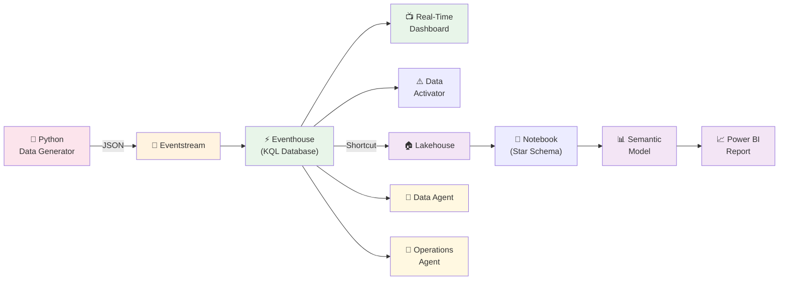

# Contoso Mining — Tutorial Implementasi Fabric RTI

> Tutorial langkah-demi-langkah untuk membangun Real-Time Intelligence demo di Microsoft Fabric.
> Waktu: ~60-90 menit | Level: Beginner-Intermediate

---

## Apa yang Akan Kita Bangun?



**Komponen yang akan dibuat:**

| # | Komponen | Fungsi |
|---|----------|--------|
| 1 | Eventhouse + 3 tabel | Penyimpanan data real-time (KQL Database) |
| 2 | 3 Eventstream | Pipeline ingesti data streaming |
| 3 | Data Generator | Python script simulator data tambang |
| 4 | Real-Time Dashboard | Monitoring live (10 tiles) |
| 5 | Data Activator | Alert otomatis via email/Teams |
| 6 | Lakehouse | Penyimpanan data historis (Delta) |
| 7 | Notebook | Transform data ke star schema |
| 8 | Semantic Model | Model data + DAX measures |
| 9 | Power BI Report | Analisis historis (3 halaman) |
| 10 | Data Agent | Tanya jawab data pakai bahasa natural |
| 11 | Ontology + Operations Agent | AI monitoring proaktif |

---

## Prerequisites

Sebelum mulai, pastikan kamu punya:

- [ ] **Microsoft Fabric account** dengan kapasitas aktif (Trial F64 atau Paid)
- [ ] **Python 3.8+** terinstall di laptop
- [ ] **pip** untuk install library Python
- [ ] File-file dari folder `scripts/` di repo ini
- [ ] Browser modern (Edge/Chrome)

> **💡 Tentang kapasitas:** Trial Fabric (F64) cukup untuk semua step kecuali Operations Agent. Operations Agent butuh **paid F2+** capacity.

---

## Step 1: Buat Workspace

1. Buka [app.fabric.microsoft.com](https://app.fabric.microsoft.com)
2. Klik **Workspaces** di sidebar kiri
3. Klik **+ New workspace**
4. Isi nama: `Contoso-Mining-RTI`
5. Klik **Apply**

✅ **Hasil:** Workspace baru muncul di sidebar.

---

## Step 2: Buat Eventhouse & Tabel

Eventhouse = tempat penyimpanan data real-time. Di dalamnya ada KQL Database.

### 2a. Buat Eventhouse

1. Dalam workspace `Contoso-Mining-RTI`, klik **+ New item**
2. Cari dan pilih **Eventhouse**
3. Nama: `ContosoMiningEH`
4. Klik **Create**

> Fabric otomatis membuat KQL Database di dalam Eventhouse.

### 2b. Buat Tabel

1. Klik KQL Database yang baru dibuat
2. Klik **+ Query** (atau **Explore your data**)
3. Buka file 📄 **`scripts/create_eventhouse_tables.kql`**
4. Copy-paste **satu blok `.create table` pada satu waktu**, lalu klik **▶ Run**
5. Ulangi untuk ketiga tabel

✅ **Hasil:** 3 tabel terbuat — `HaulingEvents`, `StockpileEvents`, `BargeLoadingEvents`.

**Verifikasi:**
```kql
.show tables
```

---

## Step 3: Buat Eventstream

Kita butuh 3 Eventstream — satu per jenis data.

### 3a. HaulingStream

1. Klik **+ New item** → **Eventstream**
2. Nama: `HaulingStream`
3. **Tambah Source:**
   - Klik **+ Add source** → **Custom App**
   - Akan muncul connection info — **catat Connection String dan Event Hub Name** (pakai nanti di Step 4)
4. **Tambah Destination:**
   - Klik **+ Add destination** → **Eventhouse**
   - Pilih database `ContosoMiningEH`
   - Pilih tabel `HaulingEvents`
   - Input data format: **JSON**
5. Klik **Publish**

### 3b. StockpileStream

Ulangi langkah yang sama:
- Nama: `StockpileStream`
- Source: Custom App (catat connection string)
- Destination: `ContosoMiningEH` → tabel `StockpileEvents`

### 3c. BargeLoadingStream

Ulangi lagi:
- Nama: `BargeLoadingStream`
- Source: Custom App (catat connection string)
- Destination: `ContosoMiningEH` → tabel `BargeLoadingEvents`

✅ **Hasil:** 3 Eventstream dengan masing-masing Custom App source.

> **💡 Kamu sekarang punya 3 pasang Connection String + Event Hub Name.** Simpan baik-baik — diperlukan di step berikutnya.

---

## Step 4: Jalankan Data Generator

Data generator mensimulasikan 20 truck, 3 stockpile, dan 3 tongkang.

### 4a. Install Dependencies

Buka terminal/command prompt di folder `scripts/`:

```bash
cd scripts
pip install -r requirements.txt
```

### 4b. Konfigurasi Connection String

Buka file 📄 **`scripts/data_generator.py`** dengan text editor.

Cari bagian **CONFIGURATION** di baris atas, lalu ganti placeholder:

```python
HAULING_CONN_STR = "<PASTE_HAULING_STREAM_CONNECTION_STRING>"
HAULING_EVENTHUB = "<PASTE_HAULING_STREAM_EVENTHUB_NAME>"

STOCKPILE_CONN_STR = "<PASTE_STOCKPILE_STREAM_CONNECTION_STRING>"
STOCKPILE_EVENTHUB = "<PASTE_STOCKPILE_STREAM_EVENTHUB_NAME>"

BARGE_CONN_STR = "<PASTE_BARGE_STREAM_CONNECTION_STRING>"
BARGE_EVENTHUB = "<PASTE_BARGE_STREAM_EVENTHUB_NAME>"
```

Paste connection string dari masing-masing Eventstream (Step 3).

### 4c. Jalankan

```bash
python data_generator.py
```

Kamu akan lihat output:

```
=======================================================
  Contoso Mining - Real-Time Data Simulator
=======================================================

Streams:
  Hauling  : setiap 30s, 20 trucks
  Stockpile: setiap 60s, 3 sites
  Barge    : setiap 45s, 3 barges

Running... Tekan Ctrl+C untuk stop.
-------------------------------------------------------
  [OK] 20 events -> HaulingStream
  [OK] 3 events -> StockpileStream
  [OK] 3 events -> BargeLoadingStream
```

> **Biarkan script berjalan** selama mengerjakan step-step berikutnya. Minimal biarkan 5-10 menit agar data cukup untuk dashboard.

---

## Step 5: Verifikasi Data Masuk

Kembali ke Eventhouse dan cek data sudah mengalir.

1. Buka `ContosoMiningEH` → KQL Database
2. Klik **+ Query**
3. Jalankan query dari 📄 **`scripts/sample_queries.kql`** bagian **VERIFIKASI**:

```kql
HaulingEvents | count
```

```kql
StockpileEvents | top 5 by timestamp desc
```

✅ **Hasil:** Kamu melihat angka count yang terus bertambah dan data JSON yang masuk.

> **Kalau count = 0:** Cek connection string di data_generator.py. Cek juga Eventstream — pastikan status source = "Active".

---

## Step 6: Buat Real-Time Dashboard

### 6a. Buat Dashboard

1. Dari Eventhouse, klik **+ New item** → **Real-Time Dashboard**
2. Nama: `Mining Operations Live`

### 6b. Tambah Tiles

Untuk setiap tile:
1. Klik **+ Add tile**
2. Paste KQL query dari 📄 **`scripts/dashboard_queries.kql`**
3. Klik **▶ Run**
4. Pilih visual type yang sesuai
5. Klik **Apply changes**

**Tiles yang dibuat:**

| # | Nama | Visual Type | Query Ref |
|---|------|-------------|-----------|
| 1 | Total Tonnage Today | Stat (scorecard) | Tile 1 |
| 2 | Active Trucks | Stat (scorecard) | Tile 2 |
| 3 | Truck Map | Map | Tile 4 |
| 4 | Hauling Trend 24h | Time chart (line) | Tile 5 |
| 5 | Stockpile Levels | Bar chart | Tile 6 |
| 6 | Barge Status | Table | Tile 7 |
| 7 | Top 10 Trucks | Bar chart | Tile 8 |
| 8 | Stockpile Temperature | Table | Tile 9 |

### 6c. Set Auto-Refresh

1. Klik ⚙️ ikon gear di dashboard
2. Set **Auto refresh** = `30 seconds`
3. Klik **Apply**

✅ **Hasil:** Dashboard live yang update otomatis setiap 30 detik.

---

## Step 7: Buat Data Activator (Alerts)

Data Activator mengirim notifikasi otomatis saat kondisi tertentu terpenuhi.

### 7a. Buat Reflex

1. Klik **+ New item** → **Reflex**
2. Nama: `StockpileAlerts`

### 7b. Hubungkan ke Data

1. Klik **+ Get data** → **Eventhouse**
2. Pilih database `ContosoMiningEH` → tabel `StockpileEvents`

### 7c. Buat Trigger Rules

**Rule 1: Stockpile Level Kritis**
1. Klik **+ New trigger**
2. Object: `stockpile_id`
3. Condition: `level_percentage` < `30`
4. Action: **Send email** ke dispatch@contosomining.com
5. (Opsional) Action: **Post to Teams**

**Rule 2: Suhu Bahaya**
1. Klik **+ New trigger**
2. Object: `stockpile_id`
3. Condition: `temperature_celsius` > `60`
4. Action: **Send email** ke safety@contosomining.com
5. Severity: **Critical**

### 7d. Aktifkan

Klik **Start** untuk mengaktifkan semua triggers.

✅ **Hasil:** Alert otomatis aktif. Kamu akan terima email/Teams saat stockpile level drop atau suhu naik.

---

## Step 8: Buat Lakehouse + Shortcut

Lakehouse digunakan untuk analisis historis — data disimpan sebagai Delta tables.

### 8a. Buat Lakehouse

1. Klik **+ New item** → **Lakehouse**
2. Nama: `ContosoMiningLH`

### 8b. Buat Shortcut dari Eventhouse

Shortcut = link ke data tanpa copy. Data tetap satu salinan.

1. Dalam Lakehouse, klik **... (menu)** pada folder **Tables**
2. Pilih **New shortcut**
3. Pilih **Microsoft OneLake**
4. Pilih `ContosoMiningEH` (Eventhouse)
5. Pilih tabel `HaulingEvents` → klik **Create**
6. Ulangi untuk `StockpileEvents` dan `BargeLoadingEvents`

✅ **Hasil:** 3 tabel muncul di Lakehouse sebagai shortcut (icon panah di tabel).

---

## Step 9: Jalankan Notebook Star Schema

Notebook ini membuat dimension tables dan fact tables untuk Power BI.

### 9a. Buat Notebook

1. Klik **+ New item** → **Notebook**
2. Nama: `Create_Star_Schema`
3. Di panel kiri, klik **Add Lakehouse** → pilih `ContosoMiningLH`

### 9b. Jalankan Script

1. Buka file 📄 **`scripts/create_star_schema.py`**
2. Copy-paste seluruh isi file ke **satu cell** di Notebook
3. Klik **▶ Run cell**

Output yang diharapkan:

```
Creating dimension tables...
  ✅ DimTruck
  ✅ DimRoute
  ✅ DimStockpile
  ✅ DimBarge
  ✅ DimJetty
  ✅ DimDate (730 rows)

Creating fact tables from Eventhouse shortcut...
  ✅ FactHauling (1200 rows)
  ✅ FactStockpile (180 rows)
  ✅ FactBargeLoading (240 rows)

✅ Star schema setup complete!
```

✅ **Hasil:** 9 tabel di Lakehouse — 6 dimension + 3 fact.

> **💡 Tips:** Jalankan ulang notebook ini secara berkala untuk meng-update fact tables dengan data terbaru dari Eventhouse.

---

## Step 10: Buat Semantic Model

Semantic Model = layer bisnis di atas data. Berisi relationships dan DAX measures.

### 10a. Buat Semantic Model

1. Dalam Lakehouse, klik **New Semantic Model**
2. Nama: `ContosoMining_SemanticModel`
3. Centang semua 9 tabel (6 Dim + 3 Fact) → klik **Confirm**

### 10b. Setup Relationships

Buka Semantic Model → tab **Model view**. Buat relationships dengan drag-drop:

| Dari | Kolom | → Ke | Kolom |
|------|-------|------|-------|
| FactHauling | truck_id | DimTruck | truck_id |
| FactHauling | route | DimRoute | route_name |
| FactHauling | date_key | DimDate | date_key |
| FactStockpile | stockpile_id | DimStockpile | stockpile_id |
| FactStockpile | date_key | DimDate | date_key |
| FactBargeLoading | barge_id | DimBarge | barge_id |
| FactBargeLoading | jetty_id | DimJetty | jetty_id |
| FactBargeLoading | date_key | DimDate | date_key |

Semua relationship: **Many-to-One**, **Single direction**.

### 10c. Tambah DAX Measures

1. Buka file 📄 **`scripts/dax_measures.dax`**
2. Untuk setiap measure:
   - Klik tabel **FactHauling** (untuk hauling measures) atau tabel yang sesuai
   - Klik **New measure**
   - Paste satu formula DAX
   - Tekan **Enter**
3. Ulangi untuk semua 15 measures

✅ **Hasil:** Semantic Model dengan 8 relationships dan 15 DAX measures.

---

## Step 11: Buat Power BI Report

### 11a. Buat Report

1. Dari Semantic Model, klik **Create Report** (atau **New Report**)
2. Nama: `ContosoMining_Historical_Analysis`

### 11b. Page 1: Hauling Performance

| Visual | Type | Fields |
|--------|------|--------|
| Total Tonnage | Card | `[Total Tonnage]` |
| Total Trips | Card | `[Total Trips]` |
| Avg Payload | Card | `[Avg Payload Per Trip]` |
| Utilization | Card | `[Truck Utilization %]` |
| Daily Trend | Line Chart | X: `DimDate[full_date]`, Y: `[Total Tonnage]` |
| By Route | Donut Chart | Legend: `DimRoute[route_category]`, Values: `[Total Tonnage]` |
| Top Trucks | Bar Chart | Y: `DimTruck[truck_name]`, X: `[Total Tonnage]`, Top N = 10 |
| Cycle vs Trips | Combo Chart | X: `DimDate[full_date]`, Column: `[Total Trips]`, Line: `[Avg Cycle Time (min)]` |

Tambahkan slicers: **DimDate[full_date]** (range), **DimTruck[truck_name]**, **DimRoute[route_category]**

### 11c. Page 2: Stockpile Analytics

Klik **+ New page** di bawah canvas.

| Visual | Type | Fields |
|--------|------|--------|
| Avg Level | Card | `AVG(FactStockpile[level_percentage])` |
| Critical Sites | Card | `[Critical Stockpiles]` |
| Avg Temp | Card | `[Avg Temperature]` |
| Levels Over Time | Area Chart | X: `timestamp` (1h bins), Y: `level_percentage`, Legend: `stockpile_id` |
| Temperature Trend | Line Chart | X: `timestamp`, Y: `temperature_celsius`, Legend: `stockpile_id` |
| Level vs Temp | Scatter | X: `level_percentage`, Y: `temperature_celsius`, Size: `estimated_tonnage` |

Tambahkan slicers: **DimStockpile[stockpile_name]**, **DimDate[full_date]**

### 11d. Page 3: Shipping & Barge Summary

| Visual | Type | Fields |
|--------|------|--------|
| Total Shipped | Card | `[Total Shipped Tonnage]` |
| Barges Done | Card | `[Barges Completed]` |
| Avg Rate | Card | `[Avg Loading Rate (TPH)]` |
| Wait Time | Card | `[Avg Barge Wait Time (hrs)]` |
| Monthly Shipped | Stacked Bar | X: `DimDate[month_name]`, Y: `[Total Shipped Tonnage]`, Legend: `DimBarge[barge_name]` |
| Status | Donut Chart | Legend: `status`, Values: Count of `barge_id` |
| Rate Trend | Line Chart | X: `DimDate[full_date]`, Y: `[Avg Loading Rate (TPH)]`, Legend: `DimJetty[jetty_name]` |
| Detail Table | Table | `barge_id`, `jetty_id`, `loaded_tonnage`, `target_tonnage`, `[Loading Efficiency %]` |

### 11e. Publish

Klik **File** → **Save** untuk menyimpan report di workspace.

✅ **Hasil:** Power BI report 3 halaman dengan data historis dari Lakehouse.

---

## Step 12: Setup Data Agent

Data Agent memungkinkan tanya jawab data menggunakan bahasa natural.

### 12a. Buat Data Agent

1. Klik **+ New item** → **Data Agent**
2. Nama: `ContosoMiningAgent`

### 12b. Tambah Data Sources

Klik **+ Add data source** dan tambahkan (maks 5 total):

| # | Source Type | Source | Tabel |
|---|-----------|--------|-------|
| 1 | KQL Database | ContosoMiningEH | HaulingEvents, StockpileEvents, BargeLoadingEvents |
| 2 | Lakehouse | ContosoMiningLH | FactHauling, DimTruck, dll |
| 3 | Semantic Model | ContosoMining_SemanticModel | (otomatis) |

### 12c. Tambah Instructions

Di tab **Instructions**, paste:

```
Kamu adalah asisten data operasional Contoso Mining.
- Jawab pertanyaan tentang hauling, stockpile, dan barge loading
- Gunakan satuan ton untuk tonase, km/h untuk kecepatan
- Untuk data real-time, gunakan KQL Database
- Untuk data historis/trend, gunakan Lakehouse atau Semantic Model
- Jawab dalam Bahasa Indonesia kecuali diminta sebaliknya
```

### 12d. Test

Di panel **Chat**, coba tanya:

- "Berapa total tonase hari ini?"
- "Stockpile mana yang paling kritis?"
- "Top 5 truck paling produktif minggu ini?"

### 12e. Publish

Klik **Publish** untuk membuat endpoint. Opsional: integrasikan ke **Copilot Studio** untuk akses via Teams.

✅ **Hasil:** Data Agent yang bisa menjawab pertanyaan operasional tambang.

---

## Step 13: Setup Fabric IQ (Opsional)

> **⚠️ Preview Feature.** Ontology & Operations Agent masih dalam preview.
> Operations Agent membutuhkan **paid capacity (F2+)**, tidak bisa pakai trial.

### 13a. Buat Ontology

1. Klik **+ New item** → cari **Ontology** (di bagian Fabric IQ)
2. Nama: `MiningOntology`
3. Buat **Entity Types**:

| Entity | Properties | Data Source |
|--------|-----------|-------------|
| Truck | truck_id, speed_kmh, payload_ton, status | Eventhouse → HaulingEvents |
| Stockpile | stockpile_id, level_percentage, temperature_celsius | Eventhouse → StockpileEvents |
| Barge | barge_id, loaded_tonnage, status, loading_rate_tph | Eventhouse → BargeLoadingEvents |

4. Buat **Relationships**:
   - Truck → *fills* → Stockpile
   - Stockpile → *loads* → Barge

### 13b. Buat Operations Agent

1. Klik **+ New item** → **Operations Agent**
2. Nama: `ContosoOpsAgent`
3. **Business Goals:**
   ```
   - Maximize daily coal throughput (target: 15,000 ton/day)
   - Minimize barge waiting time (< 4 hours)
   - Maintain stockpile temperature below 60°C
   ```
4. **Instructions:**
   ```
   - Safety is the highest priority
   - Include supporting data in every recommendation
   - Recommend actionable steps
   ```
5. **Knowledge Source:** Eventhouse `ContosoMiningEH`
6. Klik **Save** → review generated **Playbook** → klik **Start**
7. Install **"Fabric Operations Agent"** di Teams app store

✅ **Hasil:** AI agent yang proaktif memonitor data dan kirim rekomendasi via Teams.

---

## Troubleshooting

| Problem | Solusi |
|---------|--------|
| Data generator error `Connection refused` | Cek connection string. Pastikan copy dari Eventstream > Custom App > Keys |
| Eventstream status "Inactive" | Klik Eventstream → klik **Publish** ulang |
| Dashboard tiles kosong | Data belum cukup. Biarkan generator jalan 5-10 menit, lalu refresh |
| Notebook error `Table not found` | Pastikan shortcut dari Eventhouse ke Lakehouse sudah dibuat (Step 8b) |
| Semantic Model relationship error | Pastikan kolom sudah matching. Cek nama kolom case-sensitive |
| Data Agent menjawab "I don't know" | Tambahkan **Example Queries** di tab Instructions |
| Operations Agent tidak muncul | Butuh **paid F2+ capacity** — tidak bisa pakai trial |

---

## Checklist Final

Setelah semua step selesai, kamu seharusnya punya item-item ini di workspace:

```
📁 Contoso-Mining-RTI (Workspace)
├── ⚡ ContosoMiningEH          (Eventhouse)
│   └── 📋 ContosoMiningEH      (KQL Database — 3 tables)
├── 🔄 HaulingStream            (Eventstream)
├── 🔄 StockpileStream          (Eventstream)
├── 🔄 BargeLoadingStream       (Eventstream)
├── 📺 Mining Operations Live   (Real-Time Dashboard)
├── ⚠️ StockpileAlerts          (Reflex / Data Activator)
├── 🏠 ContosoMiningLH          (Lakehouse — 3 shortcuts + 9 tables)
├── 📓 Create_Star_Schema       (Notebook)
├── 📊 ContosoMining_SemanticModel (Semantic Model)
├── 📈 ContosoMining_Historical_Analysis (Power BI Report)
├── 🤖 ContosoMiningAgent       (Data Agent)
├── 📘 MiningOntology           (Ontology — Fabric IQ)
└── 🧠 ContosoOpsAgent          (Operations Agent)
```

**Total: 13 items** di workspace.

---

## Referensi

| Topik | Link |
|-------|------|
| Fabric RTI Overview | [learn.microsoft.com/fabric/real-time-intelligence](https://learn.microsoft.com/en-us/fabric/real-time-intelligence/overview) |
| Eventstream | [learn.microsoft.com/fabric/real-time-intelligence/event-streams](https://learn.microsoft.com/en-us/fabric/real-time-intelligence/event-streams/overview) |
| Eventhouse | [learn.microsoft.com/fabric/real-time-intelligence/eventhouse](https://learn.microsoft.com/en-us/fabric/real-time-intelligence/eventhouse) |
| Real-Time Dashboard | [learn.microsoft.com/fabric/real-time-intelligence/dashboard-real-time-create](https://learn.microsoft.com/en-us/fabric/real-time-intelligence/dashboard-real-time-create) |
| Data Activator | [learn.microsoft.com/fabric/data-activator](https://learn.microsoft.com/en-us/fabric/data-activator/data-activator-introduction) |
| Lakehouse | [learn.microsoft.com/fabric/data-engineering/lakehouse-overview](https://learn.microsoft.com/en-us/fabric/data-engineering/lakehouse-overview) |
| Semantic Model | [learn.microsoft.com/fabric/fundamentals/semantic-models](https://learn.microsoft.com/en-us/power-bi/connect-data/service-datasets-understand) |
| Data Agent | [learn.microsoft.com/fabric/data-science/concept-data-agent](https://learn.microsoft.com/en-us/fabric/data-science/concept-data-agent) |
| Fabric IQ | [learn.microsoft.com/fabric/real-time-intelligence/fabric-iq](https://learn.microsoft.com/en-us/fabric/real-time-intelligence/fabric-iq/overview) |

---

> **🎉 Selesai!** Kamu sekarang punya end-to-end Real-Time Intelligence solution di Microsoft Fabric — dari data generator sampai AI-powered monitoring.
