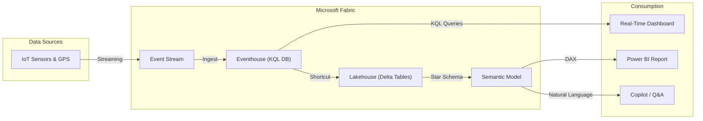

# Contoso Mining — Data Catalog, Linguistic Metadata & AI Instructions

> **Semantic Model:** `ContosoMining_SemanticModel`
> **Domain:** Coal Mining Operations — Hauling, Stockpile Monitoring, Barge Loading
> **Region:** Adaro Mining Area, South Kalimantan, Indonesia
> **Data Freshness:** Real-time streaming via Microsoft Fabric Eventhouse
>
> Dokumen ini disusun berdasarkan panduan resmi Microsoft:
> - [Use Copilot with semantic models](https://learn.microsoft.com/power-bi/create-reports/copilot-semantic-models)
> - [Optimize your semantic model for Copilot](https://learn.microsoft.com/power-bi/create-reports/copilot-evaluate-data)
> - [Copilot in Power BI tutorial: Prepare semantic model for AI](https://learn.microsoft.com/power-bi/create-reports/tutorial-copilot-power-bi-prepare-model)
> - [Enhance Q&A with Copilot for Power BI](https://learn.microsoft.com/power-bi/natural-language/q-and-a-copilot-enhancements)
> - [Intro to Q&A tooling to train Power BI Q&A](https://learn.microsoft.com/power-bi/natural-language/q-and-a-tooling-intro)

---

## 1. Entity Relationship Diagram (Mermaid)

```mermaid
erDiagram
    DimTruck {
        string truck_id PK "Identifier unik truck"
        string truck_name "Nama tampilan truck"
        string truck_type "Merk dan model truck"
        double max_payload_ton "Kapasitas muat maks (ton)"
        string operator_name "Nama operator/driver"
        string commissioning_date "Tanggal mulai operasional"
    }

    DimRoute {
        int route_id PK "Identifier numerik rute"
        string route_name "Nama lengkap rute"
        string origin "Titik asal rute"
        string destination "Titik tujuan rute"
        double distance_km "Jarak tempuh (km)"
        string route_category "Kategori rute"
    }

    DimStockpile {
        string stockpile_id PK "Identifier unik stockpile"
        string stockpile_name "Nama lengkap stockpile"
        string location "Lokasi fisik"
        double max_capacity_ton "Kapasitas maks (ton)"
        string coal_quality_spec "Spek kualitas batubara"
    }

    DimBarge {
        string barge_id PK "Identifier unik tongkang"
        string barge_name "Nama tampilan tongkang"
        string owner "Perusahaan pemilik"
        double max_capacity_ton "Kapasitas muat maks (ton)"
        string vessel_type "Tipe tongkang"
    }

    DimJetty {
        string jetty_id PK "Identifier unik jetty"
        string jetty_name "Nama dermaga"
        string location "Lokasi port dermaga"
        int conveyor_count "Jumlah conveyor"
        double max_loading_rate_tph "Rate muat maks (TPH)"
    }

    DimDate {
        int date_key PK "Surrogate key yyyyMMdd"
        date full_date "Tanggal lengkap"
        int year "Tahun"
        int month "Bulan 1-12"
        int day "Hari 1-31"
        string month_name "Nama bulan"
        int week_of_year "Minggu ke dalam tahun"
        string day_name "Nama hari"
        int shift_number "Nomor shift kerja"
    }

    FactHauling {
        string truck_id FK "FK ke DimTruck"
        datetime timestamp "Waktu event (UTC)"
        double latitude "Koordinat lintang GPS"
        double longitude "Koordinat bujur GPS"
        double speed_kmh "Kecepatan (km/jam)"
        double payload_ton "Muatan batubara (ton)"
        string status "Status operasional truck"
        string route "FK ke DimRoute via route_name"
        string cycle_phase "Fase siklus hauling"
        int date_key FK "FK ke DimDate"
        double cycle_time_minutes "Waktu siklus (menit)"
    }

    FactStockpile {
        string stockpile_id FK "FK ke DimStockpile"
        datetime timestamp "Waktu pembacaan sensor (UTC)"
        double level_percentage "Persentase level isi"
        double estimated_tonnage "Estimasi tonase saat ini"
        double max_capacity_ton "Kapasitas maks (ton)"
        string coal_quality "Kualitas batubara (GAR)"
        double temperature_celsius "Suhu stockpile (C)"
        int date_key FK "FK ke DimDate"
    }

    FactBargeLoading {
        string barge_id FK "FK ke DimBarge"
        datetime timestamp "Waktu event pemuatan (UTC)"
        string jetty_id FK "FK ke DimJetty"
        double loading_rate_tph "Rate pemuatan (TPH)"
        double loaded_tonnage "Tonase sudah dimuat"
        double target_tonnage "Target tonase penuh"
        string status "Status pemuatan"
        datetime eta_completion "Estimasi waktu selesai"
        int date_key FK "FK ke DimDate"
    }

    DimTruck ||--o{ FactHauling : "truck_id"
    DimRoute ||--o{ FactHauling : "route_name → route"
    DimDate ||--o{ FactHauling : "date_key"
    DimDate ||--o{ FactStockpile : "date_key"
    DimDate ||--o{ FactBargeLoading : "date_key"
    DimStockpile ||--o{ FactStockpile : "stockpile_id"
    DimBarge ||--o{ FactBargeLoading : "barge_id"
    DimJetty ||--o{ FactBargeLoading : "jetty_id"
```



### Relationship Summary

| Relationship | From (Dimension) | To (Fact) | Join Key | Cardinality | Filter Direction |
|---|---|---|---|---|---|
| Truck → Hauling | `DimTruck.truck_id` | `FactHauling.truck_id` | `truck_id` | One-to-Many | Single |
| Route → Hauling | `DimRoute.route_name` | `FactHauling.route` | `route_name = route` | One-to-Many | Single |
| Date → Hauling | `DimDate.date_key` | `FactHauling.date_key` | `date_key` | One-to-Many | Single |
| Date → Stockpile | `DimDate.date_key` | `FactStockpile.date_key` | `date_key` | One-to-Many | Single |
| Date → Barge Loading | `DimDate.date_key` | `FactBargeLoading.date_key` | `date_key` | One-to-Many | Single |
| Stockpile → Stockpile Fact | `DimStockpile.stockpile_id` | `FactStockpile.stockpile_id` | `stockpile_id` | One-to-Many | Single |
| Barge → Barge Loading | `DimBarge.barge_id` | `FactBargeLoading.barge_id` | `barge_id` | One-to-Many | Single |
| Jetty → Barge Loading | `DimJetty.jetty_id` | `FactBargeLoading.jetty_id` | `jetty_id` | One-to-Many | Single |

---

## 2. Data Flow Diagram (Mermaid)



---

## 3. Dimension Tables — Description & Synonyms

> **Cara menerapkan di Power BI Desktop:**
> 1. Buka Semantic Model → Model View → pilih tabel → Properties pane
> 2. Isi **Description** (maks 200 karakter pertama digunakan Copilot)
> 3. Buka **Modeling** ribbon → **Q&A Setup** → **Synonyms** tab
> 4. Tambahkan synonyms per tabel dan per kolom sesuai dokumen ini
> 5. Aktifkan **Copilot** sebagai sumber synonym via **Suggestion settings**
>
> Referensi: [Use Copilot with semantic models — Linguistic schema](https://learn.microsoft.com/power-bi/create-reports/copilot-semantic-models#develop-a-semantic-model-with-help-from-copilot)

---

### 3.1 DimTruck

**Description (≤200 chars):**
> Master data of 20 haul trucks operating in the Adaro coal mining area. Contains truck specifications, assigned operators, and commissioning dates.

**Table Synonyms:** `Trucks` · `Armada` · `Fleet` · `Dump Truck` · `Haul Truck` · `Unit Alat Angkut` · `Kendaraan Tambang` · `Mining Vehicles`

| Column | Data Type | Description | Synonyms |
|---|---|---|---|
| `truck_id` | string | Primary key. Unique truck identifier (TRK-001 to TRK-020). | ID Truk, Kode Truk, Nomor Unit, Unit ID, Truck Code |
| `truck_name` | string | Display name for the truck unit. | Nama Truk, Nama Unit, Truck Label |
| `truck_type` | string | Brand and model of the truck (Komatsu HD785-7 or CAT 777F). | Tipe Truk, Jenis Truk, Model, Merk, Brand, Equipment Type |
| `max_payload_ton` | double | Maximum payload capacity in metric tons (40–42 tons). | Kapasitas Muat, Maximum Payload, Tonnage Capacity, Max Load, Muatan Maksimal |
| `operator_name` | string | Name of the assigned truck operator/driver. | Nama Driver, Nama Pengemudi, Operator, Supir |
| `commissioning_date` | string | Date the truck unit started operations. | Tanggal Komisioning, Tanggal Mulai, Start Date, Date Commissioned |

---

### 3.2 DimRoute

**Description (≤200 chars):**
> Master data of coal hauling routes from mining pits to ROM stockyard or port areas. Contains origin, destination, distance, and route category.

**Table Synonyms:** `Rute` · `Routes` · `Jalur Angkut` · `Hauling Route` · `Lintasan` · `Trayek` · `Hauling Path`

| Column | Data Type | Description | Synonyms |
|---|---|---|---|
| `route_id` | int | Primary key. Numeric route identifier. | ID Rute, Kode Rute, Route Code |
| `route_name` | string | Full route name (e.g. "Pit-A1 to ROM-Stockyard"). Used as join key to FactHauling. | Nama Rute, Route Label, Jalur |
| `origin` | string | Starting point of the route (loading area). | Asal, Titik Muat, Origin, Source, Loading Point, Pit Asal |
| `destination` | string | End point of the route (dumping area). | Tujuan, Titik Bongkar, Destination, Target, Dumping Point |
| `distance_km` | double | Route distance in kilometers. | Jarak, Distance, Kilometer, KM, Panjang Rute |
| `route_category` | string | Route type: Pit-to-ROM, Pit-to-Port, or ROM-to-Port. | Kategori Rute, Tipe Rute, Route Type, Category |

---

### 3.3 DimStockpile

**Description (≤200 chars):**
> Master data of coal stockpile areas including ROM Stockyard and Port Stockpiles. Contains location, max capacity, and coal quality specifications.

**Table Synonyms:** `Stockpile` · `Penumpukan` · `Timbunan` · `Stok Batubara` · `Coal Stockpile` · `Storage Area` · `Tempat Penumpukan`

| Column | Data Type | Description | Synonyms |
|---|---|---|---|
| `stockpile_id` | string | Primary key. Unique stockpile identifier (ROM, PORT-A, PORT-B). | ID Stockpile, Kode Stockpile, Stockpile Code |
| `stockpile_name` | string | Full stockpile name. | Nama Stockpile, Nama Penumpukan, Stockpile Label |
| `location` | string | Physical location: "Mine Site" or "Port Area". | Lokasi, Area, Site, Tempat |
| `max_capacity_ton` | double | Maximum storage capacity in metric tons. | Kapasitas Maksimal, Maximum Capacity, Max Storage, Kapasitas Tampung |
| `coal_quality_spec` | string | Coal quality specification (GAR value). | Kualitas Batubara, Coal Quality, Spek, GAR, Kalori |

---

### 3.4 DimBarge

**Description (≤200 chars):**
> Master data of barges used for coal transportation via river or sea. Contains barge specifications, owner company, and vessel type.

**Table Synonyms:** `Tongkang` · `Barge` · `Kapal` · `Vessel` · `Angkutan Sungai` · `Angkutan Laut` · `Coal Barge`

| Column | Data Type | Description | Synonyms |
|---|---|---|---|
| `barge_id` | string | Primary key. Unique barge identifier (BRG-201 to BRG-203). | ID Tongkang, Kode Tongkang, Barge Code, Vessel ID |
| `barge_name` | string | Display name for the barge. | Nama Tongkang, Barge Label, Nama Kapal |
| `owner` | string | Barge owner/operator company. | Pemilik, Operator, Owner Company, Perusahaan Pelayaran |
| `max_capacity_ton` | double | Maximum barge load capacity in metric tons. | Kapasitas Muat, Maximum Capacity, DWT, Daya Angkut |
| `vessel_type` | string | Barge type: "Flat-top" or "Self-propelled". | Tipe Kapal, Jenis Tongkang, Vessel Type |

---

### 3.5 DimJetty

**Description (≤200 chars):**
> Master data of loading jetties/wharves for coal loading onto barges. Contains conveyor count and maximum loading rate in tons per hour.

**Table Synonyms:** `Dermaga` · `Jetty` · `Pelabuhan` · `Wharf` · `Loading Dock` · `Tempat Muat` · `Jetty Muat`

| Column | Data Type | Description | Synonyms |
|---|---|---|---|
| `jetty_id` | string | Primary key. Unique jetty identifier (JETTY-1, JETTY-2). | ID Dermaga, Kode Jetty, Jetty Code |
| `jetty_name` | string | Jetty/wharf name. | Nama Dermaga, Nama Jetty, Jetty Label |
| `location` | string | Port location (Port-A or Port-B). | Lokasi, Port, Pelabuhan |
| `conveyor_count` | int | Number of conveyors available at the jetty. | Jumlah Conveyor, Conveyor Count, Belt Conveyor |
| `max_loading_rate_tph` | double | Maximum loading rate in tons per hour (TPH). | Rate Muat, Loading Rate, TPH, Ton Per Hour, Kecepatan Muat |

---

### 3.6 DimDate

**Description (≤200 chars):**
> Date dimension table covering years 2025–2026 (730 days). Used as calendar slicer for all fact tables. Mark as Date Table in Power BI.

**Table Synonyms:** `Tanggal` · `Kalender` · `Date` · `Calendar` · `Waktu` · `Periode` · `Time`

| Column | Data Type | Description | Synonyms |
|---|---|---|---|
| `date_key` | int | Primary key. Surrogate date key in yyyyMMdd format (e.g. 20260420). | Kunci Tanggal, Date Key, Date ID |
| `full_date` | date | Full calendar date. | Tanggal Lengkap, Full Date, Calendar Date |
| `year` | int | Year (2025 or 2026). | Tahun, Year |
| `month` | int | Month number (1–12). | Bulan, Month, Month Number |
| `day` | int | Day of month (1–31). | Hari, Day, Day of Month |
| `month_name` | string | Full month name in English (January, February, etc.). | Nama Bulan, Month Name |
| `week_of_year` | int | ISO week number in the year (1–52). | Minggu, Week, Week Number, Minggu Ke |
| `day_name` | string | Day of week name in English (Monday, Tuesday, etc.). | Nama Hari, Day Name, Hari Dalam Minggu |
| `shift_number` | int | Work shift number (1 = Day Shift 06:00–18:00, 2 = Night Shift 18:00–06:00). | Shift, Shift Kerja, Work Shift, Shift Number |

---

## 4. Fact Tables — Description & Synonyms

### 4.1 FactHauling

**Description (≤200 chars):**
> Real-time hauling events from GPS-equipped trucks. Each row is a truck event with position, speed, payload, and cycle phase. Source: Eventhouse streaming.

**Table Synonyms:** `Hauling` · `Pengangkutan` · `Data Angkut` · `Hauling Events` · `Trip Data` · `Data Trip` · `Ritase` · `OB Hauling`

| Column | Data Type | Description | Synonyms |
|---|---|---|---|
| `truck_id` | string | FK → DimTruck. Truck performing the haul. | ID Truk, Kode Truk, Truck Code |
| `timestamp` | datetime | UTC timestamp when the event was recorded. | Waktu, Tanggal Waktu, Event Time, Timestamp, Jam |
| `latitude` | double | GPS latitude coordinate of the truck. | Lintang, Lat, GPS Latitude, Posisi Y |
| `longitude` | double | GPS longitude coordinate of the truck. | Bujur, Lon, Long, GPS Longitude, Posisi X |
| `speed_kmh` | double | Truck speed in km/h at the time of event. | Kecepatan, Speed, KM/H, Velocity, Laju |
| `payload_ton` | double | Coal payload in metric tons (0 if empty, 30–42 if loaded). | Muatan, Tonnase, Payload, Ton, Tonase Angkut, Load |
| `status` | string | Truck operational status: loading, loaded, unloading, unloaded, empty, idle. | Status, Status Truk, Truck Status, Kondisi |
| `route` | string | FK → DimRoute.route_name. The hauling route taken. | Rute, Jalur, Route, Jalur Angkut |
| `cycle_phase` | string | Hauling cycle phase: loading, hauling, queuing, unloading, unloaded, returning, idle. | Fase Siklus, Cycle Phase, Phase, Tahap |
| `date_key` | int | FK → DimDate. Date surrogate key (yyyyMMdd). | Kunci Tanggal, Date Key |
| `cycle_time_minutes` | double | Full hauling cycle time in minutes (35–55 min, only populated for "unloaded" phase). | Waktu Siklus, Cycle Time, CT, Durasi Siklus, Menit Siklus |

**Valid `status` values:**

| Value | Description |
|---|---|
| `loading` | Truck is being loaded at the pit |
| `loaded` | Truck is fully loaded, hauling or queuing |
| `unloading` | Truck is dumping its payload |
| `unloaded` | Payload fully dumped — used for tonnage aggregation |
| `empty` | Truck is empty, returning to the pit |
| `idle` | Truck is not operating |

**Valid `cycle_phase` values:**

| Value | Description |
|---|---|
| `loading` | Being loaded by excavator at pit |
| `hauling` | Traveling loaded to destination |
| `queuing` | Waiting in queue at dump point |
| `unloading` | Dumping payload |
| `unloaded` | Dump completed — marks end of a trip cycle |
| `returning` | Empty truck returning to loading point |
| `idle` | Not in any active cycle |

---

### 4.2 FactStockpile

**Description (≤200 chars):**
> Periodic sensor readings for coal stockpile level and temperature. Used for capacity monitoring and spontaneous combustion risk detection.

**Table Synonyms:** `Stockpile Data` · `Data Stockpile` · `Monitoring Stockpile` · `Stockpile Events` · `Level Stockpile` · `Data Penumpukan`

| Column | Data Type | Description | Synonyms |
|---|---|---|---|
| `stockpile_id` | string | FK → DimStockpile. Stockpile area identifier. | ID Stockpile, Kode Stockpile |
| `timestamp` | datetime | UTC timestamp of the sensor reading. | Waktu, Event Time, Timestamp |
| `level_percentage` | double | Stockpile fill level as percentage (15–92%). | Level, Persentase, Level Persen, Fill Level, Tingkat Isi, Kapasitas Terpakai |
| `estimated_tonnage` | double | Estimated current coal tonnage (level × capacity). | Tonase Saat Ini, Current Tonnage, Estimated Tons, Stok Saat Ini |
| `max_capacity_ton` | double | Maximum stockpile capacity in metric tons. | Kapasitas Maksimal, Max Capacity |
| `coal_quality` | string | Current coal quality (GAR-4200, GAR-4700, GAR-5000, GAR-5500). | Kualitas, Coal Quality, GAR, Kalori, Spek Batubara |
| `temperature_celsius` | double | Stockpile temperature in Celsius. Risk threshold: >60°C. | Suhu, Temperature, Temp, Derajat, Temperatur |
| `date_key` | int | FK → DimDate. Date surrogate key (yyyyMMdd). | Kunci Tanggal, Date Key |

---

### 4.3 FactBargeLoading

**Description (≤200 chars):**
> Barge loading events at jetties. Tracks loading progress, rate, and ETA. Used to monitor coal shipment via river transportation.

**Table Synonyms:** `Barge Loading` · `Pemuatan Tongkang` · `Data Tongkang` · `Barge Events` · `Loading Data` · `Data Muat Tongkang` · `Barging`

| Column | Data Type | Description | Synonyms |
|---|---|---|---|
| `barge_id` | string | FK → DimBarge. Barge being loaded. | ID Tongkang, Kode Tongkang, Barge Code |
| `timestamp` | datetime | UTC timestamp of the loading event. | Waktu, Event Time, Timestamp |
| `jetty_id` | string | FK → DimJetty. Jetty where loading occurs. | ID Dermaga, Kode Jetty, Jetty Code |
| `loading_rate_tph` | double | Current loading rate in tons per hour (700–1200 during loading, 0 otherwise). | Rate Muat, Loading Rate, TPH, Ton Per Jam, Kecepatan Muat |
| `loaded_tonnage` | double | Total tonnage loaded onto the barge so far. | Tonase Termuat, Loaded Tons, Muatan Saat Ini, Progress Muat |
| `target_tonnage` | double | Target full-load tonnage for the barge. | Target Muat, Target Tonnage, Kapasitas Target |
| `status` | string | Loading status: waiting, loading, loaded, departed. | Status, Status Muat, Loading Status, Kondisi Tongkang |
| `eta_completion` | datetime | Estimated time of loading completion. | ETA, Estimasi Selesai, Estimated Completion, Waktu Perkiraan Selesai |
| `date_key` | int | FK → DimDate. Date surrogate key (yyyyMMdd). | Kunci Tanggal, Date Key |

**Valid `status` values:**

| Value | Description |
|---|---|
| `waiting` | Barge waiting outside the jetty |
| `loading` | Barge actively being loaded at the jetty |
| `loaded` | Loading complete, barge is full |
| `departed` | Barge has left the jetty |

---

## 5. DAX Measures — Description & Synonyms

> **Best Practice:** Setiap measure harus memiliki description yang menjelaskan logika kalkulasinya.
> Copilot menggunakan 200 karakter pertama dari description sebagai konteks.
>
> Referensi: [Optimize your semantic model for Copilot — Measures](https://learn.microsoft.com/power-bi/create-reports/copilot-evaluate-data#considerations-for-semantic-models-for-copilot-use)

### 5.1 Hauling Measures

| Measure | DAX Formula | Description (≤200 chars) | Synonyms |
|---|---|---|---|
| **Total Tonnage** | `CALCULATE(SUM(FactHauling[payload_ton]), FactHauling[status] = "unloaded")` | Total metric tons of coal successfully hauled. Only counts events where truck status is unloaded to avoid double counting. | Total Tonase, Tonnage, Total Muatan, Jumlah Tonase, Total Angkut |
| **Total Trips** | `CALCULATE(COUNTROWS(FactHauling), FactHauling[status] = "unloaded")` | Count of completed hauling trips. A trip is complete when status equals unloaded. | Jumlah Trip, Total Perjalanan, Total Ritase, Trip Count |
| **Avg Payload Per Trip** | `DIVIDE([Total Tonnage], [Total Trips], 0)` | Average coal payload per completed trip in metric tons. Calculated as Total Tonnage divided by Total Trips. | Rata-rata Muatan, Average Payload, Muatan Rata-Rata |
| **Avg Cycle Time (min)** | `AVERAGE(FactHauling[cycle_time_minutes])` | Average full hauling cycle time in minutes. Includes loading, hauling, queuing, unloading, and return phases. | Rata-rata Waktu Siklus, Average Cycle Time, CT Rata-Rata |
| **Tonnage vs Target %** | `DIVIDE([Total Tonnage], 15000, 0)` | Percentage of daily tonnage target achievement. Daily target is 15,000 metric tons. | Pencapaian Target, Achievement, Target Percentage, Persentase Target |
| **Active Trucks** | `CALCULATE(DISTINCTCOUNT(FactHauling[truck_id]), FactHauling[status] <> "idle")` | Count of distinct trucks currently in operation (any status except idle). | Truk Aktif, Active Fleet, Jumlah Truk Aktif, Unit Beroperasi |
| **Idle Trucks** | `CALCULATE(DISTINCTCOUNT(FactHauling[truck_id]), FactHauling[status] = "idle")` | Count of distinct trucks not currently operating (status is idle). | Truk Idle, Truk Menganggur, Idle Fleet, Unit Tidak Beroperasi |
| **Truck Utilization %** | `DIVIDE([Active Trucks], DISTINCTCOUNT(FactHauling[truck_id]), 0)` | Fleet utilization percentage. Active trucks divided by total distinct trucks in the current context. | Utilisasi Truk, Fleet Utilization, Persen Utilisasi, Pemakaian Alat |

### 5.2 Stockpile Measures

| Measure | DAX Formula | Description (≤200 chars) | Synonyms |
|---|---|---|---|
| **Stockpile Utilization %** | `DIVIDE(SUM(FactStockpile[estimated_tonnage]), SUM(DimStockpile[max_capacity_ton]), 0)` | Current stockpile fill rate. Estimated tonnage divided by maximum capacity across all stockpiles. | Utilisasi Stockpile, Pemakaian Stockpile, Tingkat Isi, Fill Rate |
| **Avg Temperature** | `AVERAGE(FactStockpile[temperature_celsius])` | Average stockpile temperature in Celsius. Temperatures above 60°C indicate spontaneous combustion risk. | Rata-rata Suhu, Average Temperature, Suhu Rata-Rata, Temperatur |
| **Critical Stockpiles** | `COUNTROWS(FILTER(VALUES(...), CALCULATE(MAX(...)) < 30))` | Count of stockpiles with fill level below 30 percent. These need immediate refilling to avoid supply disruption. | Stockpile Kritis, Low Stock, Stockpile Rendah, Stok Kritis |

### 5.3 Barge Loading Measures

| Measure | DAX Formula | Description (≤200 chars) | Synonyms |
|---|---|---|---|
| **Loading Efficiency %** | `DIVIDE(SUM(FactBargeLoading[loaded_tonnage]), SUM(FactBargeLoading[target_tonnage]), 0)` | Barge loading efficiency as percentage. Loaded tonnage divided by target tonnage. | Efisiensi Muat, Loading Efficiency, Persen Muat |
| **Avg Loading Rate (TPH)** | `AVERAGEX(FILTER(FactBargeLoading, [status]="loading"), [loading_rate_tph])` | Average loading rate in tons per hour for barges currently being loaded. | Rata-rata Rate Muat, Average Loading Rate, TPH Rata-Rata |
| **Barges Completed** | `CALCULATE(DISTINCTCOUNT(...), [status] IN {"loaded","departed"})` | Count of distinct barges that have completed loading (loaded or departed status). | Tongkang Selesai, Barge Done, Jumlah Tongkang Selesai |
| **Total Shipped Tonnage** | `CALCULATE(SUM(FactBargeLoading[loaded_tonnage]), [status] IN {"loaded","departed"})` | Total metric tons of coal shipped via barge. Only counts loaded or departed barges. | Total Tonase Kirim, Shipped Tonnage, Total Pengiriman |
| **Avg Barge Wait Time (hrs)** | `AVERAGEX(FILTER(..., [status]="waiting"), DATEDIFF(..., HOUR))` | Average waiting time in hours for barges before loading begins. | Waktu Tunggu Tongkang, Barge Wait Time, Antrian Tongkang |

---

## 6. Fields to Exclude from Q&A / Copilot

> **Best Practice:** Nonaktifkan *Include in Q&A* untuk kolom teknis atau redundan agar tidak membingungkan Copilot.
>
> Referensi: [Use Copilot with semantic models](https://learn.microsoft.com/power-bi/create-reports/copilot-semantic-models#develop-a-semantic-model-with-help-from-copilot)

| Table | Column | Reason |
|---|---|---|
| `FactHauling` | `latitude` | Technical GPS coordinate, not useful for natural language queries |
| `FactHauling` | `longitude` | Technical GPS coordinate, not useful for natural language queries |
| `FactHauling` | `date_key` | Surrogate key — users should use DimDate columns instead |
| `FactStockpile` | `date_key` | Surrogate key — users should use DimDate columns instead |
| `FactBargeLoading` | `date_key` | Surrogate key — users should use DimDate columns instead |
| `DimDate` | `date_key` | Surrogate key — users should use full_date instead |
| `DimDate` | `shift_number` | Calculated helper field |

---

## 7. AI Instructions for Copilot

> **Cara menerapkan:**
> 1. Buka Power BI Desktop → **Home** ribbon → **Prep data for AI**
> 2. Pilih **Add AI instructions**
> 3. Paste teks di bawah ini ke dalam field instruksi
> 4. Klik **Apply**
>
> Referensi: [Copilot in Power BI tutorial — Add AI instructions](https://learn.microsoft.com/power-bi/create-reports/tutorial-copilot-power-bi-prepare-model#add-ai-instructions-preview)

### 7.1 AI Instructions Text (Paste ke Power BI Desktop)

```text
Tailor responses to industry norms for an open-pit coal mining operation in South Kalimantan, Indonesia. Mining operations managers monitor the hauling fleet, stockpile levels, and barge loading status in real-time.

=== BUSINESS CONTEXT ===
- This semantic model covers the full coal supply chain: hauling from pit to stockyard, stockpile inventory management, and barge loading for shipment.
- The daily production target is 15,000 metric tons of coal.
- There are 20 haul trucks (Komatsu HD785-7 and CAT 777F), 3 stockpile areas (ROM, PORT-A, PORT-B), 3 barges, and 2 jetties.
- Coal quality is measured in GAR (Gross As Received) calorific value: GAR-4200, GAR-4700, GAR-5000, GAR-5500.
- Operations run in two 12-hour shifts: Shift 1 (Day: 06:00–18:00) and Shift 2 (Night: 18:00–06:00).

=== DOMAIN TERMINOLOGY ===
- "Ritase" or "Trip" means one complete hauling cycle (load → haul → dump → return).
- "Tonase" or "Tonnage" means the weight of coal in metric tons.
- "Cycle Time" or "CT" means the total duration of one hauling cycle from loading to unloading.
- "ROM" stands for Run of Mine — the first stockyard after coal is extracted from the pit.
- "GAR" stands for Gross As Received — the caloric value specification of coal.
- "TPH" stands for Tons Per Hour — the rate at which coal is loaded onto a barge.
- "Spontaneous combustion" risk exists when stockpile temperature exceeds 60°C.
- A "critical stockpile" is one with fill level below 30%.

=== TABLE USAGE RULES ===
- To calculate total tonnage hauled, always use FactHauling where status = "unloaded". Never sum all payload_ton values as this would double-count.
- To count completed trips, always use FactHauling where status = "unloaded".
- To get current stockpile status, use the latest reading (most recent timestamp) for each stockpile_id in FactStockpile.
- To get barge loading progress, use the latest reading (most recent timestamp) for each barge_id in FactBargeLoading.
- Use the DimDate table and its full_date column for all date filtering. Do not filter directly on timestamp columns.
- For "today's" data, filter DimDate[full_date] = TODAY().

=== MEASURE GUIDANCE ===
- "Pencapaian target" or "target achievement" refers to the Tonnage vs Target % measure (daily target: 15,000 tons).
- "Utilisasi" or "utilization" for trucks refers to the Truck Utilization % measure.
- "Utilisasi" for stockpiles refers to the Stockpile Utilization % measure.
- "Efisiensi muat" or "loading efficiency" refers to the Loading Efficiency % measure for barges.
- When asked about "productivity", show Total Tonnage and Total Trips together.
- When asked about "fleet performance", show Active Trucks, Idle Trucks, Truck Utilization %, and Avg Cycle Time.
- When the audience is leadership or management, prioritize Total Tonnage, Tonnage vs Target %, Truck Utilization %, and Total Shipped Tonnage.

=== ALERT THRESHOLDS ===
- Stockpile temperature > 60°C = CRITICAL (fire risk). Flag immediately.
- Stockpile temperature > 50°C = WARNING. Monitor closely.
- Stockpile level < 30% = LOW STOCK. Needs refilling.
- Truck idle > 30 minutes = Investigate cause.
- Barge loading rate < 700 TPH = Below normal operating range.

=== LANGUAGE ===
- Users may ask questions in both Bahasa Indonesia and English. Both are valid.
- "Berapa tonase hari ini" = "What is today's tonnage" → use Total Tonnage measure.
- "Truk mana yang idle" = "Which trucks are idle" → filter FactHauling where status = "idle".
- "Progress muat tongkang" = "Barge loading progress" → show loaded_tonnage vs target_tonnage from FactBargeLoading.
```

---

## 8. Verified Answers (Recommended)

> **Cara menerapkan:**
> 1. Di Power BI Report → klik kanan pada visual → **Set up a verified answer**
> 2. Tambahkan connected phrases sesuai tabel di bawah
>
> Referensi: [Copilot in Power BI tutorial — Create verified answers](https://learn.microsoft.com/power-bi/create-reports/tutorial-copilot-power-bi-prepare-model#create-verified-answers-preview)

| Connected Phrase | Target Visual / Answer |
|---|---|
| Berapa total tonase hari ini? | Scorecard: Total Tonnage (filtered today) |
| What is today's total tonnage? | Scorecard: Total Tonnage (filtered today) |
| Berapa persen pencapaian target? | Scorecard: Tonnage vs Target % |
| How many trucks are active? | Scorecard: Active Trucks |
| Truk mana yang idle? | Table: FactHauling filtered status = idle, showing truck_id and idle duration |
| Berapa level stockpile saat ini? | Bar chart: Stockpile level_percentage by stockpile_id |
| What is the current stockpile level? | Bar chart: Stockpile level_percentage by stockpile_id |
| Ada stockpile yang suhunya tinggi? | Table: Stockpile temperature with conditional formatting |
| How is the barge loading progress? | Table: Barge status, loaded_tonnage, target_tonnage, progress % |
| Progress muat tongkang bagaimana? | Table: Barge loading progress |
| Berapa rata-rata cycle time? | Scorecard: Avg Cycle Time (min) |
| Top 10 trucks by tonnage? | Bar chart: Top 10 trucks by Total Tonnage |
| Bagaimana performa fleet hari ini? | Multi-visual: Active Trucks, Idle Trucks, Utilization %, Avg Cycle Time |

---

## 9. Semantic Model Configuration Checklist

> Checklist ini berdasarkan panduan dari [Optimize your semantic model for Copilot](https://learn.microsoft.com/power-bi/create-reports/copilot-evaluate-data) dan [Prepare semantic model for AI](https://learn.microsoft.com/power-bi/create-reports/tutorial-copilot-power-bi-prepare-model).

| # | Task | Status | Notes |
|---|---|---|---|
| 1 | **Star schema design** — All facts connect to dims via foreign keys | ☐ | 8 relationships defined |
| 2 | **Mark DimDate as Date Table** — Model view → Mark as Date Table | ☐ | Use `full_date` column |
| 3 | **Create Date Hierarchy** — Year > Month > Week > Day | ☐ | In DimDate table |
| 4 | **Set descriptions** for all tables | ☐ | Use Section 3 & 4 descriptions |
| 5 | **Set descriptions** for all columns | ☐ | Use Section 3 & 4 column descriptions |
| 6 | **Set descriptions** for all measures | ☐ | Use Section 5 descriptions |
| 7 | **Add synonyms** to all tables and columns | ☐ | Use Sections 3, 4, 5 synonyms |
| 8 | **Enable Q&A** — File Options → Data Load → Turn on Q&A | ☐ | Required for Copilot |
| 9 | **Disable Q&A** for technical columns | ☐ | See Section 6 |
| 10 | **Hide foreign key columns** in fact tables | ☐ | Hide date_key in all facts |
| 11 | **Set correct data types** for all columns | ☐ | Ensure numeric cols are not Text |
| 12 | **Set format strings** — % measures as Percentage, tons as #,0 | ☐ | Tonnage: #,##0, Percentage: 0.0% |
| 13 | **Add AI Instructions** | ☐ | Paste Section 7.1 text |
| 14 | **Create Verified Answers** | ☐ | See Section 8 |
| 15 | **Set Semantic Model description** in Power BI Service | ☐ | See Section 10 |
| 16 | **Set Report description** in Power BI Service | ☐ | See Section 10 |
| 17 | **Mark as Prepped for AI** in Semantic Model settings | ☐ | Final step after all above |
| 18 | **Test with Copilot** — Validate common questions | ☐ | Use Section 8 phrases |

---

## 10. Semantic Model & Report Descriptions

> **Cara menerapkan:**
> - **Semantic Model:** Power BI Service → Semantic Model → Settings → Semantic model description
> - **Report:** Power BI Service → Report → File → Settings → Description
>
> Referensi: [Copilot in Power BI tutorial — Descriptions](https://learn.microsoft.com/power-bi/create-reports/tutorial-copilot-power-bi-prepare-model#descriptions)

### Semantic Model Description

```text
Real-time coal mining operations semantic model for the Adaro mining area in South Kalimantan, Indonesia. Provides insights into hauling fleet performance (20 trucks), stockpile inventory levels (3 stockpile areas), and barge loading progress (3 barges, 2 jetties). Data streams from IoT sensors via Microsoft Fabric Eventhouse. Covers daily production target of 15,000 metric tons. Includes measures for tonnage, trip count, cycle time, fleet utilization, stockpile fill levels, temperature monitoring, and barge loading efficiency.
```

### Report Description

```text
A comprehensive real-time operational dashboard for coal mining logistics at Adaro, South Kalimantan. Monitors hauling fleet status and productivity, stockpile inventory and temperature alerts, and barge loading progress. Designed for operations managers, shift supervisors, and logistics coordinators.
```

---

## 11. Linguistic Relationship Verbs (Q&A)

> Selain synonyms, Power BI Q&A juga menggunakan *linguistic relationships* (verb phrases) untuk memahami hubungan antar tabel.
>
> Referensi: [Use Copilot with semantic models — Linguistic schema](https://learn.microsoft.com/power-bi/create-reports/copilot-semantic-models)

| Subject | Verb Phrase | Object | Example Question |
|---|---|---|---|
| DimTruck | hauls coal in | FactHauling | "Which truck hauls the most coal?" |
| DimTruck | operates on | DimRoute (via FactHauling) | "Which trucks operate on route Pit-A1 to ROM?" |
| DimRoute | is used by | DimTruck (via FactHauling) | "Which routes are used by TRK-001?" |
| DimBarge | is loaded at | DimJetty (via FactBargeLoading) | "Which barge is loaded at Jetty Utama?" |
| DimJetty | loads | DimBarge (via FactBargeLoading) | "Which jetty loads BRG-201?" |
| DimStockpile | stores coal in | FactStockpile | "How much coal is stored in ROM?" |
| DimDate | filters | FactHauling / FactStockpile / FactBargeLoading | "Show tonnage for January 2026" |

---

## Appendix A: Best Practices Summary

Ringkasan best practices berdasarkan dokumentasi resmi Microsoft untuk menyiapkan semantic model agar optimal dengan Copilot:

| Category | Best Practice | Source |
|---|---|---|
| **Model Design** | Follow star schema design with clear fact and dimension tables | [Optimize semantic model for Copilot](https://learn.microsoft.com/power-bi/create-reports/copilot-evaluate-data) |
| **Naming** | Use human-readable English names; avoid acronyms, abbreviations, and punctuation | [Use Copilot with semantic models](https://learn.microsoft.com/power-bi/create-reports/copilot-semantic-models) |
| **Descriptions** | Add concise descriptions to all tables, columns, and measures (first 200 chars used by Copilot) | [Copilot tutorial — Prepare model](https://learn.microsoft.com/power-bi/create-reports/tutorial-copilot-power-bi-prepare-model) |
| **Synonyms** | Add bilingual synonyms; use Copilot-generated suggestions as starting point then curate | [Enhance Q&A with Copilot](https://learn.microsoft.com/power-bi/natural-language/q-and-a-copilot-enhancements) |
| **Organization** | Hide technical/redundant columns; avoid duplicate field names across tables | [Copilot tutorial — Simplify schema](https://learn.microsoft.com/power-bi/create-reports/tutorial-copilot-power-bi-prepare-model#simplify-the-data-schema-preview) |
| **Measures** | Use standardized DAX with clear calculation logic; always add description | [Optimize semantic model — Measures](https://learn.microsoft.com/power-bi/create-reports/copilot-evaluate-data) |
| **AI Instructions** | Provide business context, domain terminology, table usage rules, and alert thresholds | [Copilot tutorial — AI instructions](https://learn.microsoft.com/power-bi/create-reports/tutorial-copilot-power-bi-prepare-model#add-ai-instructions-preview) |
| **Verified Answers** | Connect common questions to pre-built visuals for deterministic answers | [Copilot tutorial — Verified answers](https://learn.microsoft.com/power-bi/create-reports/tutorial-copilot-power-bi-prepare-model#create-verified-answers-preview) |
| **Testing** | Continuously test with Copilot using common user questions | [Copilot tutorial — Test your data](https://learn.microsoft.com/power-bi/create-reports/tutorial-copilot-power-bi-prepare-model#test-your-data-with-copilot-preview) |
| **Prepped for AI** | Mark semantic model as "Prepped for AI" after completing all preparation steps | [Copilot tutorial — AI preparation](https://learn.microsoft.com/power-bi/create-reports/tutorial-copilot-power-bi-prepare-model#ai-preparation-preview) |
